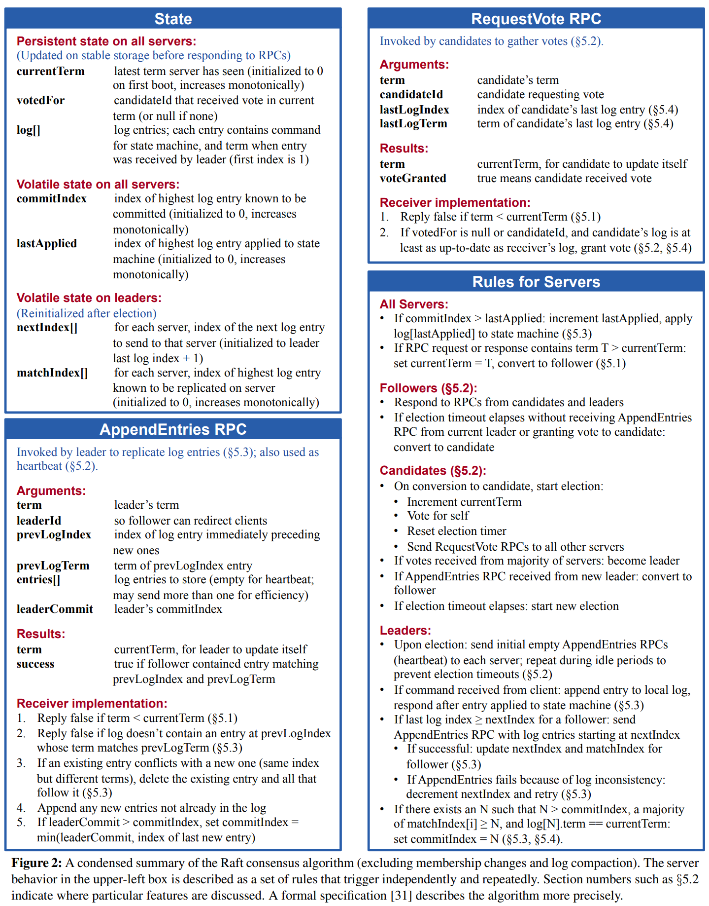

做完了2A开始做2B，发现2B的实现又比2A复杂了很多。而且其实很感慨的是，论文里的描述其实有些还是比较有误导性，如果严格按照论文里的描述，不去思考多线程/多goroutine来并行处理的话，实现起来会非常地困难，比如论文里提到
```
The leader appends the command to its log as a new entry, then issues AppendEntries RPCs in parallel to each of the other servers to replicate the entry. When the entry has been safely replicated (as described below), the leader applies the entry to its state machine and returns the result of that execution to the client.
```

按照一开始的实现思路，没能马上想到将"加入自己的log"和"发送到其他server"这两步分开，因为这个`then`给了人一种马上就要做的感觉。所以具体的实现还是要参考figure 2



## 1. 数据结构
好的，其他废话不多说，先来看增加了什么数据结构

### 1.1. Raft
```go
// index of highest log committed
commitIndex int

// index of highest log applied
lastApplied int

// index of next log entry to send to each server
nextIndex []int

// index of highest log entry replicated in each server
matchIndex []int

// conditional variable to signal log replicated to majority
cond *sync.Cond

// channel to communicate with KV service
applyCh chan ApplyMsg

// timer used to check commit consensus
commitCheckerTimer *time.Timer
```
其他几个变量都在Raft论文里有介绍，这里我们重点说一下cond和commitCheckerTimer

根据Raft论文里的描述我们知道leader在接受client的命令时需要对自己的data做多个步骤，如下所示
1. 将log加入到自己的log里
2. 发送AppendEntries到各个server，也就是这一步replication
3. 当收到majority同意的时候，commit这个新的log
4. 当commit之后，apply这个log

从这些步骤我们可以发现AppendEntries的时机会带来实现上的一个问题，根据Raft paper以及TA的文章，heartbeat并没有什么特殊，它就是AppendEntries，不应该把它们做分开处理，也就是说当log加入到本地log之后，我们无法(至少在当前的实现方式之下)控制log什么时候会replicate，但又不能干等，所以需要把后两部做成异步，也就是使用goroutine

接着问题又来了，怎么样能动态地检查到哪些log index需要commit呢？论文里已经给出了具体的方法，我们(至少前目前的版本里)使用一个background goroutine每隔一段时间就检查是否可以advnace commitIndex，而实现这个background goroutine每隔一段时间调用就需要commitCheckerTimer

在commitIndex有了动作之后，leader就可以将所有在lastApplied和commitIndex之前的log apply，那我们怎么样才能通知leader commitIndex有变化，可以apply呢？答案还是background goroutine，但是这次我们不需要再次使用每隔一段时间就调用的方式，而是可以使用conditional variable，因为commitIndex只有一个地方会变化，一旦有变化就可以使用Signal通知goroutine apply相关的log

以上就是引入cond和commitCheckerIndexTimer的原因和他们的作用

### 1.2. AppendEntries
```go
// index of log entry immediately preceding new ones
PrevLogIndex int

// term of prevLogIndex entry
PrevLogTerm int

// leader's commitIndex
LeaderCommit int
```

AppendEntriesArgs方面增加了一些fields，基本上和论文里说的一致，这里不再赘述

## 2. 实现

### 2.1. 统一Heartbeat与AppendEntries
这个说法其实并不准确，因为在2A中heartbeat的实现方法就是AppendEntries，这里更多的是概念上说法。首先我们要改动的就是`sendHeartbeat`，根据`nextIndex`与log长度来决定是否要送空Entries
```go
// check if we should send empty AppendEntries
rf.mu.Lock()
args := AppendEntriesArgs{
	Term:         term,
    LeaderId:     leaderId,
	PrevLogIndex: prevLogIndex,
	PrevLogTerm:  prevLogTerm,
    LeaderCommit: leaderCommit,
}

if rf.nextIndex[peer] >= len(rf.log) {
	args.Entries = make([]LogEntry, 0)
} else {
	args.Entries = []LogEntry{rf.log[rf.nextIndex[peer]]}
}
rf.mu.Unlock()
```
另一个需要注意的地方是当AppendEntries success时对对应的server状态的更改
```
rf.nextIndex[peer] += len(args.Entries)
rf.matchIndex[peer] = args.PrevLogIndex + len(args.Entries)
```

关于`nextIndex`和`matchIndex`，TA的文章里讲的很好，这里引用如下
```
nextIndex is a guess as to what prefix the leader shares with a given follower. It is generally quite optimistic (we share everything), and is moved backwards only on negative responses. For example, when a leader has just been elected, nextIndex is set to be index index at the end of the log. In a way, nextIndex is used for performance – you only need to send these things to this peer.

matchIndex is used for safety. It is a conservative measurement of what prefix of the log the leader shares with a given follower. matchIndex cannot ever be set to a value that is too high, as this may cause the commitIndex to be moved too far forward. This is why matchIndex is initialized to -1 (i.e., we agree on no prefix), and only updated when a follower positively acknowledges an AppendEntries RPC.
```

而AppendEntries handler的实现完全按照figure 2，根据TA的说法`figure 2 must be followerd to the letter`

### 2.2. Background goroutine
之前提到background goroutine有两个，第一个负责检查commit index，第二个负责apply logs

```go
func (rf *Raft) checkCommit() {
	rf.mu.Lock()
	defer rf.mu.Unlock()

	for idx := rf.commitIndex + 1; idx < len(rf.log); idx++ {
		N := idx
        replicateCount := 1
		for peer := range rf.peers {
			if peer == rf.me {
				continue
			}

			if rf.matchIndex[peer] >= N {
				replicateCount += 1
			}

			if replicateCount > len(rf.peers)/2 && rf.log[N].Term == rf.currentTerm {
				rf.commitIndex = N
				DPrintf("Raft %d received majority at %d, and updated commitIndex to %d", rf.me, N, rf.commitIndex)
				rf.cond.Signal()
				break
			}
		}
	}
}
```

这个goroutine每10ms运行一次，或许更好的方法是把它改成conditional variable触发，第一版里暂时先这样实现

```go
func (rf *Raft) logApplier() {
	for {
		rf.mu.Lock()

		if rf.commitIndex > rf.lastApplied {
			rf.lastApplied += 1
			DPrintf("Raft %d ready to apply state machine: %v at %d, commitIndex: %d", rf.me, rf.log, rf.lastApplied, rf.commitIndex)
			rf.applyCh <- ApplyMsg{
				CommandValid: true,
				Command:      rf.log[rf.lastApplied].Command,
				CommandIndex: rf.lastApplied,
			}
			rf.mu.Unlock()
		} else {
			DPrintf("Raft %d started waiting log apply", rf.me)
			rf.cond.Wait()
			DPrintf("Raft %d ended waiting log apply", rf.me)
			rf.mu.Unlock()
		}
	}
}
```

`logApplier`更加简单一些，其实就是不断地等待conditional variable，每当触发之后就apply logs

### 2.3. Accelerated Log Backtracking

这个优化其实就是如果leader收到AppendEntries的false回复，那么就要将对应server的nextIndex下调，基础的版本是每次下调1，但这里我们可以做一些优化
```
If a follower does not have prevLogIndex in its log, it should return with conflictIndex = len(log) and conflictTerm = None.

If a follower does have prevLogIndex in its log, but the term does not match, it should return conflictTerm = log[prevLogIndex].Term, and then search its log for the first index whose entry has term equal to conflictTerm.

Upon receiving a conflict response, the leader should first search its log for conflictTerm. If it finds an entry in its log with that term, it should set nextIndex to be the one beyond the index of the last entry in that term in its log.

If it does not find an entry with that term, it should set nextIndex = conflictIndex.
```