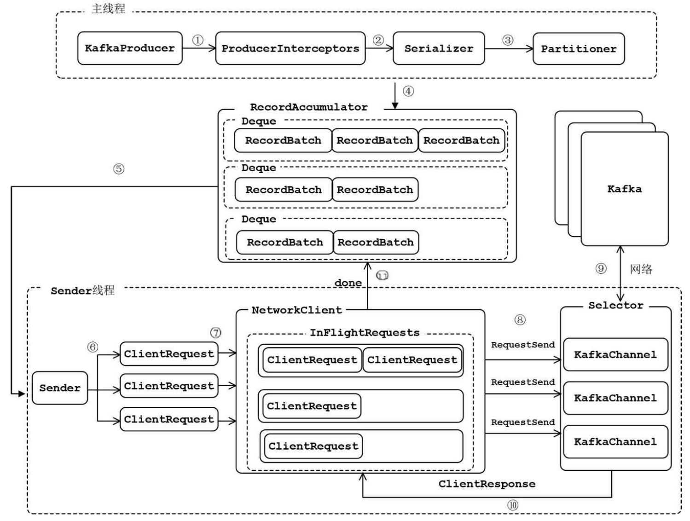

## 1. 问题

### 1.1. 问题描述

最近想着用Flink测一个简单的小功能然后把数据写入Kafka，本来功能测试没什么问题，输出的数据都对，但发现当Flink的parallelism小于Kafka topic partition数量的时候有些partition根本不会被写入。因为之前的作业基本上都会指定key，所以没遇到这个问题，于是就想着探究下出现这种现象的原因。

### 1.2. 问题分析与解决

跟随着FlinkKafkaProducer的constructor看了一下，如果没有指定partitioner的话，会默认使用FlinkFixedPartitioner
```java
public FlinkKafkaProducer(
        String topicId,
        SerializationSchema<IN> serializationSchema,
        Properties producerConfig) {
    this(
            topicId,
            serializationSchema,
            producerConfig,
            Optional.of(new FlinkFixedPartitioner<>()));
    }
```
FlinkFixedPartitioner又是怎样assign partition呢？在它的partition方法中，我们找到了元凶
```java
@Override
public int partition(T record, byte[] key, byte[] value, String targetTopic, int[] partitions) {
    Preconditions.checkArgument(
            partitions != null && partitions.length > 0,
            "Partitions of the target topic is empty.");

    return partitions[parallelInstanceId % partitions.length];
}
```
可以看到，对于某个Task，Flink只会把它写入到某个特定的partition去。看到这里，解决方法也比较显而易见了，大致有两种思路
1. 在构造FlinkKafkaProducer的时候特意设置第四个参数(也就是partitioner为null)，这样构造的ProducerRecord就没有partition，进而调用Kafka自己的partitioner
2. 实现自己的partitioner，基本方法是继承FlinkFixedPartitioner，但是重写partition方法实现random/round robin

本来问题到此可以结束，但我们再进一步的想一想，Kafka的partitioner肯定也是要保证数据在各个partition之间balance，这样才不会对下游的consumer造成影响，而且它一定会有优化，比如之前我整理过[一篇文章](https://zhuanlan.zhihu.com/p/463476542)，所以理论上讲应该是更好的选择

我当时也是这样想的，于是就使用了第一个方法，但让人惊讶的是各个partition收到的数据并不是均匀分布，在某些partition有比较严重的倾斜，这是为什么呢？那不如来看看sticky partition的实现吧

## 2. Sticky Partition

Sticky partitioner的思想说起来并不算很复杂，主要是以message batch为整体而不是以单个message来assign partition，根据Confluent的实验，这样能够降低latency以及CPU cost

### 2.1. DefaultPartitioner
Kafka已经将sticky partition集成到了默认的partitioner中
```java
/**
 * Compute the partition for the given record.
 *
 * @param topic The topic name
 * @param numPartitions The number of partitions of the given {@code topic}
 * @param key The key to partition on (or null if no key)
 * @param keyBytes serialized key to partition on (or null if no key)
 * @param value The value to partition on or null
 * @param valueBytes serialized value to partition on or null
 * @param cluster The current cluster metadata
 */
public int partition(String topic, Object key, byte[] keyBytes, Object value, byte[] valueBytes, Cluster cluster,
    int numPartitions) {
    if (keyBytes == null) {
        return stickyPartitionCache.partition(topic, cluster);
    }
    // hash the keyBytes to choose a partition
    return Utils.toPositive(Utils.murmur2(keyBytes)) % numPartitions;
}

/**
 * If a batch completed for the current sticky partition, change the sticky partition. 
 * Alternately, if no sticky partition has been determined, set one.
 */
public void onNewBatch(String topic, Cluster cluster, int prevPartition) {
    stickyPartitionCache.nextPartition(topic, cluster, prevPartition);
}
```

如果message没有指定key的话，就使用sticky partition，而如果指定的话则使用murmur2 hash来得到分布，同时在有新的batch时更换下一个partition
```java
public int nextPartition(String topic, Cluster cluster, int prevPartition) {
    List<PartitionInfo> partitions = cluster.partitionsForTopic(topic);
    Integer oldPart = indexCache.get(topic);
    Integer newPart = oldPart;
    // Check that the current sticky partition for the topic is either not set or that the partition that 
    // triggered the new batch matches the sticky partition that needs to be changed.
    if (oldPart == null || oldPart == prevPartition) {
        List<PartitionInfo> availablePartitions = cluster.availablePartitionsForTopic(topic);
        if (availablePartitions.size() < 1) {
            Integer random = Utils.toPositive(ThreadLocalRandom.current().nextInt());
            newPart = random % partitions.size();
        } else if (availablePartitions.size() == 1) {
            newPart = availablePartitions.get(0).partition();
        } else {
            while (newPart == null || newPart.equals(oldPart)) {
                int random = Utils.toPositive(ThreadLocalRandom.current().nextInt());
                newPart = availablePartitions.get(random % availablePartitions.size()).partition();
            }
        }
        // Only change the sticky partition if it is null or prevPartition matches the current sticky partition.
        if (oldPart == null) {
            indexCache.putIfAbsent(topic, newPart);
        } else {
            indexCache.replace(topic, prevPartition, newPart);
        }
        return indexCache.get(topic);
    }
    return indexCache.get(topic);
}
```

而stickyPartitionCache中最为核心的函数是nextPartition，它会使用随机数来选定下一个partition

### 2.2. Sticky Partition的问题

这一切看起来都很好，理论上来讲，在持续一段时间之后各个partition的traffic都会很平均，那么为什么还会出现我们观测到的问题呢？现在让我们回过头来仔细分析下sticky partition的基本思路`message batch为整体而不是以单个message来assign partition`，聪明的同学可能已经发现了，问题在于每个message batch的数据不一定是一致的

社区对于这个问题也有反馈，详细描述可以参考[KAFKA-10888](https://issues.apache.org/jira/browse/KAFKA-10888)，这个issue里提到在`linger.ms`为0并且某些partition处理比较慢的时候sticky partition会造成unbalanced partition。要分析和理解这个问题，首先就要对Kafka producer有一个大致的了解，这里我们先绕个路，聊一聊Kafka producer

## 3. Kafka Producer分析

### 3.1. Kafka Producer整体流程



1. ProducerInterceptors对消息进行拦截
2. Serializer对消息的key和value进行序列化
3. Partitioner为消息选择合适的partition
4. RecordAccumulator收集消息，实现批量发送
5. Sender从RecordAccumulator获取消息
6. 构造ClientRequest
7. 将ClientRequest交给NetworkCLient，准备发送
8. NetworkClient将请求放入KafkaChannel的缓存
9. 执行网络I/O，发送请求
10. 收到Response
11. 调用RecordBatch的回调函数，最终调用每个消息上注册的回调函数

消息发送的过程中，涉及两个线程协同工作。主线程首先将业务数据封装成ProducerRecord对象，之后调用send()方法将消息放入RecordAccumulator(消息收集器，也可以理解为主线程与Sender线程之间的缓冲区)中暂存。 Sender线程负责将消息信息构成请求，并最终执行网络I/O的线程，它从RecordAccumulator中取出消息并批量发送出去。需要注意的是，KafkaProducer是线程安全的，多个线程间可以共享使用同一个KafkaProducer对象

### 3.2. RecordAccumulator中消息的添加与删除

从上图我们可以看到，RecordAccumulator相当于是主线程和Sender线程共享的仓库，在RecordAccumulator中对于每一个TopicPartition都有一个Deque，存储一系列的messages。主线程通过send方法将消息加入RecordAccumulator，而Sender线程则会不断轮询，问RecordAccumulator是否满足发送条件，而具体的实现就是ready函数
```java
public ReadyCheckResult ready(Cluster cluster, long nowMs) {
    Set<Node> readyNodes = new HashSet<>();
    long nextReadyCheckDelayMs = Long.MAX_VALUE;
    Set<String> unknownLeaderTopics = new HashSet<>();

    boolean exhausted = this.free.queued() > 0;
    for (Map.Entry<TopicPartition, Deque<ProducerBatch>> entry : this.batches.entrySet()) {
        Deque<ProducerBatch> deque = entry.getValue();
        synchronized (deque) {
            // When producing to a large number of partitions, this path is hot and deques are often empty.
            // We check whether a batch exists first to avoid the more expensive checks whenever possible.
            ProducerBatch batch = deque.peekFirst();
            if (batch != null) {
                TopicPartition part = entry.getKey();
                Node leader = cluster.leaderFor(part);
                if (leader == null) {
                    // This is a partition for which leader is not known, but messages are available to send.
                    // Note that entries are currently not removed from batches when deque is empty.
                    unknownLeaderTopics.add(part.topic());
                } else if (!readyNodes.contains(leader) && !isMuted(part)) {
                    long waitedTimeMs = batch.waitedTimeMs(nowMs);
                    boolean backingOff = batch.attempts() > 0 && waitedTimeMs < retryBackoffMs;
                    long timeToWaitMs = backingOff ? retryBackoffMs : lingerMs;
                    boolean full = deque.size() > 1 || batch.isFull();
                    boolean expired = waitedTimeMs >= timeToWaitMs;
                    boolean transactionCompleting = transactionManager != null && transactionManager.isCompleting();
                    boolean sendable = full
                        || expired
                        || exhausted
                        || closed
                        || flushInProgress()
                        || transactionCompleting;
                    if (sendable && !backingOff) {
                        readyNodes.add(leader);
                    } else {
                        long timeLeftMs = Math.max(timeToWaitMs - waitedTimeMs, 0);
                        // Note that this results in a conservative estimate since an un-sendable partition may have
                        // a leader that will later be found to have sendable data. However, this is good enough
                        // since we'll just wake up and then sleep again for the remaining time.
                        nextReadyCheckDelayMs = Math.min(timeLeftMs, nextReadyCheckDelayMs);
                    }
                }
            }
        }
    }
    return new ReadyCheckResult(readyNodes, nextReadyCheckDelayMs, unknownLeaderTopics);
}
```

这个函数比较长，但是不用怕，我们只关注最中间的部分即可，可以发现，如果当前某个batch是sendable并且没有backingOff的时候可以发送，而sendable的判断条件之一就是`linger.ms`，也就是当前batch是否已经等了固定的时间。默认的`linger.ms`为0，也就是说几乎没有等待，消息一进入batch就是可以发送的状态

但是这个条件还不够，即使已经ready，Kafka Producer在实际准备从RecordAccumulator拿走数据的时候还会再检查对应的TopicPartition是否被muted，具体的函数为drainBatchesForOneNode，这里我们只截取关键代码
```java
private List<ProducerBatch> drainBatchesForOneNode(Cluster cluster, Node node, int maxSize, long now) {
    int size = 0;
    List<PartitionInfo> parts = cluster.partitionsForNode(node.id());
    List<ProducerBatch> ready = new ArrayList<>();
    /* to make starvation less likely this loop doesn't start at 0 */
    int start = drainIndex = drainIndex % parts.size();
    do {
        PartitionInfo part = parts.get(drainIndex);
        TopicPartition tp = new TopicPartition(part.topic(), part.partition());
        this.drainIndex = (this.drainIndex + 1) % parts.size();

        // Only proceed if the partition has no in-flight batches.
        if (isMuted(tp))
            continue;
        ...
    }
    ...
}
```

好的，到这里我们已经清楚了，Sender线程从RecordAccumulator拿走数据需要两个条件，第一是batch已经ready，第二是对应的TopicPartition没有inflight batches

## 4. Sticky Partition的问题

现在我们能够回过头来考虑sticky partition的问题了，在默认`linger.ms`为0的时候，每个message被放入batch之后会被认定为ready，因此request会被发送给Kafka并且产生new batch，进而调用sticky partition的onNewBatch来切换下一个batch

这看上去都没问题，但是当某一个partition出了点问题，或者网络较慢呢？根据刚才的分析，虽然batch已经ready，但是由于有inflight batches，这个batch不会被从RecordAccumulator中拿走，因此后续的message会持续写入这个partition，造成某些处理比较慢的partition收到更多的数据，从而恶性循环

解决方法呢？其实也不算复杂，首先Kafka社区已经有了一个新的提案[KIP-794](https://cwiki.apache.org/confluence/display/KAFKA/KIP-794%3A+Strictly+Uniform+Sticky+Partitioner)，基本思路是不再按照batch整体来做sticky，而是按照`batch.size`的chunk来做sticky，但这个目前还没有被实现，那么我们的两个workaround可以是

1. 继承FlinkFixedPartitioner，重写partition使得每次调用都会在partition中随机选择一个
2. 配置Kafak producer的`partitioner.class`，选择使用`org.apache.kafka.clients.producer.RoundRobinPartitioner`，但是根据[KAFKA-9965](https://issues.apache.org/jira/browse/KAFKA-9965)，它也会造成问题
3. 不断试着增大`linger.ms`，看是否还会遇到这个问题

所以看起来似乎还是重写一个FlinkFixedPartitioner比较方便...