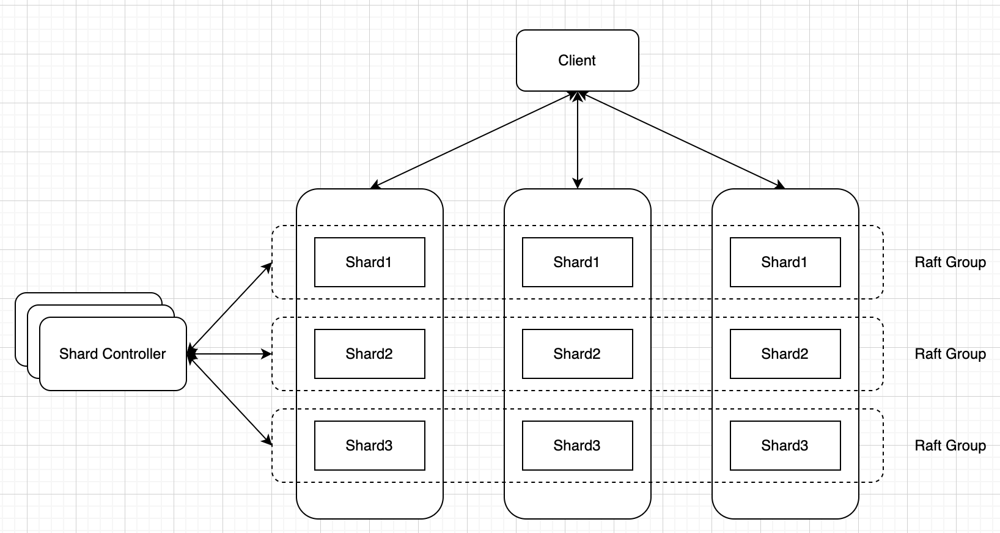

Lab 4总体需要实现一个Sharded Key/Value Service，既然是Sharded，那么我们就需要问两个问题:
1. 根据什么来shard key/value
2. 不同的Server之间怎样对Shard做load balance

对于第一个问题，代码框架已经给出了答案，就是按照key计算出hash，之后再对总的shard数量取余；对于第二个问题，我们把所有的key/value分成不同的shard，以shard为基本单位在server之间移动。总体的情况如下图所示




## 4A

实验的4A部分需要实现图中Shard controller，它作为一个控制中心负责存储shard与各个Raft group之间的对应关系，需要实现`Join`, `Leave`, `Move`和`Query`四种RPC。Shard controller自身同样是一个Raft group，因此我们可以很大程度上照搬lab 3的逻辑，只要加上4中RPC的实现即可

要注意的是在处理`Join`和`Leave`的时候需要对各个shard的分布进行rebalance，确保每个Raft group所分到的shard大致相同，一种解决方法可以是每次计算分到最多和最少shard的两个Raft group的差值，将一半shard从最多的Raft group挪到最少的Raft group去

## 4B

4B的实现感觉比较难，基本上Lab描述里提供的信息不多，要从头到尾设计出一整套流程并且处理各种corner case。我也参考了网上的不少博客和实现，一开始应该都能想到一个大致的思路，在基础的key/value service之上，至少需要添加如下内容

1. 计算client送来的key/value是否属于当前Raft group，如果不是要告知client
2. 添加background goroutine不断从shard controller拉取下一个配置信息
3. 根据配置信息作相应的处理，将shard移交到对应的Raft group

对于1，相对来说没有那么复杂，我们可以使用如下的处理逻辑
```go
shard := key2shard(key)
if kv.config.Conf.Shards[shard] == kv.gid {
	if kv.shardStates[shard] == Serving {
		return OK
	}
	return ErrTimeout
}
return ErrWrongGroup
```
shard在移交过程中没有办法处理客户端请求，因此我们除了检查shard的Raft group是否相同之外，还要检查shard的状态

对于2，首先我们需要确立两个原则，第一所有shard distribution的更改信息必须通过Raft使当前Raft group中的所有server达成一致。因此我们的到新的Config之后需要调用`kv.rf.Start`使其经过Raft层，并且在`applyCh`监听结果，一旦得知Config已被Raft group commit再从server层面handle Config的更改。要注意当某个shard没有处在serving状态的时候不需要更改配置信息。第二就是我们并不是拉取最新的配置，而是拉取当前的下一个配置，因为我们的config变化要一步一步来，不能跳过步骤。在处理Config更改的时候，我们首先计算出要发送那些shard到哪些server，然后发送RPC给对应的server。处理发送来的`HandoffArgs`同样需要调用`kv.rf.Start`，在处理完之后需要告知源Raft group，让其可以删除掉相关的shard

其他的一些细节就不拾人牙慧了，可以参考一下几个博客
1. https://ray-eldath.me/programming/deep-dive-in-6824/
2. https://www.inlighting.org/archives/mit-6.824-notes
3. https://github.com/OneSizeFitsQuorum/MIT6.824-2021