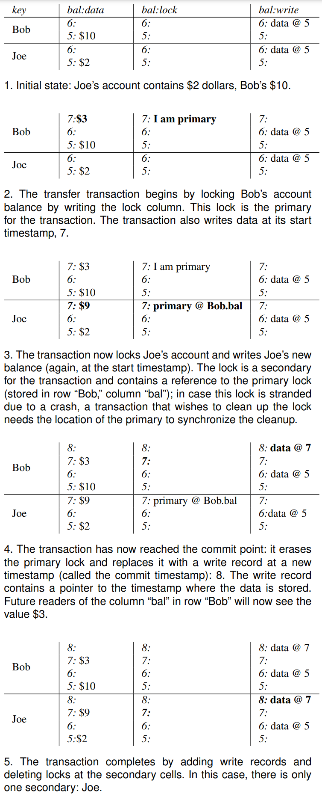

## 1. 分布式事务

### 1.1. 什么是分布式事务
事务是计算机科学领域中的一个抽象，由于其ACID特性屏蔽了底层的实现细节以及错误处理，可以让程序员关注应用逻辑，从而得到了广泛的应用。然而，平时我们讨论的事务时基本都是在讨论单机情况下，也就是说参与事务的所有数据存储在同一个节点(存储和计算的最小单元，可以是一台机器，也可以是一台机器的局部)上，如果参与事务的数据存储在多个节点上，就需要分布式事务

举例来说，假设某个事务中涉及对用户A，B和C数据的改动，由于partition的原因，A，B和C的数据存储在3个不同的节点上，这就需要分布式事务在这个过程中保证即使是多个节点的环境，也能像在同一个节点一样保持ACID等特性。分布式事务目前来看只有一种方法，即Two-phase commit，其他方法都是对它的改进

### 1.2. Two-phase Commit

2PC引入了coordinator的概念，事务开始的时候，由各个节点(participants)自行读写数据。当准备commit的时候，coordinator发起phase 1: 它向所有的participants发送prepare request，如果搜有的participants都回答yes，那么在phase 2 coordinator会给各个participants发送commit request，进而事务commit；如果有任何一个节点回复no，那么coordinator会向所有节点发送abort request

2PC整体的概念如上文所述，似乎平平无奇，为了探究它为什么work，我们探讨一下2PC的详细过程:
1. 当应用准备发起分布式事务的时候，会从coordinator拿到一个transaction id，这个id全局唯一
2. 各个节点开启单机事务过程，并且附上transaction id，如果失败则abort
3. 准备commit时，coordinator向各个participant发送prepare request，若任何timeout或fail则发送abort request
4. 当participant收到prepare request时，它会确保自己在任何情况下都能够commit，包括将数据写入disk并且检查任何conflict。当返回yes的时候相当于是participant放弃了abort transaction的权利
5. Coordinator收到所有prepare response之后要做决定，并且做出的决定必须落盘，以保证即使自己crash重启也能继续，这一步叫做commit point
6. 一旦coordinator的决定落盘之后，commit或者abort request就会发送到所有participants。如果任何的participant fail或者timeout，coordinator必须一直retry直到成功

从以上步骤就可以看出，coordinator是十分关键，如果它在发送prepare request之前fail，那么没有问题，一切都可以挽回。但如果它在发送prepare之后fail或者network partition，问题就很大，因为participants没有任何其他方式得知是否需要commit/abort，只能一直等待，而由于participant执行的是单机事务，它们通常都持有不同的锁，造成其他操作等待，因此2PC的效率往往很低

除了上面提到的问题之外，coordinator需要落盘的特性还意味着coordinator必须能够访问某些durable storage，不管是自身的disk还是其他

## 2. Percolator的原理

在理解了什么是分布式事务以及2PC之后，我们就可以来看看什么是Percolator，它源自于Google的一篇论文[Large-scale Incremental Processing Using Distributed Transactions and Notifications](https://research.google/pubs/pub36726/)。这篇论文其实说了两件事，一个是Percolator事务模型，另一个是基于Percolator的observer增量计算机制，这里我们只关注Percolator

那么Percolator是什么，它解决了什么问题呢？在分析某个新算法/工具之前我们都要问下自己这个问题。简单来说，Percolator是一种2PC算法，它基于具有row transaction的storage(BigTable)实现了分布式事务

用论文里的这张图来展示最为直接，每个key都有3个对应的column: data, lock和write(metadata)



## 3. Percolator的实现

结合PingCAP的分布式事务实验，我们来看一下怎样基于一个具有事务特性的单机badger db实现Percolator，不得不感谢PingCAP为传播分布式系统相关知识所做的工作

具体来说，我们会实现`Get`, `Prewrite`, `Commit`, `Rollback`, `CheckTxnStatus`和`ResolveLock`，它们都属于`Command` interface

### 3.1. Command Interface以及整体流程
```go
// Command is an abstraction which covers the process from receiving a request from gRPC to returning a response.
type Command interface {
	Context() *kvrpcpb.Context
	StartTs() uint64
	// WillWrite returns a list of all keys that might be written by this command. Return nil if the command is readonly.
	WillWrite() [][]byte
	// Read executes a readonly part of the command. Only called if WillWrite returns nil. If the command needs to write
	// to the DB it should return a non-nil set of keys that the command will write.
	Read(txn *mvcc.RoTxn) (interface{}, [][]byte, error)
	// PrepareWrites is for building writes in an mvcc transaction. Commands can also make non-transactional
	// reads and writes using txn. Returning without modifying txn means that no transaction will be executed.
	PrepareWrites(txn *mvcc.MvccTxn) (interface{}, error)
}
```
其中`WillWrite`会返回要写的keys，`Read`执行读取，`PrepareWrites`用来构建些内容。由于每个transaction都有unique identifier，而这个unique identifier就是`start_ts`，`StartTs()`用于返回这个值

在这些行为的具体实现之前，我们来看一下调用流程，搞明白这些command会怎样被使用
```go
// Run runs a transactional command.
func RunCommand(cmd Command, storage storage.Storage, latches *latches.Latches) (interface{}, error) {
	ctxt := cmd.Context()
	var resp interface{}

	keysToWrite := cmd.WillWrite()
	if keysToWrite == nil {
		// The command is readonly or requires access to the DB to determine the keys it will write.
		reader, err := storage.Reader(ctxt)
		if err != nil {
			return nil, err
		}
		txn := mvcc.RoTxn{Reader: reader, StartTS: cmd.StartTs()}
		resp, keysToWrite, err = cmd.Read(&txn)
		reader.Close()
		if err != nil {
			return nil, err
		}
	}

	if keysToWrite != nil {
		// The command will write to the DB.

		latches.WaitForLatches(keysToWrite)
		defer latches.ReleaseLatches(keysToWrite)

		reader, err := storage.Reader(ctxt)
		if err != nil {
			return nil, err
		}
		defer reader.Close()

		// Build an mvcc transaction.
		txn := mvcc.NewTxn(reader, cmd.StartTs())
		resp, err = cmd.PrepareWrites(&txn)
		if err != nil {
			return nil, err
		}

		latches.Validate(&txn, keysToWrite)

		// Building the transaction succeeded without conflict, write all writes to backing storage.
		err = storage.Write(ctxt, txn.Writes())
		if err != nil {
			return nil, err
		}
	}

	return resp, nil
}
```

首先会调用`WillWrite`得到要写的keys，如果没有的话则说明是读command，进而会从storage得到reader并且包装成transaction，最后调用`Read`得到结果；而如果有要写的keys，它同样会从storage得到transaction，进而调用`PrepareWrites`得到要写的具体内容，最后由storage写入


### 3.2. Get

根据Percolator论文，Get流程如下:
1. 检查从0到`start_ts`有没有锁，若有的话说明存在concurrent write，需要backoff
2. 从write column得到从0到`start_ts`最新的写，根据其中的timestamp找到data column里对应的data

```go
func (g *Get) Read(txn *mvcc.RoTxn) (interface{}, [][]byte, error) {
	key := g.request.Key
	log.Debug("read key", zap.Uint64("start_ts", txn.StartTS),
		zap.String("key", hex.EncodeToString(key)))
	response := new(kvrpcpb.GetResponse)

	// YOUR CODE HERE (lab1).
	// Check for locks and their visibilities.
	// Hint: Check the interfaces provided by `mvcc.RoTxn`.
	lock, err := txn.GetLock(key)
	if err != nil {
		return nil, nil, err
	}

	if lock != nil && lock.IsLockedFor(key, g.startTs, response) {
		return response, nil, nil
	}

	// YOUR CODE HERE (lab1).
	// Search writes for a committed value, set results in the response.
	// Hint: Check the interfaces provided by `mvcc.RoTxn`.
	val, err := txn.GetValue(key)
	if err != nil {
		return nil, nil, err
	}

	if val == nil {
		response.NotFound = true
	}
	response.Value = val

	return response, nil, nil
}
```

这里只展示了大致的流程，具体`GetLock`, `IsLockedFor`的实现，可以详细看代码，基本都是通过在key-value上构建不同的key和将key按照时间排序来Seek实现

### 3.3. Prewrite

Prewrite的流程如下:
1. 检查在`start_ts`之后在write column有没有write，如果有则放弃
2. 检查在lock column有没有锁，如果有则放弃
3. 将数据和`start_ts`写入data column，同时也将`start_ts`和primary写入lock column

```go
	// Check for write conflicts.
	// Hint: Check the interafaces provided by `mvcc.MvccTxn`. The error type `kvrpcpb.WriteConflict` is used
	//		 denote to write conflict error, try to set error information properly in the `kvrpcpb.KeyError`
	//		 response.
	_, commitTs, err := txn.RoTxn.MostRecentWrite(key)
	if err != nil {
		return nil, err
	}

	if commitTs >= txn.StartTS {
		return &kvrpcpb.KeyError{Conflict: &kvrpcpb.WriteConflict{
			StartTs:    txn.StartTS,
			ConflictTs: commitTs,
			Key:        key,
			Primary:    p.request.PrimaryLock,
		}}, nil
	}

	// YOUR CODE HERE (lab1).
	// Check if key is locked. Report key is locked error if lock does exist, note the key could be locked
	// by this transaction already and the current prewrite request is stale.
	lock, err := txn.GetLock(key)
	if err != nil {
		return nil, err
	}
	if lock != nil {
		if lock.Kind == mvcc.WriteKindFromProto(mut.Op) && lock.Ts == txn.StartTS {
			return nil, nil
		}
		return &kvrpcpb.KeyError{Locked: lock.Info(key)}, nil
	}

	// YOUR CODE HERE (lab1).
	// Write a lock and value.
	// Hint: Check the interfaces provided by `mvccTxn.Txn`.
	txn.PutLock(key, &mvcc.Lock{
		Primary: p.request.PrimaryLock,
		Ts:      txn.StartTS,
		Ttl:     p.request.LockTtl,
		Kind:    mvcc.WriteKindFromProto(mut.Op),
	})

	switch mut.Op {
	case kvrpcpb.Op_Put:
		txn.PutValue(key, mut.Value)
	case kvrpcpb.Op_Del:
		txn.DeleteValue(key)
	}
```

这里有个要注意的点，就是在检查lock column的时候，有可能这个lock是被同一个transaction写入的，这时候是不冲突的。根据前面的分析，每个transaction的unique identifier就是其`start_ts`，所以这里我们检查lock的类型和时间戳即可

### 3.4. Commit

即使所有的prewrite都已经成功，也不能保证commit一定成功，在commit的时候会检查lock column里有没有自己的lock，如果没有或者lock不属于自己的话，需要做相应的处理，若lock column正常则写入write column并且删除lock column里的lock
```go
	if lock == nil || lock.Ts != txn.StartTS {
		// There is no lock, check the write status.
		existingWrite, ts, err := txn.CurrentWrite(key)
		if err != nil {
			return nil, err
		}
		if existingWrite == nil {
			// YOUR CODE HERE (lab1).
			rollbackWrite := &mvcc.Write{StartTS: txn.StartTS, Kind: mvcc.WriteKindRollback}
			txn.PutWrite(key, txn.StartTS, rollbackWrite)
			return nil, nil
		} else {
			if existingWrite.Kind == mvcc.WriteKindRollback {
				// The key has already been rolled back, so nothing to do.
				return nil, nil
			}

			err := new(kvrpcpb.KeyError)
			err.Abort = fmt.Sprintf("key has already been committed: %v at %d", key, ts)
			respValue := reflect.ValueOf(response)
			reflect.Indirect(respValue).FieldByName("Error").Set(reflect.ValueOf(err))
			return response, nil
		}
	}

	if lock.Kind == mvcc.WriteKindPut {
		txn.DeleteValue(key)
	}

	write := mvcc.Write{StartTS: txn.StartTS, Kind: mvcc.WriteKindRollback}
	txn.PutWrite(key, txn.StartTS, &write)
	txn.DeleteLock(key)
```

### 3.5. Rollback

当transaction决定要fail的时候，它的lock就必须被清除，并且需要在write column写一条rollback记录

```go

	if lock == nil || lock.Ts != txn.StartTS {
		// There is no lock, check the write status.
		existingWrite, ts, err := txn.CurrentWrite(key)
		if err != nil {
			return nil, err
		}

		if existingWrite == nil {
			// YOUR CODE HERE (lab1).
			rollbackWrite := &mvcc.Write{StartTS: txn.StartTS, Kind: mvcc.WriteKindRollback}
			txn.PutWrite(key, txn.StartTS, rollbackWrite)
			return nil, nil
		} else {
			if existingWrite.Kind == mvcc.WriteKindRollback {
				// The key has already been rolled back, so nothing to do.
				return nil, nil
			}

			// The key has already been committed. This should not happen since the client should never send both
			// commit and rollback requests.
			err := new(kvrpcpb.KeyError)
			err.Abort = fmt.Sprintf("key has already been committed: %v at %d", key, ts)
			respValue := reflect.ValueOf(response)
			reflect.Indirect(respValue).FieldByName("Error").Set(reflect.ValueOf(err))
			return response, nil
		}
	}

	if lock.Kind == mvcc.WriteKindPut {
		txn.DeleteValue(key)
	}

	write := mvcc.Write{StartTS: txn.StartTS, Kind: mvcc.WriteKindRollback}
	txn.PutWrite(key, txn.StartTS, &write)
	txn.DeleteLock(key)
```

### 3.6. CheckTxnStatus

我们可以通过检查`primary key`或者`primary lock`的记录来判断某个transaction的情况。如果primary lock是由这个transaction写入并且已经过了ttl，那么可以清理这个transaction，具体方式就是在write column写入rollback并且删除lock，但如果lock还没有过ttl，那么可以认为transaction还在进行中

如果没有primary lock或者现存的lock不是由这个transaction写入，就要看一下write column，如果write column什么都没有，说明这个transaction既没有primary lock也没有write column，这时候就要写入一个rollback到write column，如果write column已经rollback可以什么都不做，但是如果write column有个正常的值，则说明这个transaction已经commit

```go
	lock, err := txn.GetLock(key)
	if err != nil {
		return nil, err
	}
	if lock != nil && lock.Ts == txn.StartTS {
		if physical(lock.Ts)+lock.Ttl < physical(c.request.CurrentTs) {
			// YOUR CODE HERE (lab1).
			// Lock has expired, try to rollback it. `mvcc.WriteKindRollback` could be used to
			// represent the type. Try using the interfaces provided by `mvcc.MvccTxn`.
			log.Info("checkTxnStatus rollback the primary lock as it's expired",
				zap.Uint64("lock.TS", lock.Ts),
				zap.Uint64("physical(lock.TS)", physical(lock.Ts)),
				zap.Uint64("txn.StartTS", txn.StartTS),
				zap.Uint64("currentTS", c.request.CurrentTs),
				zap.Uint64("physical(currentTS)", physical(c.request.CurrentTs)))
			write := mvcc.Write{StartTS: txn.StartTS, Kind: mvcc.WriteKindRollback}
			txn.PutWrite(key, txn.StartTS, &write)
			txn.DeleteLock(key)
			if lock.Kind == mvcc.WriteKindPut {
				txn.DeleteValue(key)
			}

			response.Action = kvrpcpb.Action_TTLExpireRollback
		} else {
			// Lock has not expired, leave it alone.
			response.Action = kvrpcpb.Action_NoAction
			response.LockTtl = lock.Ttl
		}

		return response, nil
	}

	existingWrite, commitTs, err := txn.CurrentWrite(key)
	if err != nil {
		return nil, err
	}
	if existingWrite == nil {
		// YOUR CODE HERE (lab1).
		// The lock never existed, it's still needed to put a rollback record on it so that
		// the stale transaction commands such as prewrite on the key will fail.
		// Note try to set correct `response.Action`,
		// the action types could be found in kvrpcpb.Action_xxx.
		write := mvcc.Write{StartTS: txn.StartTS, Kind: mvcc.WriteKindRollback}
		txn.PutWrite(key, txn.StartTS, &write)

		response.Action = kvrpcpb.Action_LockNotExistRollback

		return response, nil
	}

	if existingWrite.Kind == mvcc.WriteKindRollback {
		// The key has already been rolled back, so nothing to do.
		response.Action = kvrpcpb.Action_NoAction
		return response, nil
	}

	// The key has already been committed.
	response.CommitVersion = commitTs
	response.Action = kvrpcpb.Action_NoAction
```

### 3.7. ResolveLock

当一个事务遇到 Lock 时，可能有几种情况。

- Lock 所属的事务还未提交这个 Key，Lock 尚未被清理
- Lock 所属的事务遇到了不可恢复的错误，正在回滚中，尚未清理 Key
- Lock 所属事务的节点发生了意外错误，例如节点 crash，这个 Lock 所属的节点已经不能够更新它

在 Percolator 协议下，会通过查询 Lock 所属的 Primary Key 来判断事务的状态，但是当读取到一个未完成的事务（Primary Key 的 Lock 尚未被清理）时，我们所期望的，是等待提交中的事物至完成状态，并且清理如 crash 等异常留下的垃圾数据。此时会借助 ttl 来判断事务是否过期，遇到过期事务时则会主动 Rollback 它。

```go
	// A map from start timestamps to commit timestamps which tells us whether a transaction (identified by start ts)
	// has been committed (and if so, then its commit ts) or rolled back (in which case the commit ts is 0).
	commitTs := rl.request.CommitVersion
	response := new(kvrpcpb.ResolveLockResponse)

	log.Info("There keys to resolve",
		zap.Uint64("lockTS", txn.StartTS),
		zap.Int("number", len(rl.keyLocks)),
		zap.Uint64("commit_ts", commitTs))

	var err error
	for _, kl := range rl.keyLocks {
		// YOUR CODE HERE (lab1).
		// Try to commit the key if the transaction is committed already, or try to rollback the key if it's not.
		// The `commitKey` and `rollbackKey` functions could be useful.
		log.Debug("resolve key", zap.String("key", hex.EncodeToString(kl.Key)))
		if commitTs == 0 {
			_, err = rollbackKey(kl.Key, txn, response)
		} else {
			_, err = commitKey(kl.Key, commitTs, txn, response)
		}
		if err != nil {
			return nil, err
		}
	}

```