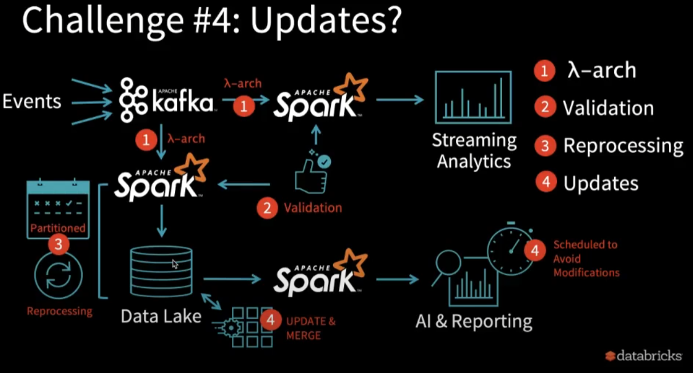
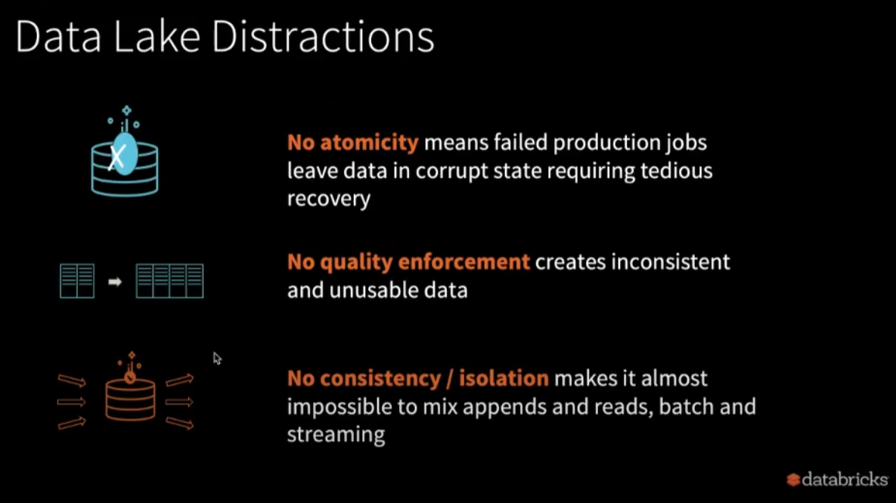
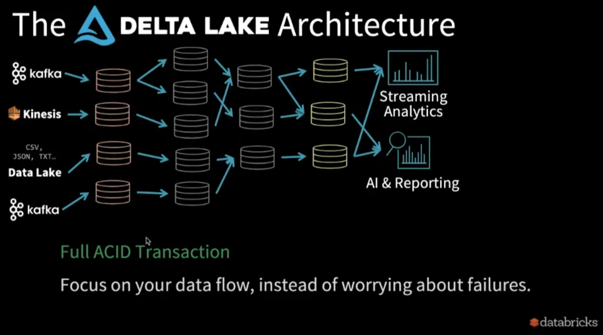
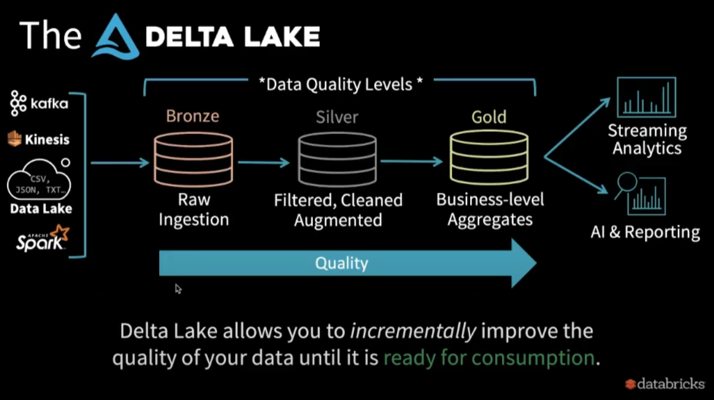
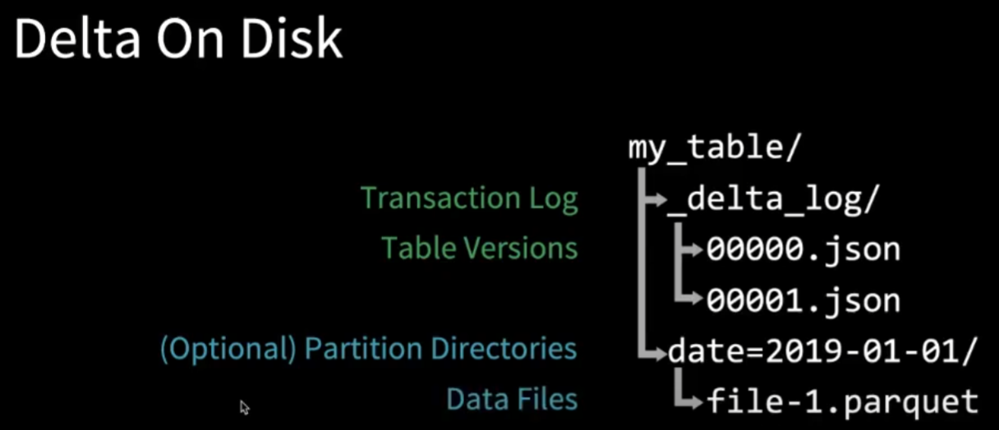
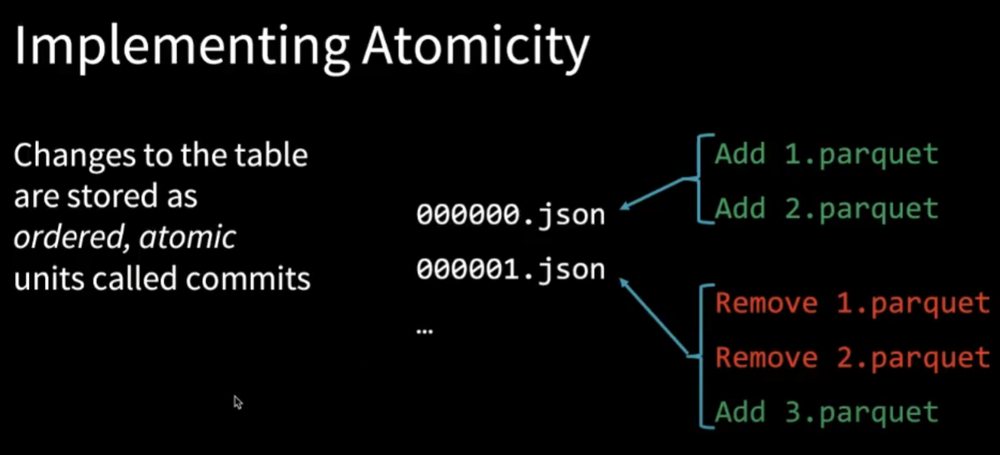
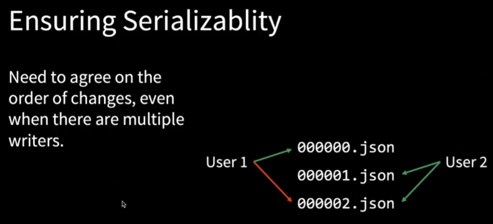
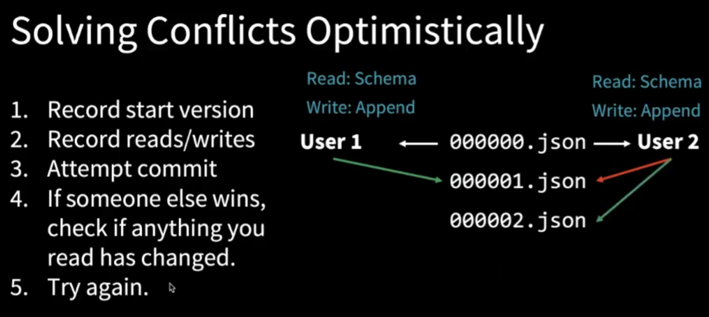
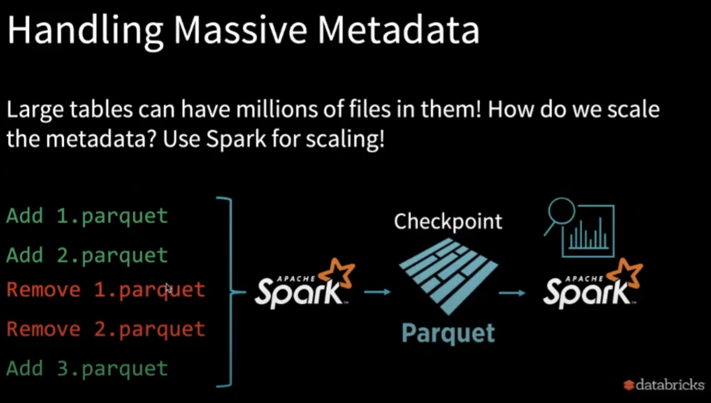

这篇文章来自于Databricks工程师Michael Armbrust的[演讲](https://www.youtube.com/watch?v=whaV6bMaf5o)

## 1. Data Lake

The Promise of the Data Lake:
- Collect Everything
- Store it all in the Data Lake
- Data Science & Machine Learning

Michael说的比较夸张，但他意思是大部分进来的数据都是garbage，因为很难保证quality，那么一个典型的data lake项目应该是什么样的呢:

简单来说，为了解决实时分析和历史分析的问题，加入了lambda architecture；为了解决数据质量的问题，加入了validatioin；为了reprocess某些数据，加入了reprocessing；为了更新某些数据(比如为了隐藏PII)加入了update功能

Data Lake Distractions

## 2. Delta Lake

Delta Lake希望让上面的架构变化为如下的样子

希望能够让data被增量地improve

Bronze阶段
- Dumping group for raw data
- Often with long retention(years)
- Avoid error-prone parsing

Silver阶段
- Immediate data with some cleanup applied
- Querable for easy debugging

Gold阶段
- Clean data, ready for consumption
- Read with Spart or Presto

在data从Bronze -> Silver -> Gold移动的过程中，可以使用stream或者batch

## 3. How does Delta Lake Work

### 3.1. Delta on Disk

可以看到table通过一系列的json file来保存transaction和version的信息，那么怎样使用json来保存table呢？我们可以先思考下table是什么，它其实就是一系列action所造成的结果，如果我们能保存一系列的action，那么也就有了table。而且在Delta Lake中，table中的数据是否可见以能否在json中找到对应的action为准，如果找不到的话，这些parquet file会被自动garbage collected

Table = result of a set of actions
- **Change Metadata** - name, schema, partitioning, etc
- **Add File** - adds a file (with optional statistics)
- **Remove File** - removes a file

Result: Current Metadata, List of Files, list of Txns, Version

### 3.2. Handling Massive Metadata

假设我们有个很大的table，有10 million的file，但我们只想query昨天的数据，首先可以写一个small Spark query来filter metadata来找到与query相关的file，接着使用另一个Spark query来process那些file