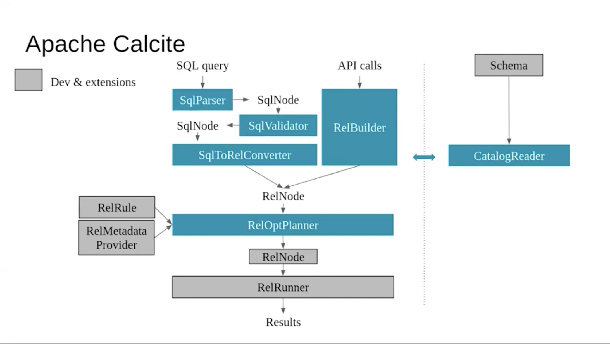
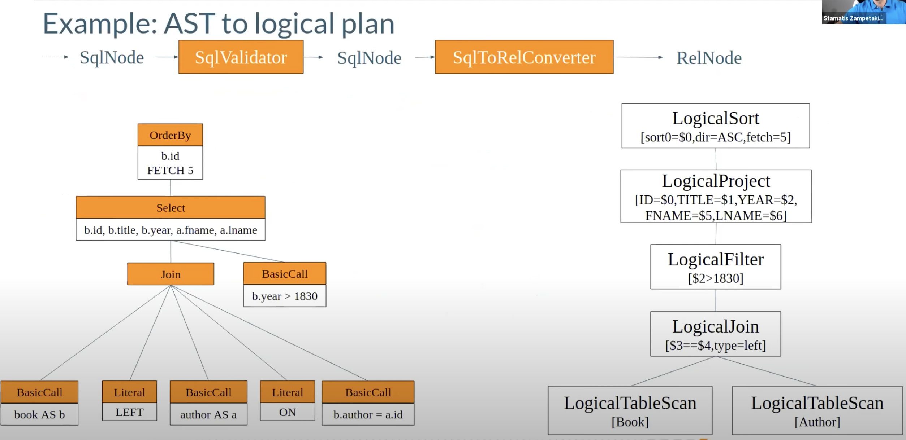
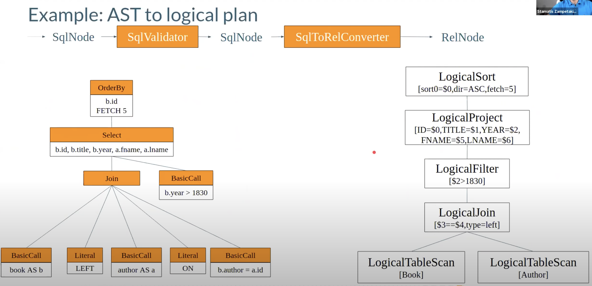
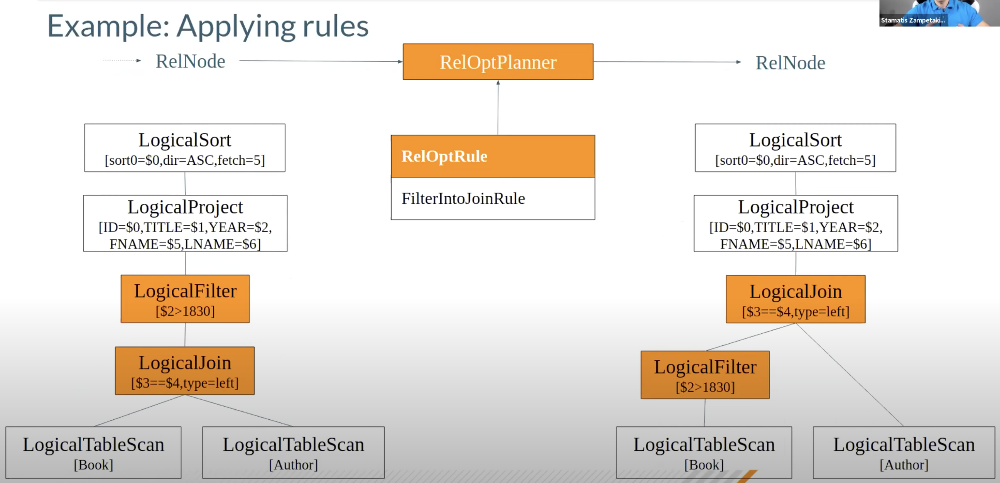

## 1. Apache Calcite

Apache Calcite is a dynamic data management framework. It contains many of the pieces that comprise a typical database management system, but omits some key functions: storage of data, algorithms to process data, and a repository for storing data

### 1.1. Apache Calcite简介

以上是Apache Calcite官方网站对于Calcite的介绍，如果没有相关经验的话，看起来可能会一头雾水，不知道说的是什么。另外我还想大胆的说一句....Calcite官方网站上的Tutorial真的很差，不是说内容不行，而是很避重就轻不得要领...整个看完了还不完全清楚Calcite能干什么以及怎样使用它关键的功能

下面根据自己的理解介绍一下Calcite，我也只是一个初学者，不能保证内容完全正确，如果有错请大家斧正

在关系型数据库中我们通常会使用SQL来查询或者更改数据，而SQL是一种declarative language，它并没有像imperative language一样指定**要怎样做**，只是说了**要做什么**。这样带来的一个好处就是separate of concern，SQL的使用者可以关注逻辑层面，而底层系统的实现者可以在执行SQL的时候做各种各样的优化

渐渐地，因为SQL的良好特性，它的受众越来越多，很多非Software Engineer希望各种各样的数据系统都可以提供一个SQL抽象层，不关注底层的实现。故而，除了在OLTP上使用SQL，也要在OLAP上使用SQL，更进一步地，也要在其他计算/存储系统上使用SQL，比如Spark，Flink和Lucene

那么问题就来了，如果某个系统想要支持SQL应该怎么办呢？每次自己都发明一套轮子实在太繁琐，而且相关人员也不一定有SQL/SQL优化经验，导致执行计划不是最优从而造成性能问题。这时候Calcite就派上用场了，它可以在底层系统之上，提供SQL的一个抽象层，更具体的来说，Calcite可以自定义SQL语法，将SQL转化成AST并对其进行验证，把AST转化成logical plan并进行优化，最终调用底层系统进行具体的操作

一句话总结，Calcite提供了一个可插拔的SQL层，可以套在各个系统之上让其支持SQL

### 1.2. Apache Calcite架构



Calcite的架构如图所示，看起来似乎有点繁杂而且有许多不明觉厉的单词，我们这就来介绍

首先我们需要记住的是Calcite从high-level来看，做两件事情，把SQL query转化成AST，把AST转化成logical plan。在图中可以看到，SQL query通过SqlParser转化成SqlNode，进而被SqlValidate验证，到这一步标志着AST转化成功，所有与Parsing，AST相关的概念基本都以Sql做前缀；接下来经过SqlToRelConverter，这一步就是将AST转化成logical plan，logical plan其实就是关系代数，可以通过关系代数的等价变化logical plan做优化，也就是RelOptPlanner的部分，最后生成结果

在validate和plan的过程中，不可避免的要知道AST中的table，column名称等是否合理。Calcite中有Catalog的概念，包含了相关的metadata信息，所以可以看图中右侧有CatalogReader

### 1.3. Apache Calcite处理流程







## 2. Query to AST

在这一部分我们着重展示一下怎样使用Calcite将SQL query转化成AST

### 2.1. Parsing

既然要进行Parsing，那么就要知道什么样的语法是合法的，Calcite支持通过JavaCC自定义SQL的语法。关于JavaCC可以参考[这篇教程](https://www.cin.ufpe.br/~in1007/transparencias/MaterialApoio/javacc-tutorial.pdf)，是我看到JavaCC最好的介绍，这里简单提一下，JavaCC是Java Compiler Compiler，顾名思义，它是Compiler的Compiler。JavaCC支持根据自定义的语法规则生成parser，而这个parser可以parse任意的代码，判断其是否符合自定义的规则

在这里我们不需要对SQL语法做更改，使用默认的情况就可以，但需要知道怎么改，具体方式就是修改JavaCC定义的语法规则并生成对应的parser
```java
    String sql =
        "SELECT a.id, a.name, SUM(b.score1 * 0.7 + b.score2 * 0.3) AS total_score "
            + "FROM student a "
            + "INNER JOIN exam_result b ON a.id = b.student_id "
            + "WHERE a.age < 20 AND b.score1 > 60.0 "
            + "GROUP BY a.id, a.name";

    // Step 1. Parse
    SqlParser parser = SqlParser.create(sql);
    SqlNode originalSqlNode = parser.parseStmt();
    System.out.println();
    System.out.println(originalSqlNode.toString());
```

我们定义了SQL和parser，并且调用parser去产生AST，结果如下
```sql
SELECT `A`.`ID`, `A`.`NAME`, SUM(`B`.`SCORE1` * 0.7 + `B`.`SCORE2` * 0.3) AS `TOTAL_SCORE`
FROM `STUDENT` AS `A`
INNER JOIN `EXAM_RESULT` AS `B` ON `A`.`ID` = `B`.`STUDENT_ID`
WHERE `A`.`AGE` < 20 AND `B`.`SCORE1` > 60.0
GROUP BY `A`.`ID`, `A`.`NAME`
```

### 2.2. Validate

Validate不仅仅是parse那么简单，Calcite在这一过程中需要知道SQL中的table，column是否合法，SQL中的关键字，operator等等是否合法，所以在创建validator的时候我们要提供这些信息

首先，我们创建schema，也就是SQL里使用的`student`和`exam_result`两个table
```java
    SchemaPlus rootSchema = Frameworks.createRootSchema(true);
    rootSchema.add(
        "USERS",
        new AbstractTable() { // note: add a table
          @Override
          public RelDataType getRowType(final RelDataTypeFactory typeFactory) {
            RelDataTypeFactory.Builder builder = typeFactory.builder();

            builder.add(
                "ID", new BasicSqlType(new RelDataTypeSystemImpl() {}, SqlTypeName.INTEGER));
            builder.add("NAME", new BasicSqlType(new RelDataTypeSystemImpl() {}, SqlTypeName.CHAR));
            builder.add(
                "AGE", new BasicSqlType(new RelDataTypeSystemImpl() {}, SqlTypeName.INTEGER));
            return builder.build();
          }
        });

    rootSchema.add(
        "JOBS",
        new AbstractTable() {
          @Override
          public RelDataType getRowType(final RelDataTypeFactory typeFactory) {
            RelDataTypeFactory.Builder builder = typeFactory.builder();

            builder.add(
                "ID", new BasicSqlType(new RelDataTypeSystemImpl() {}, SqlTypeName.INTEGER));
            builder.add("NAME", new BasicSqlType(new RelDataTypeSystemImpl() {}, SqlTypeName.CHAR));
            builder.add(
                "COMPANY", new BasicSqlType(new RelDataTypeSystemImpl() {}, SqlTypeName.CHAR));
            return builder.build();
          }
        });

    rootSchema.add(
        "CUBE2L_IB00040010_CN000",
        new AbstractTable() {
          public RelDataType getRowType(final RelDataTypeFactory typeFactory) {

            RelDataTypeFactory.Builder builder = typeFactory.builder();
            builder.add(
                "DATE_CD",
                typeFactory.createTypeWithNullability(
                    typeFactory.createSqlType(SqlTypeName.DATE), true));
            builder.add(
                "IDX_VAL",
                typeFactory.createTypeWithNullability(
                    typeFactory.createSqlType(SqlTypeName.BIGINT), true));
            builder.add(
                "test",
                typeFactory.createTypeWithNullability(
                    typeFactory.createSqlType(SqlTypeName.BIGINT), true));
            builder.add(
                "IDX_ID",
                typeFactory.createTypeWithNullability(
                    typeFactory.createSqlType(SqlTypeName.VARCHAR), true));

            return builder.build();
          }
        });
```

接着我们创建`CalciteCatalogReader`
```java
    CalciteConnectionConfig readerConfig =
        CalciteConnectionConfig.DEFAULT.set(CalciteConnectionProperty.CASE_SENSITIVE, "false");
    SqlTypeFactoryImpl defaultTypeFactory = new SqlTypeFactoryImpl(RelDataTypeSystem.DEFAULT);

    CalciteCatalogReader catalogReader =
        new CalciteCatalogReader(
            CalciteSchema.from(rootSchema),
            Collections.emptyList(),
            defaultTypeFactory,
            readerConfig);
```

在`CalciteConnectionConfig`中，我们使用DEFAULT，但是在其上设置`CASE_SENSITIVE`为false，这样就不会因为大小写出问题；`SqlTypeFactoryImpl`提供了SQL所需要的data type信息，这里我们用了其中的一种实现，另一种实现是`JavaTypeFactoryImpl`，将Java的类型转化为Calcite可以读懂的信息

我们传递了4个参数给`CalciteCatalogReader`的构造函数，分别是root schema，默认schema，type factory和reader config

最后我们创建`SqlValidator`并使用它来进行validate
```java
    SqlValidator validator =
        SqlValidatorUtil.newValidator(
            // allow Calcite to know which operators are valid in the system
            SqlStdOperatorTable.instance(),
            catalogReader,
            defaultTypeFactory,
            SqlValidator.Config.DEFAULT);
    SqlNode validatedSqlNode = validator.validate(originalSqlNode);

    System.out.println();
    System.out.println(validatedSqlNode.toString());
```

结果如下
```sql
SELECT `A`.`ID`, `A`.`NAME`, SUM(`B`.`SCORE1` * 0.7 + `B`.`SCORE2` * 0.3) AS `TOTAL_SCORE`
FROM `STUDENT` AS `A`
INNER JOIN `EXAM_RESULT` AS `B` ON `A`.`id` = `B`.`student_id`
WHERE `A`.`age` < 20 AND `B`.`score1` > 60.0
GROUP BY `A`.`id`, `A`.`name`
```

其实看起来并没有什么变化

## 3. AST to Logical Plan

这一步的作用是把经过验证的AST转化成logical plan，也就是关系代数表达，在Calcite中就是Rel开头的相关概念

### 3.1. Convert AST to Rel
```java
    RelOptCluster relOptCluster =
        RelOptCluster.create(new VolcanoPlanner(), new RexBuilder(defaultTypeFactory));

    SqlToRelConverter sqlToRelConverter =
        new SqlToRelConverter(
            // no view expansion
            (type, query, schema, path) -> null,
            validator,
            catalogReader,
            relOptCluster,
            // standard expression noralization (se StandardConvertletTable.INSTANCE)
            StandardConvertletTable.INSTANCE,
            // default configuration (SqlToRelConverter.config())
            SqlToRelConverter.config());

    RelRoot relRoot = sqlToRelConverter.convertQuery(validatedSqlNode, false, true);
    RelNode originalRelNode = relRoot.rel;

    System.out.println();
    System.out.println(RelOptUtil.toString(originalRelNode));
```

首先创建`RelOptCluster`，它是上下文信息，holds information during planning，在参数重传入了VolcanoPlanner和RexBuilder，VolcanoPlanner之后会介绍，RexBuilder是为了创建row level expressions(RexNode)。之后创建`SqlToRelConverter`，参数的介绍可以在comment里看到，最终调用`convertQuery`进行logical planning，结果如下
```
LogicalProject(ID=[$0], NAME=[$1], TOTAL_SCORE=[$2])
  LogicalAggregate(group=[{0, 1}], TOTAL_SCORE=[SUM($2)])
    LogicalProject(id=[$0], name=[$1], $f2=[+(*($5, 0.7:DECIMAL(2, 1)), *($6, 0.3:DECIMAL(2, 1)))])
      LogicalFilter(condition=[AND(<($3, 20), >($5, 60.0:DECIMAL(3, 1)))])
        LogicalJoin(condition=[=($0, $4)], joinType=[inner])
          LogicalTableScan(table=[[student]])
          LogicalTableScan(table=[[exam_result]])
```

### 3.2. 优化阶段

基于关系代数的等价变化，我们可以对logical plan进行优化。既然要进行优化，那么就要提供一个标准，我们是根据什么标准进行优化呢？Calcite中有两种优化策略

**基于规则的优化(RBO)**

基于规则的优化器(Rule-Based Optimizer, RBO)：根据优化规则对关系表达式进行转换，这里的转换是说一个关系表达式经过优化规则后会变成另外一个关系表达式，同时原有表达式会被裁剪掉，经过一系列转换后生成最终的执行计划

RBO 中包含了一套有着严格顺序的优化规则，同样一条SQL，无论读取的表中数据是怎么样的，最后生成的执行计划都是一样的。同时，在RBO中SQL写法的不同很有可能影响最终的执行计划，从而影响执行计划的性能


**基于成本的优化(CBO)**

基于代价的优化器(Cost-Based Optimizer, CBO)：根据优化规则对关系表达式进行转换，这里的转换是说一个关系表达式经过优化规则后会生成另外一个关系表达式，同时原有表达式也会保留，经过一系列转换后会生成多个执行计划，然后CBO会根据统计信息和代价模型(Cost Model)计算每个执行计划的Cost，从中挑选Cost最小的执行计划

由上可知，CBO中有两个依赖：统计信息和代价模型。统计信息的准确与否，代价模型的合理与否都会影响CBO选择最优计划。从上述描述可知，CBO是优于RBO的，原因是RBO是一种只认规则，对数据不敏感的呆板的优化器，而在实际过程中，数据往往是有变化的，通过RBO生成的执行计划很有可能不是最优的。事实上目前各大数据库和大数据计算引擎都倾向于使用CBO，但是对于流式计算引擎来说，使用CBO还是有很大难度的，因为并不能提前预知数据量等信息，这会极大地影响优化效果，CBO主要还是应用在离线的场景。


#### 3.2.1. Planner
Calcite提供了两种planner: HepPlanner和VolcanoPlanner

**HepPlanner**

1. HepPlanner is a heuristic optimizer similar to Spark’s optimizer，与 spark 的优化器相似，HepPlanner 是一个 heuristic 优化器
2. Applies all matching rules until none can be applied：将会匹配所有的 rules 直到一个 rule 被满足
3. Heuristic optimization is faster than cost- based optimization：它比 CBO 更快
4. Risk of infinite recursion if rules make opposing changes to the plan：如果没有每次都不匹配规则，可能会有无限递归风险


**VolcanoPlanner**

1. VolcanoPlanner is a cost-based optimizer：VolcanoPlanner是一个CBO优化器
2. Applies matching rules iteratively, selecting the plan with the cheapest cost on each iteration: 迭代地应用 rules，直到找到cost最小的plan
3. Costs are provided by relational expressions；
4. Not all possible plans can be computed：不会计算所有可能的计划
5. Stops optimization when the cost does not significantly improve through a determinable number of iterations: 根据已知的情况，如果下面的迭代不能带来提升时，这些计划将会停止优化


#### 3.2.2. 优化
```java
    HepProgram hepProgram =
        new HepProgramBuilder()
            .addRuleInstance(CoreRules.FILTER_INTO_JOIN)
            .addRuleInstance(FILTER_TO_CALC)
            .build();

    HepPlanner hepPlanner = new HepPlanner(hepProgram);
    hepPlanner.setRoot(originalRelNode);
    RelNode optimizedRelNode = hepPlanner.findBestExp();

    System.out.println(RelOptUtil.toString(optimizedRelNode));
```

我们首先创建一个`HepProgram`并添加了两条rule，之后调用`findBestExp()`进行优化，结果如下所示
```
LogicalProject(ID=[$0], NAME=[$1], TOTAL_SCORE=[$2])
  LogicalAggregate(group=[{0, 1}], TOTAL_SCORE=[SUM($2)])
    LogicalProject(id=[$0], name=[$1], $f2=[+(*($5, 0.7:DECIMAL(2, 1)), *($6, 0.3:DECIMAL(2, 1)))])
      LogicalJoin(condition=[=($0, $4)], joinType=[inner])
        LogicalCalc(expr#0..3=[{inputs}], expr#4=[20], expr#5=[<($t3, $t4)], proj#0..3=[{exprs}], $condition=[$t5])
          LogicalTableScan(table=[[student]])
        LogicalCalc(expr#0..2=[{inputs}], expr#3=[60.0:DECIMAL(3, 1)], expr#4=[>($t1, $t3)], proj#0..2=[{exprs}], $condition=[$t4])
          LogicalTableScan(table=[[exam_result]])
```

可以看到，和之前的logical plan相比，有两个重要的变化。首先FIlter被push down到了Join以后，第二，Filter被转化成了Calc

#### 3.2.3. Rule的实现

那么这些Rule是怎么实现的呢？既然是一条rule，那么它就需要回答两个问题，什么时候可以apply这条rule以及怎样apply这条rule。我们来看一下`FILTER_TO_CALC`的代码

首先关于什么时候可以apply这条rule
```java
  /** Rule configuration. */
  public interface Config extends RelRule.Config {
    Config DEFAULT = EMPTY
        .withOperandSupplier(b ->
            b.operand(LogicalFilter.class).anyInputs())
        .as(Config.class);

    @Override default FilterToCalcRule toRule() {
      return new FilterToCalcRule(this);
    }
  }
```

虽然有不少不明白的地方，但是核心部分是清楚的，即`b.operand(LogicalFilter.class).anyInputs()`，就是说只要遇到一条Filter就满足match的条件。另外Calcite中rule的match还有另一种写法，就是在Constructor中指定，看起来应该更直观一些，比如在`JoinAssociateRule`中
```java
/**
  * Creates a JoinAssociateRule.
  */
 public JoinAssociateRule(RelBuilderFactory relBuilderFactory) {
   super(
       operand(Join.class,
           operand(Join.class, any()),
           operand(RelSubset.class, any())),
       relBuilderFactory, null);
 }
```

它匹配的logical plan就是
```
join
    join
        any
```

当某个rule被match的时候就会调用`onMatch`
```java
  @Override public void onMatch(RelOptRuleCall call) {
    final LogicalFilter filter = call.rel(0);
    final RelNode rel = filter.getInput();

    // Create a program containing a filter.
    final RexBuilder rexBuilder = filter.getCluster().getRexBuilder();
    final RelDataType inputRowType = rel.getRowType();
    final RexProgramBuilder programBuilder =
        new RexProgramBuilder(inputRowType, rexBuilder);
    programBuilder.addIdentity();
    programBuilder.addCondition(filter.getCondition());
    final RexProgram program = programBuilder.getProgram();

    final LogicalCalc calc = LogicalCalc.create(rel, program);
    call.transformTo(calc);
  }
```

可以看到大致情况是从`LogicalFilter`中提取相关的信息，创建`LogicalCalc`，最后将`LogicalFilter`转化成`LogicalCalc`

另外一个有趣的情况是，在我们configure `HepPlanner`的时候，如果我们调用rule添加的顺序，把`FILTER_TO_CALC`放到前面，产生的plan就会变成这样
```
LogicalProject(ID=[$0], NAME=[$1], TOTAL_SCORE=[$2])
  LogicalAggregate(group=[{0, 1}], TOTAL_SCORE=[SUM($2)])
    LogicalProject(id=[$0], name=[$1], $f2=[+(*($5, 0.7:DECIMAL(2, 1)), *($6, 0.3:DECIMAL(2, 1)))])
      LogicalCalc(expr#0..6=[{inputs}], expr#7=[20], expr#8=[<($t3, $t7)], expr#9=[60.0:DECIMAL(3, 1)], expr#10=[>($t5, $t9)], expr#11=[AND($t8, $t10)], proj#0..6=[{exprs}], $condition=[$t11])
        LogicalJoin(condition=[=($0, $4)], joinType=[inner])
          LogicalTableScan(table=[[student]])
          LogicalTableScan(table=[[exam_result]])
```

所以可以发现，RBO apply rule的规则或者说顺序对于最终的结果也有很大影响

## 4. 总结

对于我来说Apache Calcite比较难上手，原因在于网上比较深入的资料也不多(尤其是官方Tutorial不知所云...)，而且平时也不会接触SQL相关的处理和优化。总的来说，还是希望能从一个Calcite使用者的角度来看它，观其大意并理解怎样使用就好，作为初学者文章里肯定会有不少疏漏之处，可能的话还希望大家指出来，共同进步

## 5. 参考
1. [Apache Calcite 处理流程详解(一)](https://matt33.com/2019/03/07/apache-calcite-process-flow/)
2. [Apache Calcite 优化器详解(二)](https://matt33.com/2019/03/17/apache-calcite-planner/)
3. [Calcite tutorial at BOSS 2021](https://www.youtube.com/watch?v=meI0W12f_nw)
4. [Calcite RBO rule 解析和自定义](https://guosmilesmile.github.io/2020/08/11/Calcite-RBO-rule-%E8%A7%A3%E6%9E%90%E5%92%8C%E8%87%AA%E5%AE%9A%E4%B9%89/)