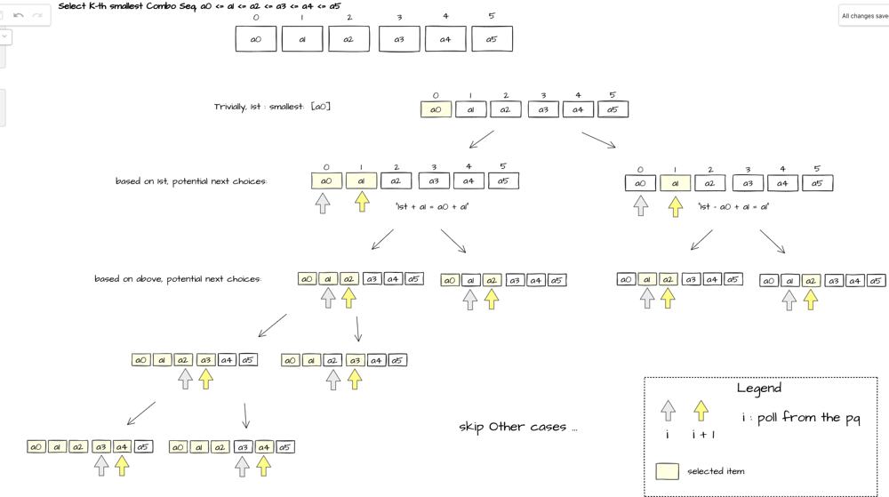

### Minimum Hours of Training to Win a Competition
这道题Contest的时候错了好几次，主要原因是太心急，没有认真理解题意就提交

首先对于energy，可以直接算，初始值要大于sum(energy) + 1；而对于experience，可以从初始不断向后迭代，遇到小于curr experience就加上，大于等于的话则需要锻炼
```python
class Solution:
    def minNumberOfHours(self, initialEnergy: int, initialExperience: int, energy: List[int], experience: List[int]) -> int:
        res = 0
        
        n = len(energy)
        energy_total = sum(energy)
        
        res = 0
        if energy_total >= initialEnergy:
            res = energy_total - initialEnergy + 1

        curr_exp = initialExperience
        for i in range(n):
            if curr_exp <= experience[i]:
                res += experience[i] - curr_exp + 1
                curr_exp = experience[i] * 2 + 1
            else:
                curr_exp += experience[i]
    
        return res
```

### Largest Palindromic Number
这道题目比赛的时候一开始想到的是枚举，但是复杂度有点高。后面提交的方法思路如下，我们首先统计输入中各个数字的数量，之后从9到0依次看每个数字的数量是多少，如果是偶数则分别将一半加在结果的前面和后面，如果是奇数则// 2加在前面和后面，同时还要记录下最大的出现次数为奇数的数字，放到结果中间

这种方法有一些corner case要处理，比如最后要在prefix和suffix中删除0，以及处理全是0的情况
```python
class Solution:
    def largestPalindromic(self, num: str) -> str:
        if not num:
            return ""

        counter = Counter(num)
        
        prefix_builder = []
        suffix_builder = []
        
        max_odd_digit = ""
        for digit in "9876543210":
            if counter[digit] % 2 == 0:
                for _ in range(counter[digit] // 2):
                    prefix_builder.append(digit)
                    suffix_builder.append(digit)
            else:
                for _ in range(counter[digit] // 2):
                    prefix_builder.append(digit)
                    suffix_builder.append(digit)
                if max_odd_digit == "":
                    max_odd_digit = digit
        
        if max_odd_digit != "":
            prefix_builder.append(max_odd_digit)
        
        i, j = 0, len(suffix_builder) - 1
        while i < len(prefix_builder) and prefix_builder[i] == '0':
            i += 1
        prefix_builder = prefix_builder[i:]
        
        while j >= 0 and suffix_builder[j] == '0':
            j -= 1
        
        if j == -1:
            suffix_builder = []
        else:
            suffix_buidler = suffix_builder[:j + 1]
        
        if not prefix_builder and not suffix_builder:
            return "0"
        
        return "".join(prefix_builder) + "".join(reversed(suffix_builder))
```

看了大雪菜的讲解视频，发现思路是类似的，不过他的分别枚举最高位(不能选0)，中间位和剩余位(如果有出现奇数次的数字)，也很清晰

### Amount of Time for Binary Tree to Be Infected
这道应该是最简单的，dfs找关系+bfs
```python
# Definition for a binary tree node.
# class TreeNode:
#     def __init__(self, val=0, left=None, right=None):
#         self.val = val
#         self.left = left
#         self.right = right
class Solution:
    def dfs(self, root, parents, val_to_node):
        if not root:
            return
        
        val_to_node[root.val] = root
        
        if root.left:
            parents[root.left] = root
            self.dfs(root.left, parents, val_to_node)
        
        if root.right:
            parents[root.right] = root
            self.dfs(root.right, parents, val_to_node)
        
    def amountOfTime(self, root: Optional[TreeNode], start: int) -> int:
        if not root:
            return 0

        parents = dict()
        val_to_node = dict()
        self.dfs(root, parents, val_to_node)
        
        queue = deque()
        visited = set()
        
        start_node = val_to_node[start]
        
        queue.append(start_node)
        visited.add(start_node)
        
        step = 0
        while queue:
            size = len(queue)
            # print(size)
            for _ in range(size):
                node = queue.popleft()
                
                if node.left and node.left not in visited:
                    queue.append(node.left)
                    visited.add(node.left)
                
                if node.right and node.right not in visited:
                    queue.append(node.right)
                    visited.add(node.right)
                
                if node in parents and parents[node] not in visited:
                    queue.append(parents[node])
                    visited.add(parents[node])
            
            step += 1
        
        return step - 1
```

### Find the K-Sum of an Array
这道题在比赛的时候没有做出来，只写出来了一种backtrack + heap的暴力做法
```python
class Solution:
    def dfs(self, start, nums, curr_sum, heap, k):
        heappush(heap, curr_sum)
        if len(heap) > k:
            heappop(heap)
        
        n = len(nums)
        for i in range(start, n):
            self.dfs(i + 1, nums, curr_sum + nums[i], heap, k)
        
    def kSum(self, nums: List[int], k: int) -> int:     
        nums.sort()

        heap = []
        self.dfs(0, nums, 0, heap, k)
        
        return heap[0]
```

比赛的时候也想到了先把所有的正数加起来，然后依次减去最小的正数或者加上最大的负数，并且使用heap维护顺序，但是在产生下一个较小数字的时候卡住了，没有想到有效的方法，之后看解答这张图解释地很清楚


代码如下
```python
class Solution:
    def kSum(self, nums: List[int], k: int) -> int:
        curr_sum = sum(num for num in nums if num > 0)
        
        vals = sorted(abs(num) for num in nums)
        heap = [(-curr_sum, 0)]
        for _ in range(k):
            curr_sum, idx = heappop(heap)
            if idx < len(vals):
                heappush(heap, (curr_sum + vals[idx], idx + 1))
                if idx > 0:
                    heappush(heap, (curr_sum - vals[idx - 1] + vals[idx], idx + 1))
        
        return -curr_sum
```