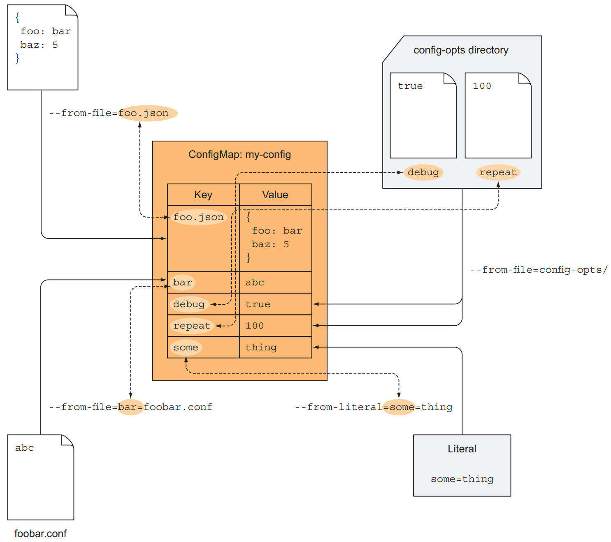

# 1. Introducing Kubernetes

Kubernetes abstracts away the hardware infrastructure and exposes your whole data-center as a single enormous computational resource

## 1.1. 为什么需要Kubernetes类似的系统

在科技公司尤其是互联网公司中，将monolithic application转向microservice architecture是大势所趋，相较于单一的monolithic application来说，microservice在开发，部署和协调方面有一些问题需要解决，比如每个microservice对environment，dependency的需求不同，甚至会有冲突。这就需要provide a consistent environment to applications，保证开发环境和生产环境一致

## 1.2. Container Technologies

Kubernetes uses Linux container technologies to provide isolation of running applications

### 1.2.1. 理解什么是container

与container类似的一个概念是Virtual Machine(VM)，当deploy的程序比较大的时候，使用虚拟机是完全可以的，但在microservice architecture中，对每个microservice都提供一个VM会显得非常浪费。相较于VM，container更加轻量级，a container is nothing more than a single isolated process running in the host OS，中间没有虚拟出的OS一层，因此containers all perform system calls on the exact same kernel running in the host OS. Each VM runs its own set of system services, while containers don't, because they all run in the same OS

那么container是怎样做到在同一个OS上isolate process呢？答案是Linux提供的两种机制
- Linux Namespace: Makes sure each process sees its own personal view of the system(files, processes, network interfaces, hostnames, and so on)
- Linux Control Group(cgroups): Limits the amout of resources the process can consume(CPU, memory, network, bandwidth, and so on)

namespace的概念是针对不同的resource而言，一个process需要各种namespace来使用resource，比如Mount(mnt), Process ID(pid), Network(net)等等，each namespace kind is used to isolate a certain group of resources

### 1.2.2. Docker

Docker有三个主要的概念
- Images: A Docker-based container image is something you package your application and its environment into. Docker images是分层的
- Registries: —A Docker Registry is a repository that stores your Docker images and facilitates easy sharing of those images between different people and computers
- Containers: A Docker-based container is a regular Linux container created from a Docker-based container image

Different images can contain the exact same layers because every Docker image is built on top of another image and two different images can both use the same parent image as their base. 两个具有部分相同layer的docker container可以share文件，因为container image layers are read-only, when a container is run, a new writable layer is created on top of the layers in the image

因为没有提供虚拟的OS层，所以Docker对于系统环境有要求，并不是完全portable。最后需要强调的是，Docker本身并不提供process isolation，真正的container isolation是在Linux kernel level实现(Linux Namespaces and groups)，Docker只是让这些功能更加易于使用


## 1.3. Introducing Kubernetes

Kubernetes is a software system that allows you to easily deploy and manage containerized applications on top of it. It relies on the features of Linux containers to run heterogeneous applications without having to know any internal details of these applications and without having to manually deploy these applications on each host. Kubernetes can be thought as an operating system for the cluster

Kubernetes由两部分组成，control plane和worker notes
- Control Plane
    - Kubernetes API Server: Users and the other Control Plane components communicate with
    - Scheduler: Schedules your apps(assigns a worker node to each deployable component of your application)
    - Control Manager: Performs cluster-level functions, such as replicating components, keeping track of worker nodes, handling node failures, and so on
    - etcd: a reliable distributed data store that persistently stores the cluster configuration
- Nodes
    - Container runtime: Docker/rkt or others, runs your applications
    - Kubelet: Talks to the API server and manages containers on its node
    - Kubernetes Service Proxy(kube-proxy): Load-balances network traffic between application components

To run an application in Kubernetes, you first need to package it up into one or more container images, push those images to an image registry, and then post a description of your app to the Kubernetes API server. Kubernetes continuously makes sure that the deployed state of the application always matches the description you provided

# 2. First steps with Docker and Kubernetes

## 2.1. Creating, running, and sharing a container image
大概有以下五个步骤

1. Install Docker and run your first "Hello world" container
2. Create a trivial Node.js app that you’ll later deploy in Kubernetes
3. Package the app into a container image so you can then run it as an isolated
container
4. Run a container based on the image
5. Push the image to Docker Hub so that anyone anywhere can run it

具体细节不再详述，只记录一些需要关注的点和常用的docker command
```
运行某个Docker image，不指定version的话默认使用latest tag
docker run <image>:<tag>
```
Dockerfile包含一系列指令来build Docker image
```
docker build -t kubia .
```
Docker build process并不发生在Docker client，整个directory的内容都会被上传到Docker daemon并且build image. Docker image并不是一个single, big, binary blob, but is composed of mutiple layers，在build image的时候，a new layer is created for each individual command in the Dockerfile
```
List locally stored images
docker images
```
```
docker run --name kubia-container -p 8080:8080 -d kubia
```
以上命令告诉Docker to run a new container called `kubia-container` from the `kubia` image，`-d`指的是detached mode，在background运行，`-p`指的是将本机的8080端口映射到container里的8080端口
```
List running containers
docker ps

Get additional information about a container
docker inspect kubia-container
```
```
docker exec -it kubia-container bash
```
上面的命令will run `bash` inside the existing `kubia-container` container, `bash`进程会使用与这个container进程相同的Linux namespace，`-i`保证STDIN is kept open，需要使用它来输入command，`-t`会allocate a pseudo terminal(TTY)
```
docker stop kubia-container
docker ps -a
docker rm kubia-container
```
在将Docker image push到repository之前要在之前加上namespace(比如下面的luksa或者shenzhu)
```
docker tag kubia luksa/kubia
docker push luksa/kubia
docker run -p 8080:8080 -d luksa/kubia
```

## 2.2. Setting up a Kubernetes cluster

介绍了使用minikube和在GKE上搭建Kubernetes，具体细节不再赘述
```
kubectl cluster-info
kubectl get nodes
kubectl describe node <node name>
```

## 2.3. Running your first app on Kubernetes
最简单的方法是使用`kubectl run`命令
```
kubectl run kubia --image=luksa/kubia --port=8080 --generator=run/v1
```

Kubernetes并不直接与container打交道，it uses the concept of multiple co-located containers, this group of containers is called a Pod.  A pod is a group of one or more tightly related containers that will always run together on the same worker node and in the same Linux namespace(s). Each pod is like a separate logical machine with its own IP, hostname, processes, and so on, running a single application. All the containers in a pod will appear to be running on the same logical machine

```
kubectl get pods -o wide
kubectl describe pod kubia-hczji
```

# 3. Pods: running containers in Kubernetes

## 3.1. Intorducing pods

Pod is a co-located group of containers and represents he basic building block in Kubernetes. Instead of deploying containers individually, you always deploy and operate on a pod of containers
 
Containers are designed to run only a single process per container, container的设计是每个container只跑一个process, 不然多个process在一起要分别考虑它们的autoscaling, failure-recovery等问题，会比较麻烦. Because you're not supposed to group multiple processes into a single container, it's obvious you need another higher-level construct that will allow you to bind containers together and manage them as a single unit. Kubernetes通过安排同一个pod里的container共享Linux namespace(包括Network和UTS namespace等等), 从而达到共享资源的效果, 也就是partial isolation between containers of the same pod

Pods are logical hosts and behave much like physical hosts or VMs in the non-container world. Processes running in the same pod are like processes running on the same physical or virtual machine, except that each process is encapsulated in a container

Pods are relatively lightweight, you can have as many as you need without incurring almost any overhead

A pod is also the basic unit of scaling, Kubernetes can't horizontally scale individual containers

## 3.2. Creating pods from YAML or JSON descriptors
```
kubectl get po kubia-zxzij -o yaml
```
Pod definition包含的内容
- Kubernetes API version
- Type of resource the YAML is describing
- Metadata: Includes the name, namespace, labels and other information about the pod
- Spec: Contains the actual description of the pod's contents
- Status: Contains the current information about the running pod, read-only
```
kubectl explain pods
kubectl create -f kubia-manual.yaml
kubectl logs kubia-manual(pod name) -c kubia(container name)
kubectl port-forward kubia-manual 8888:8080
```

## 3.3. Organizing pods with labels

As the number of pods increases, the need for categorizing them into subsets becomes more and more evident

Labels are a simple, yet incredibly powerful, Kubernetes feature for organizing not only pods, but all other Kubernetes resources. A label is an arbitrary key-value pair you attach to a resource, which is then utilized when selecting resources using label selectors
```
kubectl get pod --show-labels
kubectl get pod -L creation_method,env
```

## 3.4. Listing subsets of pods through label selectors

Label selectors allow you to select a subset of pods tagged with certain labels and perform an operation on those pods
```
kubectl get po -l creation_method=manual
kubectl get po -l env
kubectl get po -l '!env'
```

## 3.5. Using labels and selectors to constrain pod scheduling

Labels can be attached to any Kubernetes object, including nodes. 可以通过这种方式使得某些pod只会被schedule到某些node上面去, 具体的更改方式参考书本

## 3.6. Annotating pods

In addition to labels, pods and other objects can also contain annotations. Annotations are also key-value pairs, can hold much larger pieces of information and are primarily meant to be used by tools
```
kubectl annotate pod kubia-manual mycompany.com/someannotation="foo bar"
```

## 3.7. Using namespaces to group resources

Kubernetes namespaces provide a scope for object names, you can split them into multiple namespaces, which also allows you to use the same resource name multiple times

并不是所有的resource都会根据namespace来划分, 比如说node这种硬件资源属于global and not tied to a single namespace
```
kubectl get ns
kubectl get pod --namespace kube-system
```

除了isolating resource之外, namespace can also be used for allowing only certain users access to particular resources and even for limiting the amount of computational resources available to individual users

Namespace并不provide any kind of isolation of running objects, 比如说不同的用户将pod deploy到不同的namespace时, 这些pod仍然可以互相交流(根据具体的network设置而定)

## 3.8. Stopping and removing pods
```
kubectl delete pod kubia-gpu
kubectl get pod --namespace kube-system
kubectl delete ns custom-namespace
kubectl delete all --all
```
最后一个命令中, 第一个`all`说明要删除所有类型的resource, 第二个`--all`则说明要删除所有名字的resource instance

# 4. Replication and other controllers: deploying managed pods

Pods represent the basic deployable unit in Kubernetes, 不过在实际中, 我们基本不会直接操作pod, 而是通过其他资源create并且manage pod

## 4.1. Keeping pods healthy

一旦pod被schedule到某个node之后, 所属node的Kubelet会负责run the container and restart the container if the container's main process crashes. 对于container而言, 各种各样错误的可能有很多，如果我们一一在程序中检查相对应的异常并尝试作出处理的话, 很可能没有办法cover所有的case, 故而最好的方法是在外部检测application的health, 发现失败之后交由Kubelet进行重启

### 4.1.1. Intorducing liveness probes

Kubernetes can check if a container is still alive through liveness probes. 一般可以使用以下三种方式
- HTTP GET: 使用HTTP GET到container的IP和host, 检查HTTP response code是否正常
- TCP Socket: 尝试对container的某个port建立TCP connection, 建立成功则说明工作正常
- Exec: Executes an arbitrary command inside the container and checks the command's exit status code, 0则表示正常

### 4.1.2. Creating an HTTP-based liveness probe
```
...
spec:
  containers:
  - image: luksa/kubia-unhealthy
    name: kubia
    livenessProbe:
      httpGet:
        path: /
        port: 8080
```

### 4.1.3. Seeing a liveness probe in action

这部分参考书里的例子, 具体不再详述
```
kubectl logs mypod --previous
```

### 4.1.4. Configuring additional properties of the liveness probe

除了基本的liveness probe之外, 我们还可以定义一些其他的properties
- delay: 在container started之后多久开始进行livenss probe, always remember to set an initial delay to account for your ppa's startup time
- timeout: container must response within this timeout
- period: 多久进行一次probe
- failures: 可以tolerate多少次failure


### 4.1.5. Creating effective liveness probes

对于在production环境下运行的pods都应该定义liveness probe, 不然Kubernetes没有办法知道app是alive, 定义liveness probe的时候有以下的best practice
1. What should check: 比如对于HTTP GET来说, 可以定义一个/health path, 每次访问的时候由app自己进行检测, /health HTTP endpoint shouldn't require authentication
2. Keeping probes light: Livensss probe不应该食用过多的computational resource也不应该太花时间, 另外对于运行在JVM上的app, 要使用HTTP GET而不是Exec probe, 因为Exec probe会spin up a whole new JVM to get the liveness information
3. Don't bother implementing retry loops in your probes
4. Liveness probe wrap-up: Monitor和restart container的工作由node上的Kubelet负责完成

## 4.2. Intorducing ReplicationControllers

### 4.2.1. The operation of a ReplicationController

A ReplicationController constantly monitors the list f running pods and makes sure the actual number of pods of a "type" always matches the desired number

A ReplicationController has 3 parts:
- Label selector: 确定在ReplicationController scope中的pods
- Replica count: Desired number of pods should be running
- Pod template: Used when creaeting new pod replicas, 更改pod template不会影响现有的pods, 只会对将来创建的pods产生影响

### 4.2.2. Creating a ReplicationController

具体语法参考书本, 不再详述

### 4.2.3. Seeing the ReplicationController in action

同上

### 4.2.4. Moving pods in and out of the scope of a ReplicationController

直接更改pod的label即可

### 4.2.5. Changing the pod template

Changing the pod template is like replacing a cookie cutter with another one. It will only affect the cookies you cut out afterward and will not effect on the ones you've already cut

### 4.2.6. Horizontally scalling pods

直接更改ReplicationController即可

### 4.2.7. Deleting a ReplicationController

When you delete a ReplicationController through `kubectl delete`, the pods are also deleted, you can also choose to delete only the ReplicationController and leave the pods running(by passing `--cascade-false` option)

## 4.3. Using ReplicaSets instead of ReplicationControllers

Always create ReplicaSets instead of ReplicationControllers

### 4.3.1. Comparing a ReplicaSet to a ReplicationController

A ReplicaSet behaves exactly like a ReplicationController, but it has more expressive pod selectors

### 4.3.2. Defining a ReplicaSet

具体语法参考书本, 不再详述

### 4.3.3. Creating and examing a ReplicaSet

同上

### 4.3.4. Using the ReplicaSet's more expressive label selectors
```
selector:
  matchExpressions:
    - key: app
      operator: In
      values:
        - kubia
```

如果`matchLabels`和`matchExpressions`都有指定, 那么必须要两个条件都满足才算match

### 4.3.5. Wrapping up ReplicaSets
```
kubectl delete rs kubia
```

## 4.4. Running exactly one pod on each node with DaemonSets

ReplicaSet和ReplicationController只能保证在整个Kubernetes cluster中运行指定数量的pod, 但是对于这些pod在node中的分布则不容易指定. 如果我们希望each node needs to run exactly one instance of the pod, 可以使用`DaemonSet`

### 4.4.1. Using a DaemonSet to run a pod on every node

Pods created by a DaemonSet already have a targe node specified and skip the Kubernetes Scheduler. A DaemonSet makes sure it creates as many pods as there are nodes and deploys each one on its own node

### 4.4.2. Using a DaemonSet to run pods only on certain nodes

使用`nodeSelector`, 具体里的例子见书本

## 4.5. Running pods that perform a single completable task

### 4.5.1. Introducing the Job resource

Kubernetes同时支持`Job` resource, it allows you to run a pod whose container isn't restarted when the process running inside finishes successfully

### 4.5.2. Defining a Job resource

具体例子见书本, 不再详述. 有一个需要注意的property时`restartPolicy`, 默认的值是`Always`, 但是Job pod不能使用这个默认policy, 需要将其设置为`onFailure`或者`Never`

### 4.5.3. Seeing a Job run a pod

在Job执行完之后, pod并不会delete, 方便检查log. The pod will be deleted when you delete it or the Job that created it.

### 4.5.4. Running multiple pod instances in a Job

主要是`completions`和`parallelism`两个property
- completions: Setting completions to 5 makes this Job run five pods sequentially
- parallelism: By setting parallelism to 2, the Job creates two Pods and runs them in parallel

### 4.5.5. Limiting the time allowed for a Job pod to complete

使用`activeDeadlineSeconds`

## 4.6. Scheduling Jobs to run periodically or once in the future

Kubernetes支持`CronJob`, 在指定的时间, Kubernetes will create a Job resource according to the Job template configured in the CronJob object.

### 4.6.1. Creating a CronJob

具体例子见书本, 不再详述 

### 4.6.2. Understanding how scheduled jobs are run

在大概指定的时间, Kubernetes会创建Job, Job进而创建pods, 可以使用`starrtingDeadlineSeconds`规定必须在指定时间多久之后开始, 否则判定为fail

# 5. Services: enabling clients to dicover and talk to pods

对于一些pod来说, 需要对外提供固定的hostname和port, 即使是某些pod fail, 被scale up, scale down, hostname和port也要保持固定. 为此, Kubernetes提供了Services

## 5.1. Services

A Kubernetes Service is a resource you create to make a single, constant point of entry to a group of pods providing the same service, 每个service都有固定的IP地址和port, 并且在service存在过程中不会发生变化, client对这个IP地址和port的链接会被转发到这个service背后的某个pod instance

### 5.1.1. Creating services

创建service使用的YAML descriptor参考书本, 这里不再详述
```
kubectl get svc
```
当我们刚刚创建service并使用上面的command去查看时, 很可能看到我们的service被分配了`CLUSTER-IP`, 但并没有`EXTERNAL-IP`, `CLUSTER-IP`只能在Kubernetes cluster内部中使用

`kubectl exec` command allows us to remotely run arbitrary commands inside an existing container of a pod, 我们可以使用这个命令测试service的`CLUSTER-IP`
```
kubectl exec kubia-7nog1 -- curl -s http://10.111.249.153
```
这里的`--` signals the end of command options for `kubectl`, everything after it is the command that should be executed inside the pod

上面的`CLUSTER-ip`之后对应多个pod, 因此我们的request很可能被转发到任意一个pod, 如果想要all requests made by a certain client to be redirected to the same pod every time, you can set the `sessionAffinity` property to `ClusterIP`(默认为`None`). Kubernetes暂时不支持cookie-based session affinity, 因为Kubernetes Service deal with TCP and UDP packages and don't care about the payload they carry. 因为cookies是在HTTP protocol中, service并不知道它们

另外在创建Service时, 尽量使用named port, 这样就把port number的定义固定在了pod spec中

### 5.1.2. Discovering services

虽然Service的IP地址和port在Service存在期间不会发生改变,  怎么样让其他的Service发现它也是需要考虑的问题, 通常有以下几种方法

#### (1) 使用Environment Variables
当创建pod的时候, Kubernetes会初始化一系列的环境变量, 而这些环境变量指向当时已知的services. If  we create the service before creating the client pods, processes in those pods can get the IP address and port of the service by inspecting their environment variables. 如果我们的Service name为`kubia`, 那么对应的环境变量就是`KUBIA_SERVICE_HOST`, `KUBIA_SERVICE_PORT`, `-`会被转化成`_`
#### (2) 使用DNS
Kubernetes cluster自带DNS server, 任何pod的DNS query都会先经过cluster的DNS server, 而每一个service都会得到fully qualified domain name(FQDN)
```
backend-database.default.svc.cluster.local
<service name>.<namespace>.<configurable cluster domain suffix>
```
我们仍然需要port number, 如果service使用的是默认端口则没问题(80 for HTTP), 否则还是要从environment variable中得到

另外需要注意的是, ssh到某个container中ping service name是行不通的. That's because the service's cluster IP is a virtual IP, and only has meaning when combined with the service port
```
$ kubectl exec -it kubia-3inly bash

root@kubia-3inly:/# curl http://kubia
You’ve hit kubia-8awf3

root@kubia-3inly:/# ping kubia
PING kubia.default.svc.cluster.local (10.111.249.153): 56 data bytes
^C--- kubia.default.svc.cluster.local ping statistics ---
54 packets transmitted, 0 packets received, 100% packet loss
```

## 5.2. Connecting to services living outside the cluster

### 5.2.1. Introducing service endpoints

Services并不是直接与pod打交道, Endpoint在中间起到桥梁的作用. Endpoints resource is a list of IP addresses and ports exposing a service. Service中的pod selector会被用来build a list of IPs and ports, which is then stored in the Endpoint resources. 当client连接到service的时候, service proxy会选择其中一个并且将incoming connection redirect到那里

### 5.2.2. Manually configuring service endpoints

将Service和它的endpoints分开让我们能够分别创建和更新这两种资源, 如果我们创建Service但并没有pod selector的话, Kubernetes不会为其创建endpoint, endpoints are a separate resource and not an attribute of a service

关于如何manually创建endpoint, 见书本

### 5.2.3. Creating an alias for an external service

Create a Service resource with the `type` field set to `ExternalName`. `ExternalName` services are implemented solely at the DNS level-a simpe `CNAME` DNS record is created for the service.

## 5.3. Exposing services to external clients

有以下几种方式to make a service accessible externally:
- Setting the service type to `NodePort`: 对于`NodePort` service, 每个cluster node都会在开一个port并且将这个port收到的traffic redirect到underlying service
- Setting the service type to `LoadBalancer`: 是基于`NodePort`的一种延申, this makes the service accessible through a dedicated load balancer, provisioned from the cloud infrastructure Kubernetes is running on
- Creating an `Ingress` resource: 它在HTTP层工作

### 5.3.1. Using a NodePort service

通过创建`NodePort` service, you make Kubernetes reserve a port on all its nodes and forward incoming connections to the pods that are part of the service

具体的YAML语法见书本, 它本质上是Service的一种类型, 并不是像Endpoint一样是新的resource

缺点是我们只能通过node的ip地址去访问, 如果某个node fail只能手动切换另一个node的ip地址

### 5.3.2. Exposing a service through an external load balancer

The load balancer will have its own unique, publicly accessible IP address and will redirect all connections to your service, 它是`NodePort`的extension

具体的YAML语法见书本, 它本质上也是Service的一种类型

### 5.3.3. Understanding the peculiarities of external connections

在我们使用load balancer时request的流程是`client -> load balander -> pod`, 可见中间多了一层hop. When the connection is received through a node port, the packets' source IP is changed, because Source Network Address Translation(SNAT) is performed on the packets.

## 5.4. Exposing services externally through an Ingress resource

在我们有多个services的时候, 如果使用`LoadBalander`的话那么对于每个service都要创建, 然而`Ingress`只需要创建一个. Ingress operate at the application layer of the network stack(HTTP) and can provide features such as cookie-based session affinity and the like

如果想要使用`Ingress`的话, 整个cluster里必须有Ingress controller, 不同的Kubernetes环境对于controller有不同的实现, 甚至有些会不提供Ingress controller

### 5.4.1. Creating an Ingress resource

具体YAML语法见书本

### 5.4.2. Accessing the service through the Ingress

想要通过URL访问service的话, you need to make sure the domain name resolves to the IP of the Ingress controller, 可以使用下面的命令得到在ingress中domain对应的IP
```
kubectl get ingresses
```


### 5.4.3. Exposing multiple services through the same Ingress

具体语法见书本

### 5.4.4. Configuring Ingress to handle TLS traffic

具体内容见书本

## 5.5. Signling when a pod is ready to accept connections

### 5.5.1. Introducing readiness probes

Liveness probes can keep your apps healthy by ensuring unhealthy containers are restarted automatically. Similar to liveness probes, Kubernetes allows you to also define a readiness probe for your pod. The readiness probe is invoked periodically and determines whether the specific pod should receive client requests or not.

和liveness pod相似, readiness pod也有三种
- Exec probe
- HTTP GET probe
- TCP socket probe: If TCP connection can be established to a specific port of the pod, the container is considered ready

当container start的时候, wait for a configurable amount of time to pass before performing the first readiness check. After that, it invokes the probe periodically and acts based on the result of the readiness probe. 与liveness probe不同的是, if a container fails the readiness check, it won't be killed or restarted. Liveness probes keep pods healthy by killing off unhealthy containers and replacing them with new, healthy ones, whereas readiness probes make sure that only pods that are ready to serve requests receive them

当readiness probe fail的时候, 对应的pod会被移出Endpoints. A readiness probe makes sure clients only talk to those healthy pods and never notice there's anything wrong with the system

### 5.5.2. Adding a readiness probe to a pod

可以通过更改ReplicaSet/ReplicationController的pod template来实现, 但要注意的是更改pod template对现有的pod无效, 只对将来的pod有效

### 5.5.3. Understanding what real-world readiness probes should do

在production service中, always define a readiness probe. If you don't add a readiness probe to your pods, they'll become service endpoints almost immediately, 但实际上service可能还没准备好

## 5.6. Using a headless service for discovering individual pods

对于需要connect所有pod的client, 它需要知道每个pod的IP地址, by setting the `clusterIP` field to `None` in service specification, the DNS server will return the pod IPs instead of the single service IP.

### 5.6.1. Creating a headless service

Setting the `clusterIP` field in a service spec to `None` makes the service headless

### 5.6.2. Discovering pods through DNS

```
$ kubectl exec dnsutils nslookup kubia-headless
...
Name: kubia-headless.default.svc.cluster.local
Address: 10.108.1.4 
Name: kubia-headless.default.svc.cluster.local
Address: 10.108.2.5 
```
当client链接headeless service的时候, DNS会返回所有pod的IP地址, 这时的load balancing为DNS round-robin, 而不是service proxy

### 5.6.3. Discovering all pods-even thoses that aren't ready
```
service.alpha.kubernetes.io/tolerate-unready-endpoints: "true"
```

## 5.7. Troubleshooting services

具体的建议见书本

# 6. Volumes: attaching disk storage to containers

Each container in a pod has its own isolated filesystem, because the file system comes from the container’s image. If container restarted, new container will not see anything that was written to the filesystem by the previous container, even though the newly started container runs in the same pod

Volume是一个pod的概念, 因此无论pod中的container怎样重启, 都能看到volume中的数据, 在同一个pod里多个container也可以使用相同的volume

## 6.1. Introducing volumes

Kubernetes volumes are a component of a pod and are thus defined in the pod's specification. A volume is available to all containers in the pod, but it must be mounted in each container that needs to access it.

### 6.1.1. Explaining volumes in an example


Linux allows you to mount a filesystem at arbitrary locations in the file tree. When you do that, the contents of the mounted filesystem are accessible in the directory it's mounted into

### 6.1.2. Introducing abailable volume types
- emptyDir: A simple empty directory used for storing transient data
- hostPath: Used for mounting directories from the worker node’s filesystem into the pod
- gitRepo: Initialized by checking out the contents of a Git repository
- nfs: An NFS share mounted into the pod
- gcePersistentDisk, awsElasticBlockStore, azureDisk
- cinder, cephfs, iscsi, flocker, glusterfs, quobyte, rbd, flexVolume: Network storage
- configMap, secret, downwardAPI: Special types of volumes
- persistentVolumeClaim - A way to use a pre- or dynamically provisioned persistent storage

A single pod can use multiple volumes of different types at the same time

## 6.2. Using volumes to share data between containers

### 6.2.1. Using an emptyDir volume

`emptyDir`会创建一个空的directory, apps可以向其中写入数据, 但是它作为一个volume, lifetime与pod绑定在一起, 当pod消失的时候其中的数据也会消失. 默认情况下`emptyDir`会在the worker node hosting the pod上创建volume

具体例子和YAML语法见书本

### 6.2.2. Using a Git repository as the starting point for a volume

与`emptyDir`相同, 只不过会预先将指定的repo clone下来, 注意它不会主动去sync remote. 具体的sync工作可以另外创建一个sidecar container完成, sidecar container指的是a container that augments the operation of the main container of the pod

## 6.3. Accessing files on the worker node's filesystem

### 6.3.1. Intorducing the hostPath volume

A `hostPath` volume points to a specific file or directory on the node's filesystem. Pods running on the same node and using the same path in their `hostPath` volume see the same files. 不要使用`hostPath`做DB的storage, pod可能会被schedule到不同的node上面, 因此看到的数据会不同

### 6.3.2. Examing system pods that use hostPath volumes

具体例子见书本, 不要用hostPath存储persistent data, 它应该只用来读写system files

## 6.4. Using persistent storage

### 6.4.1. Using a GCE Persistent Disk in a pod volume

具体例子见书本

### 6.4.2. Using other types of volumes with underlying persistent storage

同上

另外在pod中定义硬件类型不是一个好的选择, 这意味着pod的定义会与具体的cluster联系起来, 不能起到在各处都能运行的效果

## 6.5. Decoupling pods from the underlying storage technology

### 6.5.1. Introducing PersistentVolumes and PersistentVolumeClaims


### 6.5.2. Creating a PersistentVolume

具体语法见书本

PersistentVolumes don't belong to any namespace, they're cluster-level resources like nodes

### 6.5.3. Claiming a PersistentVolume by creating a PersistentVolumeClaim

Need to claim the PersistentVolume first before we can use them in the pods

具体语法见书本

```
kubectl get pvc
```
有三种access modes
- RWO(ReadWriteOnce): 只能被一个node mount并读写
- ROX(ReadOnlyMany): 可以被多个node mount并读
- RWX(ReadWriteMany): 可以被多个node mount并读写

注意以上限制都是针对node而言, 并不是针对pod的数量

### 6.5.4. Using a PersistentVolumeClaim in a pod

具体语法见书本

### 6.5.5. Understanding the benefits of using PersistentVolumes and claims


### 6.5.6. Recycling PersistentVolumes

当pod删除之后, 它所使用PersistentVolumed的状态会显示为`Released`, not `Available`. 在`persistentVolumeReclaimPolicy`为`Retain`的情况下, as far as the aurthor knows(at that time), the only way to manually recycle PersistentVolume to make it available again is to delete and recreate it

另外两种reclaim policy是Recycle和Delete, Recycle会将volume的内容删除并让其available again, 而Delete则会连带内容和volume

## 6.6. Dynamic provisioning of PersistentVolumes

Instead of the administrator pre-provisioning a bunch of PersistentVolumes, they need to define one or two (or more) StorageClasses and let the system create a new PersistentVolume each time one is requested through a PersistentVolumeClaim

### 6.6.1. Defining the available storage types through StorageClass resources

具体例子见书本

### 6.6.2. Requesting the storage class in a PersistentVolumeClaim

After the StorageClass resource is created, users can refer to the storage class by name in their PersistentVolumeClaims.

具体例子见书本

### 6.6.3. Dynamic provisioning without specifying a storage class

Kubernetes会创建一个默认的StorageClass, 如果在PersistenVolumeClaim中没有指定StorageClass的话, 默认的就会使用

Explicitly set storageClassName to "" if you want the PVC to use a preprovisioned PersistentVolume.


# 7. ConfigMaps and Secrets: configuring applications

## 7.1. Configuring containerized applications

一般来说有以下几种方法
- Passing command-line arguments to containers
- Setting custom environment variables for each container
-  Mounting configuration files into containers through a special type of volume

## 7.2. Passing command-line arguments to containers

### 7.2.1 Defining the command and arguments in Docker

The whole command that gets executed in the Docker container is composed fo two parts: the command and the arguments
- ENTRYPOINT: Defines the executable invoked when the container is started
- CMD: Specifies the argument that get passed to the ENTRYPOINT

在定义ENTRYPOINT的时候有两种形式
- shell form: `ENTRYPOINT node app.js`
- exec form: `ENTRYPOINT ["node", "app.js"]`

在shell方式下会先启动一个shell, 然后再在上面启动process, 而这一步是完全不需要的, 所以要使用exec方式

### 7.2.2. Overriding the command and arguments in Kubernetes

在Kubernete中定义pod的时候, 可以override ENTRYPOINT和CMD

## 7.3. Setting environment variables for a container

Like the container’s command and arguments, the list of environment variables also cannot be updated after the pod is created

### 7.3.1. Specifying environment variables in a container definition

具体语法见书本, 不再详述

### 7.3.2. Referring to other environment variables in a variable's value
```
"$(FIRST_VAR)bar"
```

### 7.3.3. Understanding the drawback of hardcoding environment variables

安全性, 复用性

## 7.4. Decoupling configuration with a ConfigMap

### 7.4.1. Introducing ConfigMaps

Kubernetes allows separating configuration options into a separate object called a ConfigMap, which is a map containing key/value pairs with the values ranging from short literals to full config files

An application doesn’t need to read the ConfigMap directly or even know that it exists. The contents of the map are instead passed to containers as either environment variables or as files in a volume 

### 7.4.2. Creating a ConfigMap



### 7.4.3. Passing a ConfigMap entry to a container as an environment variable
`valueFrom`

### 7.4.4. Passing all entries of a ConfigMap as environment variables at once
`envFrom`

### 7.4.5. Passing a ConfigMap entry as a command-line argument

基于environment variable, 在args中指定environment variable

### 7.4.6. Using a ConfigMap volume to expose ConfigMap entries as files

A configMap volume will expose each entry of the ConfigMap as a file

具体例子见书本

Mounting a directory hides existing files in that directory, 可以指定要mount的file, 这样同一个directory的其他文件不会被隐藏

默认情况下configMap volume中的file permission为644(-rw-r-r--), 可以更改

### 7.4.7. Updating an app's config without having to restart the app

更改configMap会导致configMap volume中的内容被更改, container可能会发现这个更改(视具体container中app的逻辑而定). All the files are updated atomically, which means all updates occur at once

One big caveat relates to updating ConfigMap-backed volumes. If you’ve mounted a single file in the container instead of the whole volume, the file will not be updated

If the app does support reloading, modifying the ConfigMap usually isn’t such a big deal, but you do need to be aware that because files in the ConfigMap volumes aren’t updated synchronously across all running instances, the files in individual pods may be out of sync for up to a whole minute