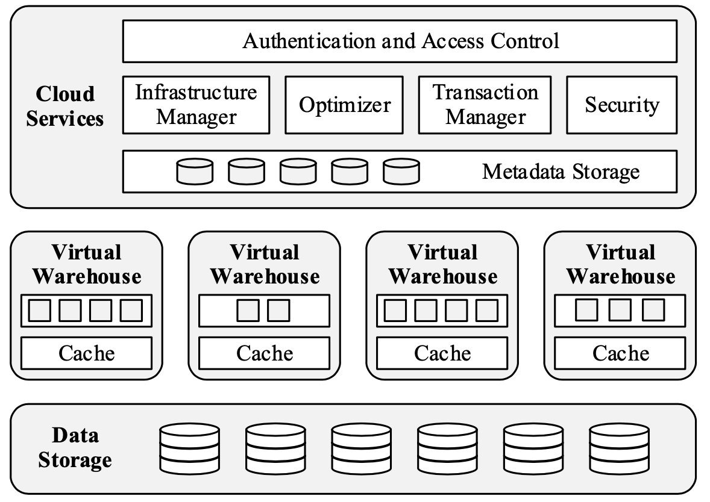
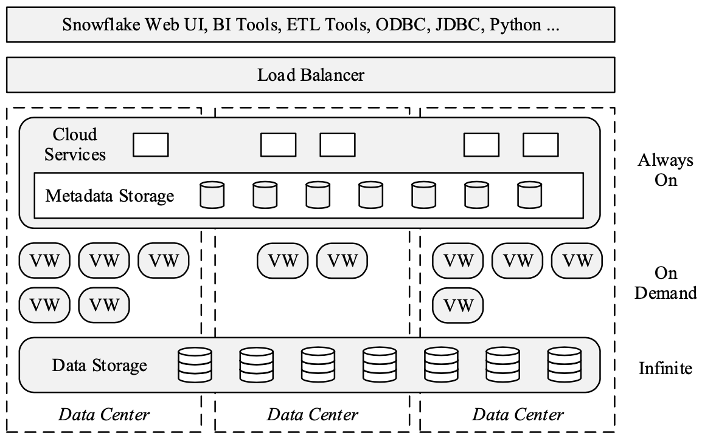
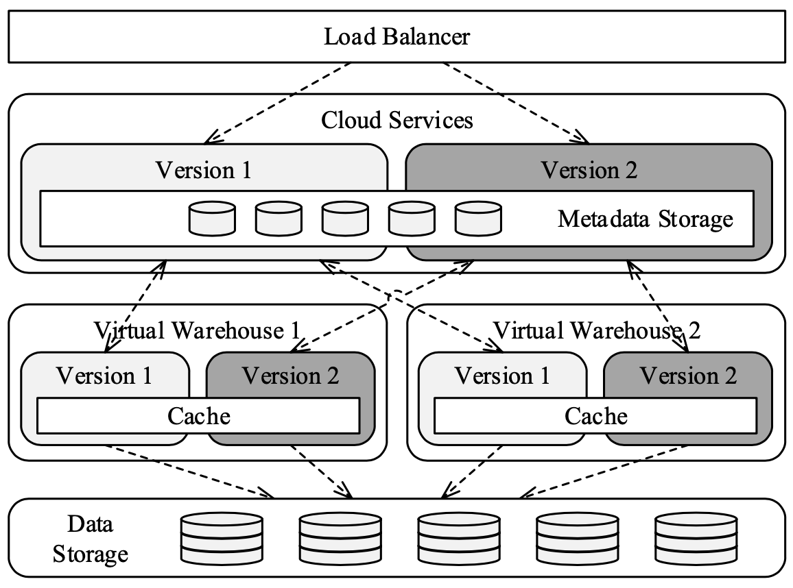

Snowflake is a multi-tenant, transactional, secure, highly scalable and elastic system with full SQL support and built-in extensions for semi-structured and schema-less data.

# 1. Introduction

Snowflake的主要feature
- Pure Software-as-a-Service(SaaS) Experience: buy no machines, no tuning knobs, no physical design, no storage grooming tasks, 使用Web UI就可以操作
- Relational: 支持ANSI SQL和ACID transaction
- Semi-Structured: Offer built-in functions and SQL extensions for traversing, flattening, and nesting of semi-structured data
- Elastic: 计算和存储资源可独立scale
- Highly Available
- Durable
- Cost-efficient: 讲真这点存疑...
- Secure

# 2. Storage Versus Compute

Shared-nothing架构已经成了data warehousing的dominant system architecture，主要由于它的scalability和running on commodity hardware. 在一个纯粹的shared-nothing architecture中, every node has the same responsibilities and runs on the same hardware, 但这种方式也存在缺点
- Heterogeneous Workload: 虽然hardware homogeneous, 但运行在其上的workload却并不总是这样, 有些是I/O-intensive, 有些则是CPU-intensive
- Membership Changes: 在membership变化的时候, large amounts of data need to be reshuffled, 而同时每个node都要负责data shuffling和query processing, 会带来性能问题
- Online Upgrade: 由于每个node都相同, upgrade会涉及到所有的node，比较复杂

由于上面的一些原因, Snowflake separates storage and compute. Compute由Snowflake自身的shared-nothing engine提供, 而storage则使用Amazon S3

# 3. Architecture

Snowflake使用service-oriented architecture, 各个service之间通过RESTful interface交流, 主要分3层
- Data Storage: Amazon S3
- Virtual Warehouse: 使用elastic clusters of virtual machines来处理query execution
- Cloud Services: Collection of services that manage virtual warehouses, queries, transactions and all metadata

## 3.1. Data Storage

S3只支持HTTP(S)-based PUT/GET/DELETE, file不能被append只能overwritten, S3支持range GET. Snowflake的table被horizontally partitioned into large, immutable files which are equivalent to blocks or pages in a traditional database system. Within each file, the values of each attribute or column are grouped together and heavily compressed. Each table file has a header which, among other metadata, contains the offsets of each column within the file

除了table data之外，Snowflake还会使用S3来存储temp data generated by query operators once disk space is exhausted. 但是Metadata such as catalog objects, which table consists of which S3 files, statistics, locks, transaction logs, etc. is stored  in a scalable, transactional key-value store, which is part of the Cloud Services layer

## 3.2. Virtual Warehouses

Virtual Warehouse layer consists of clusters of EC2 instances, 它们纯粹被用来提供计算资源(execute queries), 用户并不需要知道具体用了多少EC2, 而是在从X-Small到XX-Large范围中选择合适的size

VMs are pure compute resources. They can be created, destroyed, or resized at any point, on demand

在运行时VMs会使用LRU cache来缓存table files, 使用file stealing(When ever a worker process completes scanning its set of input files, it requests additional files from its peers, then it retrieves data from S3)来缓解data skew问题

Snowflake的query execution engine有以下特点
- Columnar stroage and execution: Make more effective use of CPU caches and SIMD instructions
- Vectorized execution: Avoid materialization of intermediate results, data is processed in pipelined fashion, in batches of a few thousand rows in columnar format
- Push-based execution: Relation operators push their results to downstream operators rather than waiting for these operators to pull data

所有的major operators(join, group by, sort)都会在memory用完之后将结果写入disk并且将来重复使用

## 3.3. Cloud Services

Cloud Services会负责query management and optimization, 同时它也要处理concurrency control. Snowflake的ACID transaction基于Snapshot Isolation(SI)实现, 在SI, all reads by a transactions see a consistent snapshot of the database as of the time the transaction started. SI is implemented on top of multi-version concurrenty control(MVCC), which means a copy of every changed database object is preserved for some duration(configurable)

Limiting access only to data that is relevant to a given query is one of the most important aspects of query processing. Snowflake并没有使用传统的B+-tree(需要random access和maintain indexes, 并且用户要自己制定哪些index), 而是采用了min-max based pruning, 基本思路就是记录每个chunk of data的range和distribution, 根据query的需要只读相关的chunks

# 4. Feature Highlights
- Pure Software-as-a-Service Experience
- Continuous Availability: Metadata store is also distributed and replicated across multiple AZs. VMs of different versions are able to share the same worker nodes and caches.
- Semi-Structured and Schema-Less Data: 提供了一种新的data type `VARIANT`
- Time Travel and Cloning: Write operations on a table produce a newer version by adding and removing whole files, when files are removed by a new version, they are retained for a configurable duration
- Security

# 5. Summary

总的来看Snowflake的架构在当时来看比较新颖, 非常充分地利用了云计算的基础设施. 最impress到我的还是对系统易用性的强调, 使用Snowflake只需要通过一个WebUI, 其他不需要做任何事情，也不需要调各种参数(比如Kafka/Flink的一对参数), 这对争取各种各样的用户非常重要

# 6. 相关文章
[The Snowflake Elastic Data WareHouse](https://zhuanlan.zhihu.com/p/374475261)