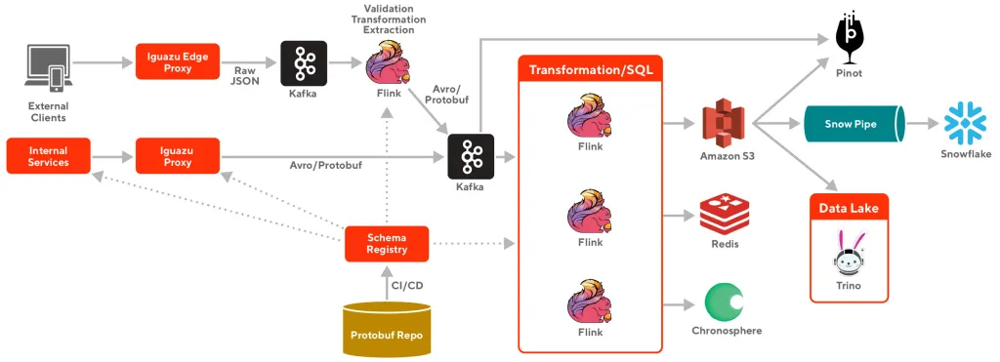
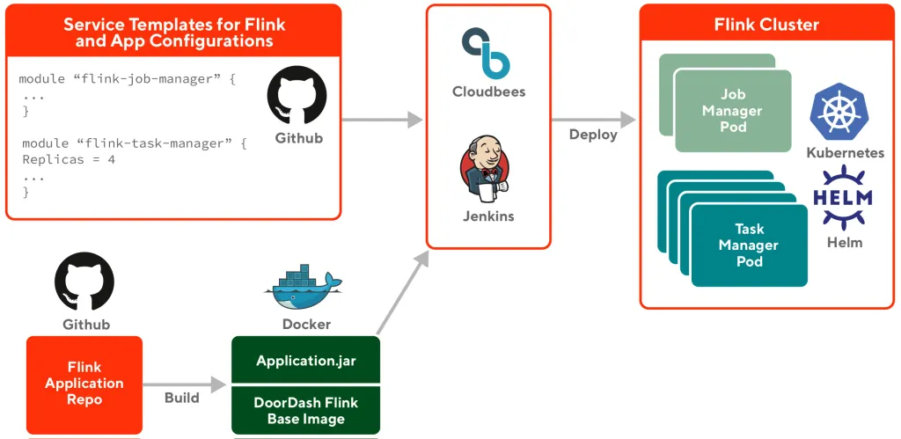
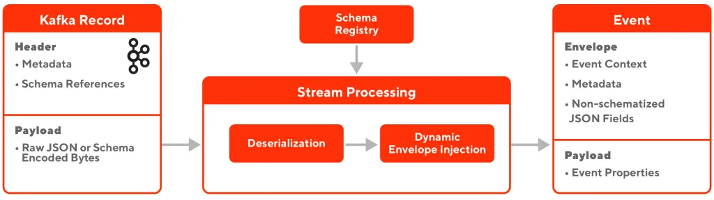
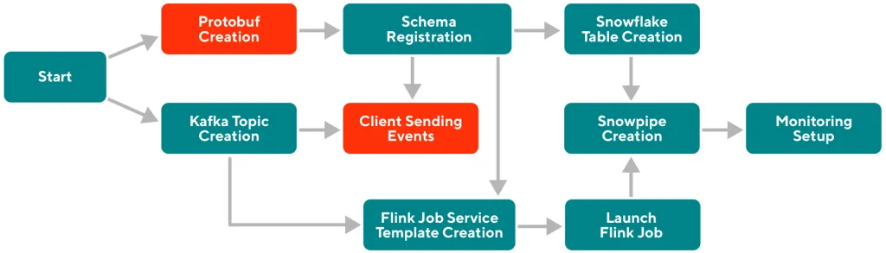

这篇笔记来自于[DoorDash Engineering blog](https://doordash.engineering/2022/08/02/building-scalable-real-time-event-processing-with-kafka-and-flink/)

## Legacy System
早期DoorDash的数据平台如下, 使用Snowflake作为data warehouse


但这种方式有一些问题
- Cost inefficient: 需要构建多个相似的pipeline，成本比较高
- Observability: 将多个种类的data transport, messaging/queueing系统放在一起，对于observability比较困难

结果就是high data latency, significant cost, and operational overhead

### Introducing Iguazu

Iguazu是DoorDash自研的real time event processing system, 解决了以下问题
- Heterogeneous data sources and destinations: 能够从各个不同的source(monolithic web application, microservices and mobile/web devices)获取数据，并且发送到不同的destination
- Easily accessible: 方便各个team使用data stream并且可以customize processing logic
- End-to-end schema enforcement and schema evolution
- Scalable, fault-tolerant, and easy to operator for a small team

将高度依赖AWS和第三方vendor的战略转向使用，定制和整合开源系统，最终的架构如下


## Simplify and optimize event producing

使用Kafka作为pub/sub system

### Leveraging and enhancing Kafka Rest Proxy

使用Kafka最方便的方法应该是创建Kafka client，但是这样做有几个问题
- 如果每个team都要configure Kafka connection的话会有重复工作，而且他们也不一定熟悉Kafka配置
- 不能为Kafka producer提供uniform and optimized configuration
- 在mobile和web application链接Kafka不现实

因此使用了[Confluent Kafka Rest Proxy](https://docs.confluent.io/platform/current/kafka-rest/index.html#confluent-rest-apis)，它提供了一些基本功能
- Supporting different kinds of payload formats, including JSON and binaries
- Supporting batch, which is crucial to reduce processing overhead for both client applications and Kafka brokers
- Integration with Confluent’s schema registry makes it possible to validate and convert the JSON payload with schema

在此之上，DoorDash进行了更改并加入了以下功能
- The capability to produce multiple Kafka clusters
- Asynchronous Kafka producing requests: 在message放到producer的buffer之后就马上返回，但它会导致data loss，优化方法是retry + monitor
- Pre-fetching Kafka topic metadata and producing test Kafka records as part of the Kubernetes pod readiness probe: Warm up cache and Kafka connection来避免冷启动问题
- Supporting Kafka header as port of the proxy produce request payload: 使用Kafka header来避免(de)serialization cost

### optimizaing producer configuration
- 2 for replication factor, 1 for minimal in-sync replica
- 一旦partition leader收到ack就返回成功
- 50ms - 100ms for linger ms to leverage sticky partitioner

上面的操作大概将Kafka broker CPU使用率降低30 - 40%

### Running Rest Proxy in Kubernetes

## Event processing with different abstractions

使用Flink作为processing engine

### Deployment with Helm in Kubernetes

提供基本的Flink docker支持与DoorDash其他的系统整合和发送metrics，每个Flink job作为单独的Kubernetes service使用standalone模式deploy. 使用Terraform Flink template进一步简化开发流程



### Providing SQL Abstraction

```
sources:
  - name: canary_store_order_count
    type: REALTIME
    compute_spec:
      type: RIVIERA
      riviera_spec:
        kafka_sources:
          - cluster: default
            topic: store_timeline_events
            proto_class: "com.doordash.timeline_events.StoreTimelineEvent"

        sql: >-
          SELECT
            store_id as st,
            SUM(CAST(has_store_order_confirmed_data AS INT)) as
                saf_st_p20mi_order_count_sum_canary
          FROM store_timeline_events
          GROUP BY HOP(_time, INTERVAL '20' SECONDS, 
                       INTERVAL '20' MINUTES), 
                   store_id
        resource_config:
          number_task_manager: 2
          memory: "1Gi"
          cpu: "2400m"

features:
  - name: canary_store_order_count
    source: canary_store_order_count
    materialize_spec:
      sink:
        - prod_canary_features
      feature_ttl: 1200
    metadata_spec:
      description: Store Order Sum over 20 minute
```

Deploy Flink SQL只需要创建以上PR，之后CD pipeline会构建Flink job并且deploy

## Event format, serialization, and schema validation

所有的event都有standard envelope and payload(比如creation time, source, metadata, references to schema)，payload含有actual content，并且将non-schematized raw JSON blob放进event里

Internal microservice发出的event都会进行schema validation，mobile/web events则是raw json，会有另外的一套stream processing系统对其进行schema validation/transformation



使用Confluent schema registry，而且不在runtime register schema，因为
- 在有新的event发来时会产生大量的schema update requests，对schema registry造成影响
- incompatible schema change会导致update failure，进而造成runtime error

因此，DoorDash将schema registry update与CI/CD process整合在一起，PR提交的时候CI会validate schema，如果fail的话不允许merge，merge之后CD会自动register/update schema registry

## Data Warehouse Integration

Snowflake仍然是DoorDash主要的data warehouse，与Snowflake的整合主要分为两步

1. Flink会从Kafka获取data并且将其以Parquest file format写入S3，这一步主要是decouple ingest process from Snowflake itself, StreamingFileSink
2. Data会通过Snowpipe从S3 copy到Snowflake, triggered by SQS messages

每种event都有各自的stream processing application for S3 upload and own Snowpipe

## Working towards a self-serve platform

每种event在Iguazu中都有自己从Flink到Snowpipe的pipeline，这就对infra的self-serve和operation有很高的要求

一开始整个过程比较复杂，DoorDash采用[Infrastructure-As-Code](https://en.wikipedia.org/wiki/Infrastructure_as_code)的原则



创建Github App来programmatically create and merge pull requests, 同时使用[Cadence workflow engine](https://cadenceworkflow.io/)来进一步加强automation

为了更进一步提供self-serve，使用[Retool framework](https://retool.com/)创建UI

## Learnings and Future Work
- Create event processing system with a platform mindset，不要轻易被ad-hoc solutions带偏方向
- Picking the right framework, Kafka, Flink, Confluent Rest Proxy, Confluent schema registry
- Try to make system more user friendly and easy to adopt