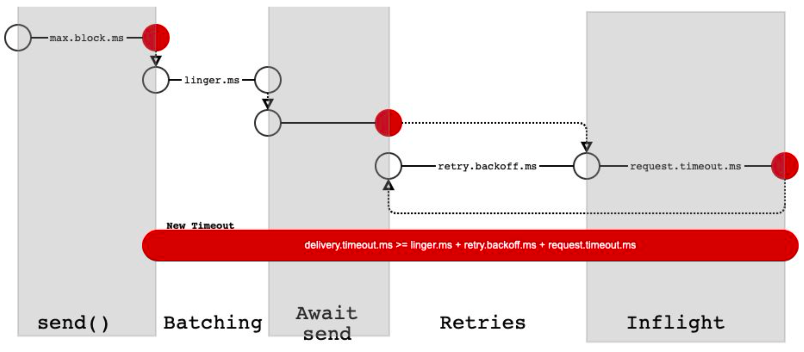
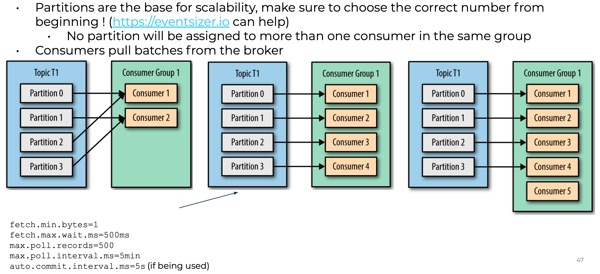
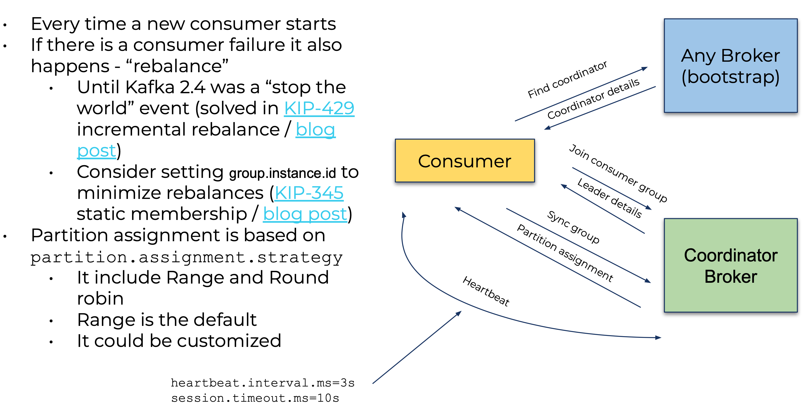
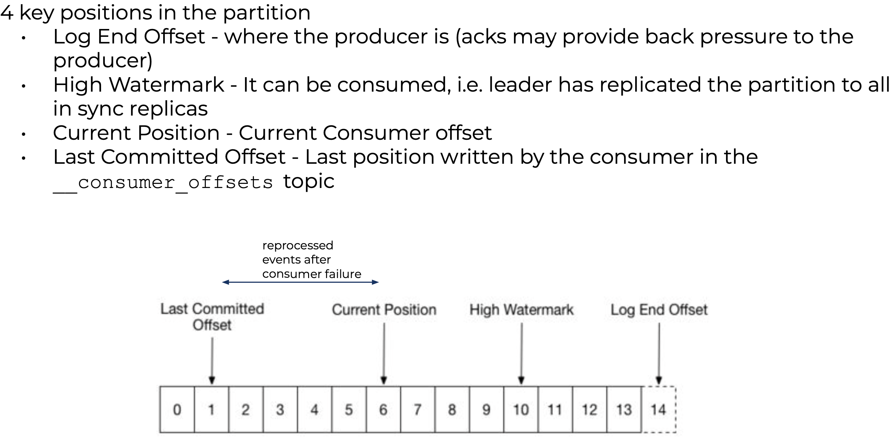

这篇文章来自于Confluent workshop笔记

## 1. Producer Configuration

创建Producer时必须config的parameter分成以下三类
- Kafka access: bootstrap.servers, key.serializer, value.serializer
- Important(optional) parameters: acks, retries, delivery.timeout.ms, idempotence
- Confluent Schema Registry: schema.registry.url

重要的parameter如下

#### acks

多少broker需要ack消息before返回成功，当消息被存到page cache总就算成功，之后会async存储到disk

Java默认acks=1, good for latency; librdkafka默认acks=all, good for durability

acks=all表示leader必须等待所有in-sync replica ack, min in-sync replica的数量同样可调

记得使用callback来catch error
```
Future<RecordMetadata> send(ProducerRecord<K, V> record, Callback callback);

producer.send(record, (metadata, exception) -> {
});
```

#### retries

It will cause the client to resend any record whose send fails with a potentially transient error

Java <= 2.1默认为0，>=2.2默认为infinity，librdkafka默认为2，注意考虑将这个值变大

使用built-in retry，不需要自行实现retry的逻辑，将它从0增加到infinity，`retries * retry.backoff.ms`应该要大于zookeeper timeout

#### delivery.timeout.ms

An upper bound on the time to report success or failure after a call to `send()` returns.



解释一下这张图中的各种time
- max.block.ms: The configuration controls how long the KafkaProducer's `send()`, `partitionsFor()`, `initTransactions()`, `sendOffsetsToTransaction()`, `commitTransaction()` and `abortTransaction()` methods will block. 也就是说当buffer已满，没有办法获取metadata或者transaction coordinator有问题时就会block
- linger.ms: 在buffer中等待batch的时间
- retry.backoff.ms: retry之间的间隔
- request.timeout.ms: Client发送request之后等待response的最大时间，如果没有收到response并且retry次数没有用完的话client就会retry
- delivery.timeout.ms: 在调用`send()`方法返回之后，report success或者failure的time upper bound. 因为`send()`是async，说人话就是在这个时间内，一定能够知道message又没有发送成功，默认值为120000(2分钟)

#### enable.idempotence

在retry的时候可能有重复，设置`enable.idempotence`为true保证了每个message只有1个copy被发送成功

具体方法是给每个message一个UUID，然后broker会检测每个收到message的UUID

关于retry和dedup的总结如下，如果不关心duplicate and ordering
- retries = Inteer.MAX_VALUE
- delivery.timeout.ms = Integer.MAX_VALUE
- max.inflight.requests.per.connection=5(default)

如果不关心duplicate但是关心ordering
- retries = Integer.MAX_VALUE
- delivery.timeout.ms = Integer.MAX_VALUE
- max.inflight.requests.per.connection = 1

如果关心duplicate和ordering
- retires = Integer.MAX_VALUE
- delivery.timeout.ms = Integer.MAX_VALUE
- enable.idempotence = true

## 2. Consumer Configuration

创建Consumer时必须config的parameter分成以下两类
- Kafka: bootstrap.server, key.deserializer, value.deserializer, group.id
- Confluent Schema Registry: schema.registry.url

Consumer会以batch的形式从broker poll messages







普通的Kafka consumer不支持exactly-once semantics, 只有at-least-once

一些可能有用的链接
- [Best Practices for Developing Apache Kafka® Applications on Confluent Cloud](https://assets.confluent.io/m/14397e757459a58d/original/20200205-WP-Best_Practices_for_Developing_Apache_Kafka_Applications_on_Confluent_Cloud.pdf?_ga=2.144525693.978338537.1582532890-95953378.1581329934)
- [Benchmark Your Dedicated Apache Kafka® Cluster on Confluent Cloud](https://assets.confluent.io/m/2d7c883a8aa6a71d/original/20200501-WP-Benchmark_Your_Dedicated_Apache_Kafka_Cluster_on_Confluent_Cloud.pdf)
- [Optimize Kafka for Throughput, Latency, Durability, and Availability](https://www.confluent.io/white-paper/optimizing-your-apache-kafka-deployment/)
- Github confluentinc/jmx-monitoring-stack
- Github jeanlouisboudart/kafka-platform-prometheus