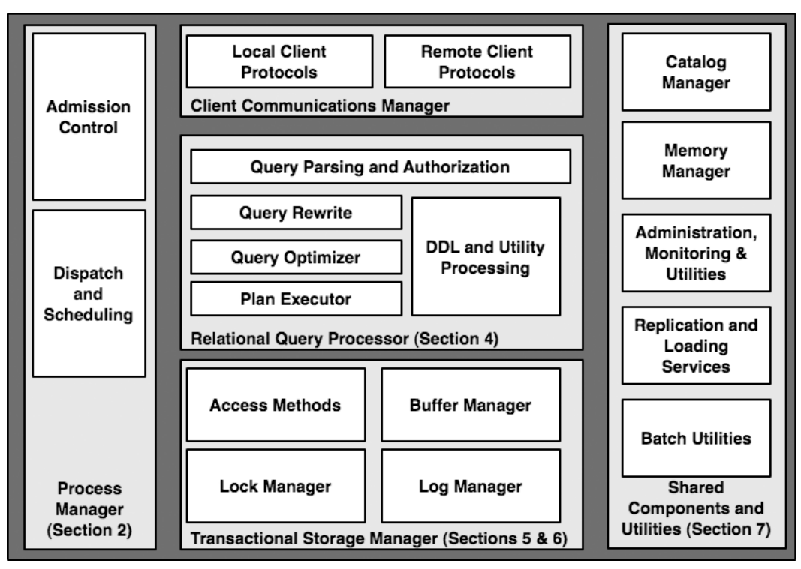
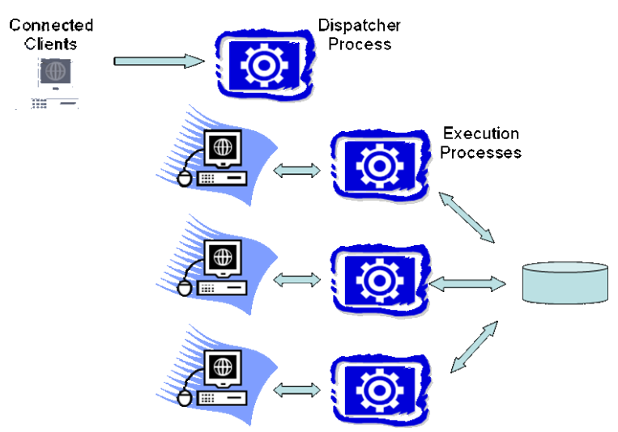
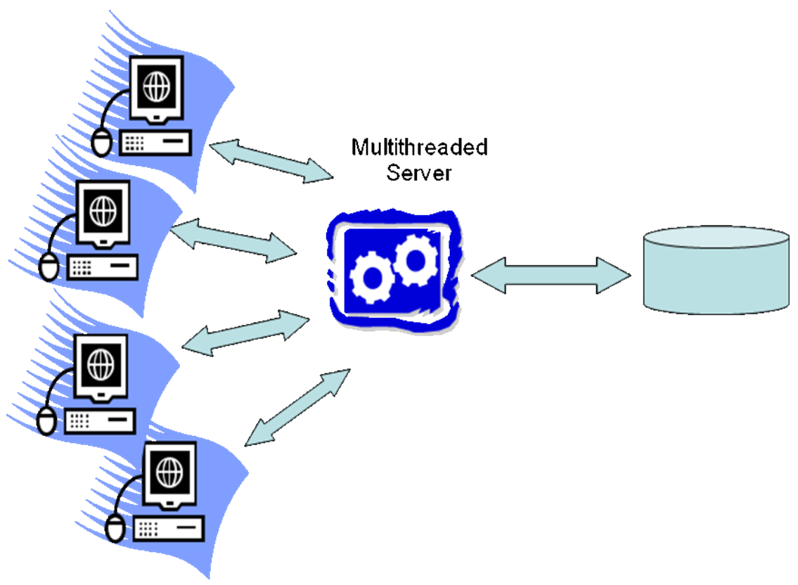
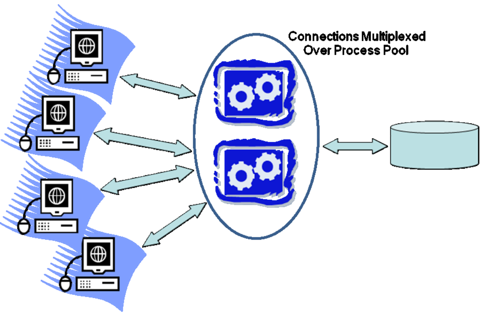
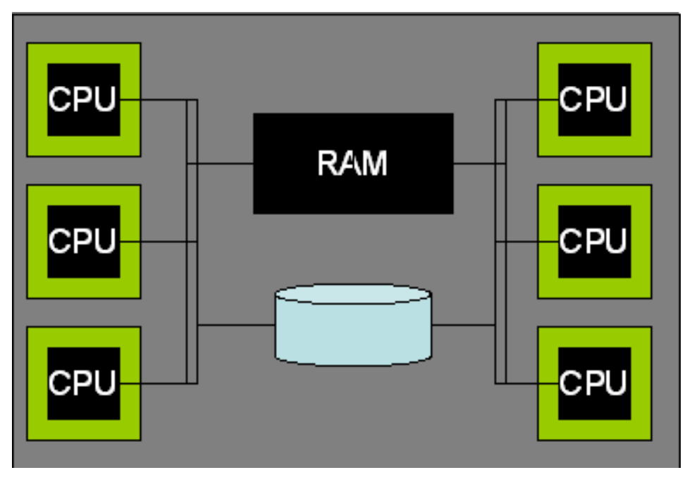
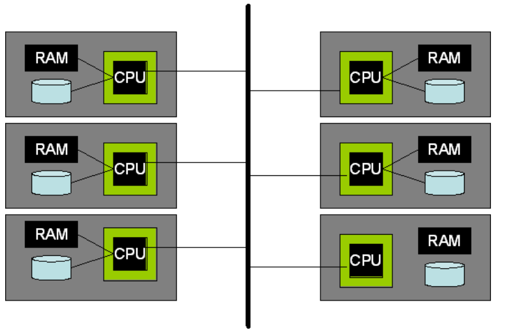
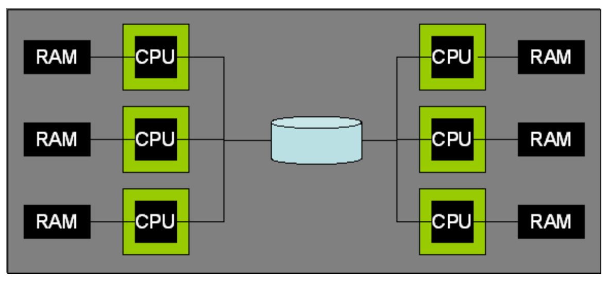
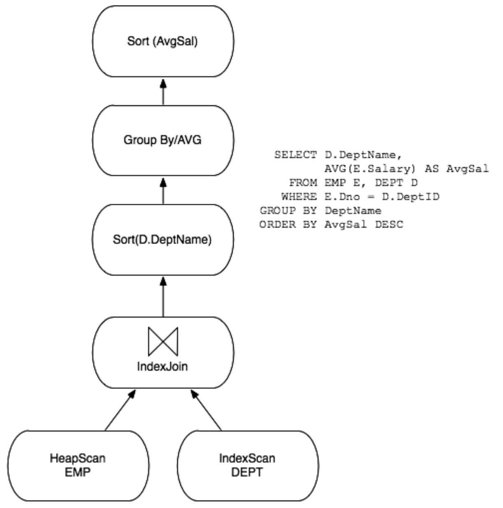

This paper presents an architectural discussion of DBMS design principles, including process models, parallel architecture, storage system design, transaction system implementation, query processor and optimizer architectures, and typical shared components and utilities

# 1. Introduction

## 1.1. Relational Systems: The Life of a Query

The most mature and widely used database systems in production
today are relational database management systems (RDBMSs)



举个例子，single-query transaction的流程大致如下

1. Client端直接(或者通过web server)发送SQL命令. A typical DBMS needs to be compatible with many different connectivity protocols used by various client drivers and middleware systems. Communications manager会负责建立安全连接，记录SQL command以及相关连接信息，将client request转发给DBMS更下层的部分进行处理

2. 收到SQL command之后，会assign a "thread of computation" to that command，在这一步最重要的决定是adminssion control，即根据系统的资源决定要不要现在就执行这个query

3. 当决定要执行之后，会调用Relational Query Processor来进行authorization，将SQL转化成query plan并交给plan executor执行. The plan eecutor consists of a suite of "operators" for executing any query

4. 这些Operators调用Transactional Storage Manager来读取数据

5. For large result sets, the client typically will make additional calls to fetch more data incrementally from the query, resulting in multiple iterations through the communications manager, query executor, and storage manager

The catalog is used by the query processor during authentication, parsing, and query optimization. The memory manager is used throughout the DBMS whenever memory needs to be dynamically allocated or deallocated.

## 1.2. Scope and Overview

这篇论文里, our focus is on architectural fundamentals supporting core database functionality

# 2. Process Models

When designing any multi-user server, early decisions need to be made regarding the execution of concurrent user requests and how these are mapped to operating system processes or threads

一些重要的概念定义如下
- An Operating System Process combines an operating system (OS) program execution unit (a thread of control) with an address space private to the process
- An Operating System Thread is an OS program execution unit without additional private OS context and without a private address space
- A Lightweight Thread Package is an application-level construct that supports multiple threads within a single OS process, a lightweight thread is scheduled in user-space without kernel scheduler involvement or knowledge
- A DBMS Client is the software component that implements the API used by application programs to communicate with a DBMS
- A DBMS Worker is the thread of execution in the DBMS that does work on behalf of a DBMS Client. A 1:1 mapping exists between a DBMS worker and a DBMS Client: the DBMS worker handles all SQL requests from a single DBMS Client

## 2.1. Uniprocessors and Lightweight Threads

我们从简单的情况开始，假设以下两个条件
- OS thread support: 假设OS支kernel threads and that a process can have a very large number of threads
- Uniprocessor hardware: Single machine with a single CPU for machines

在这种假设下，DBMS有三种process model
- process per DBMS worker
- thread per DBMS worker
- process pool

### 2.1.1. Process per DBMS Worker



DBMS workers are mapped directly onto OS processes. 因为peocess的state比较大，所以有大量concurrent connection的时候scale不方便

### 2.1.2. Thread per DBMS Worker

A single multithreaded process hosts all the DBMS worker activity



Each connection is allocated a new thread. As each client submits SQL requests, the request is executed entirely by its corresponding thread running a DBMS worker. 由于各个OS提供的thread API不同，使用这种方式的DBMS移植到不同的平台会有困难

### 2.1.3. Process Pool

Each connection is allocated a new thread. As each client submits SQL requests, the request is executed entirely by its corresponding thread running a DBMS worker



Process pool is often implemented with a dynamically resizable process pool where the pool grows potentially to some maximum number when a large number of concurrent requests arrive

### 2.1.4. Shared Data and Process Boundaries

虽然以上提到的model都尽量在多个request之间提供isolation，但由于它们都在同一个shared database上运行，完全的isolation是不太可能的

在thread per DBMS worker model里，data sharing比较方便，在其他model里，data必须能够从DBMS move to the clients. Therefore, SQL requests need to be moved into the server processes and that all results for return to the client need to be moved back out

这个是由各种buffer pool完成的，两个major types are
- Disk I/O buffers: There are two separate disk I/O scenarios to consider
  - Database I/O Requests: The Buffer Pool, all persistent database data is staged through the DBMS buffer pool. 对于thread per worker model使用heap-resident data structure, 对于另外两个则使用shared memory
  - Log I/O Requests: The Log Tail. The database log is an array of entries stored on one or more disks. They are staged to an in-memory queue that is periodically flushed to the log disk(s) in FIFO order. This queue is usually called the log tail. 对于thread per worker使用heap-resident data structure，而另外两个会使用单独的process来manage log，通过IPC或者shared memory交流
- Client communication buffers:  SQL is typically used in a "pull" model: clients consume result tuples from a query cursor by repeatedly issuing the SQL FETCH request
- Lock table: The lock table is shared by all DBMS workers and is used by the Lock Manager to implement database locking semantics

## 2.2. DBMS Threads

### 2.2.1. DBMS Threads

比较早期的时候OS并不支持高性能的thread，因此DBMS developers需要自行开发

## 2.3. Standard Practice

- Process per DBMS worker: default Oracle process model, PostgreSQL
- Thread per DBMS worker: OS thread per DBMS worker is the model used by MySQL
- Process/thread pool: DBMS workers multiplexed over a process pool/DBMS workers multiplexed over a thead pool, Microsoft SQL Server使用后者

## 2.4. Adminssion Control

DBMS中的sorting或者hash join会占用大量的内存，这时候如果我们继续执行新的query会对已有的query造成影响. Adminssion Control在这种情况下会让新的SQL query等待，虽然这些SQL query的latency增加了，但是整体来看DB的性能保持在峰值

Admission control can be done in two tiers. First, a simple admission control policy may be in the dispatcher process to ensure that the number of client connections is kept below a threshold. Secondly, execution admission controller runs after the query is parsed and optimized, and determines whether a query is postponed, begins execution with fewer resources, or begins execution without additional constraints. 这里的metrics可以包括disk random/sequential I/O, CPU, memory, 其中memory是最重要的

## 2.5. Discussion and Additional Material

近些年来的一个新思路是将worker划分为不同的职责，每个worker负责一部分，这样a single query可以由多个worker负责执行，每一个worker也可以同时执行多个query

# 3. Parallel Architecture: Processes and Memory Coordination

## 3.1. Shared Memory

A shared-memory parallel system is one in which all processors can access the same RAM and disk with roughly the same performance



Multi-core processor的模型与此类似. All three models run well on these systems and support the execution of multiple, independent SQL requests in parallel. The main challenge is to modify the query execution layers to take advantage of the ability to parallelize a single query across multiple CPU

## 3.2. Shared-Nothing

A shared-nothing parallel system is made up of a cluster of independent machines that communicate over a high-speed network interconnect or, increasingly frequently, over commodity networking components



Each system in the cluster stores only a portion of the data. The tables are spread over multiple systems in the cluster using horizontal data partitioning to allow each processor to execute independently of the others

这种方式需要用各种distributed system的算法来保证高可用并要能处理partial failure, the shared-nothing architecture is fairly common today, and has unbeatable scalability and cost characteristics

## 3.3. Shared-Disk

The shared-nothing architecture is fairly common today, and has unbeatable scalability and cost characteristics

Do not have to consider partitioning tables across machines in order to achieve parallelism, the failure of a single DBMS processing node does not affect the other nodes’ ability to access the entire database



Each machine has its own local memory for locks and buffer pool pages. Hence explicit coordination of data sharing across the machines is needed. Shared-disk systems depend upon a distributed lock manager facility

## 3.4. NUMA

Non-Uniform Memory Access (NUMA) systems provide a shared memory programming model over a cluster of systems with independent memories. Local memory本地访问，remote memory通过特定的硬件访问，但相对于local还是有些delay

## 3.5. DBMS Threads and Multi-processors

Thread per worker model在多核情况下会遇到问题，因为这些thread通常是在同一个OS process中，而一个process有没有办法被放到多个core去运行. 同时还会遇到hotspot问题，某个process很忙而其它很闲，这时候就要implement thread migration between processes

## 3.6. Standard Practice

## 3.7. Discussion and Additional Material

新的硬件类型比如多核处理器会带来新的挑战，现有的data center都可能包含成百上千台机器，在这种情况下DBA也忙不过来，必须使用distributed system相关的技术来进行自动化备份和容灾

# 4. Relational Query Processor

A relational query processor takes a declarative SQL statement, validates it, optimizes it into a procedural dataflow execution plan, and (subject to admission control) executes that dataflow program on behalf of a client program

Data Definition Language (DDL) statements such as `CREATE TABLE` and `CREATE INDEX` are typically not processed by the query optimizer. These statements are usually implemented procedurally in static DBMS logic through explicit calls to the storage engine and catalog manager

## 4.1. Query Parsing and Authorization

SQL Parser的任务如下
- Check that the query is correctly specified
- Resolve names and references
- Convert the query into the internal format used by the optimizer
- Verify that the user is authorized to execute the query

在执行过程中，Parser会先去考虑在FROM子句中的table reference并将其转化成`server.database.schema.table`的four part name，接着会调用catalog manager来检查这个table是否被register以及attribute reference是正确的

下一步是authorization，检查user是否有足够的权限执行在query. 有些系统支持row-level security，因此不是所有的authorization都能够交给parser compilation的时候执行, 另外security checking下推到execution time也可以使得query plan能够在多个user之间share. 因此，某些部分的security check会在query plan执行时进行

## 4.2. Query Rewrite

Rewrite module is responsible for simplifying and normalizing the query without changing its semantics, 它不一定是独立的系统，可能被整合到query parser或者query optimization中, rewriter的主要作用如下
- View expansion: For each view reference that appears in the FROM clause, the rewriter retrieves the view definition from the catalog manager
- Constant arithmetic evaluation
- Logical rewriting of predicates
- Semantic optimization: 比如下面的例子，如果对于每个Emp都只有一个Dept的话，那么这个query的join可以完全不需要
```
SELECT Emp.name, Emp.salary
FROM Emp, Dept
WHERE Emp.deptno = Dept.dno
```
- Subquery flattening and other heuristic rewrites

## 4.3. Query Optimizer

The query optimizer’s job is to transform an internal query representation into an efficient query plan for executing the query. A query plan can be thought of as a dataflow diagram that pipes table data through a graph of query operators



To enable cross-platform portability, everymajorDBMS now compiles queries into some kind of interpretable data structure

### 4.3.1. A Note on Query Compilation and Recompilation

SQL supports the ability to “prepare” a query: to pass it through the parser, rewriter and, optimizer, store the resulting query execution plan, and use it in subsequent “execute” statements

DBMSs store these dynamic query execution plans in the query plan cache. If the same (or very similar) statement is subsequently submitted, the cached version is used. As a database changes over time, it often becomes necessary to reoptimize prepared plans. At a minimum, when an index is dropped, any plan that used that index must be removed

## 4.4. Query Executor

The query executor operates on a fully-specified query plan.This is typically a directed dataflow graph that connects operators that encapsulate base-table access and various query execution algorithms

Most modern query executors employ the iterator model that was used in the earliest relational systems
```c++
class iterator {
  iterator &inputs[];
  void init();
  tuple get_next();
  void close();
}
```

### 4.4.1. Iterator Discussion

An important property of iterators is that they couple dataflow with control flow. The get next() call is a standard procedure call that returns a tuple reference to the caller via the call stack. 这样的设计比较清晰而且方便debug

Parallelism and network communications can be encapsulated within special exchange iterators

### 4.4.2. Where's the Data?

In practice, each iterator is pre-allocated a fixed number of tuple descriptors. A tuple descriptor is typically an array of column references, where each column reference is composed of a reference to a tuple somewhere else in memory, and a column offset in that tuple

- BP-tuples: Tuples reside in pages in the buffer pool
- M-tuple: An iterator implementation may allocate space for a tuple on the memory heap

### 4.3.3. Data Modification Statements

Execution plans for these statements typically look like simple straight-line query plans, with a single access method as the source, and a data modification operator at the end of the pipeline

## 4.5. Access Methods

Access methods are the routines that manage access to the various disk-based data structures that the system supports

## 4.6. Data Warehouses

Data Warehouses — large historical databases for decision-support that are loaded with new data on a periodic basis — have evolved to require specialized query processing support

### 4.6.1. Bitmap Indexes

对于sex这种只有两种可能性的value，可以使用one bit per record in a bitmap, the result set can be determined by intersecting bitmaps. The disadvantage of bitmaps is that they are expensive to update, so their utility is restricted to warehouse environments

### 4.6.2. Fast Load

Real time streaming, avoid update-in-place, and provide historical queries

### 4.6.3. Materialized Views

Unlike the purely logical views discussed earlier in this section, materialized views take are actual tables that can be queried, but which correspond to a logical view expression over the true “base” data tables. The materialized view must be kept up to date as updates are performed

### 4.6.4. OLAP and Ad-hoc Query Support

Compute a materialized view which is the aggregate sales by department for each store. Then, if the above region query is specified, it can be satisfied by "rolling up" individual stores in each region, such aggregates are often called data cubes

Clearly, data cubes provide high performance for a predictable, limited class of queries. However, they are generally not helpful for supporting ad-hoc queries

### 4.6.5. Optimization for Snowflake Schema Queries

针对star schema和snowflake schema作特定优化

### 4.6.6. Data Warehousing: Conclusions

As can be seen, data warehouses require quite different capabilities from OLTP environments. In addition to B+-trees, one needs bitmap indexes. Instead of a general purpose optimizer, one needs to focus special attention on aggregate queries over snowflake schemas. Instead of normal views, one requires materialized views. Instead of fast transactional updates, one needs fast bulk load, etc

Column stores may have a huge advantage in the data warehouse space versus traditional storage engines in which the unit of storage is a table row

### 4.7. Database Extensibility

### 4.7.1. Abstract Data Types

为了支持多个ADT，parser在工作的时候必须与catalog交互，因为那里保存着这些ADT的信息，以及怎样和它们进行交互

To make abstract data types run efficiently in the DBMS, the query optimizer has to account for “expensive” user-defined code in selection and join predicates, and in some cases postpone selections until after joins

### 4.7.2. Structured Types and XML

3种做法
- 设计custom database system来处理(逐渐被淘汰)
- 当作一个单独的ADT
- 只存储reference，在query时去拿真正的数据

### 4.7.3. Full-Text Search

A key challenge in handling full-text search in a relational database is to bridge the semantics of relational queries (unordered and complete sets of results) with ranked document search using keywords (ordered and typically incomplete results) in a way that is useful and flexible

### 4.7.4. Additional Extensibility Issues

- 让optimizer变得extensible: Most schemes provide rule-driven subsystems that generate or modify query plans, and allow new optimization rules to be registere independently
- Wrap remote data: The optimizer may need to handle data sources that do not support scans, but will respond requests

## 4.8. Standard Practice

基本上所有的关系型数据库的query engine架构斗鱼system R prototype类似. Major design differences across systems arise in the optimizer search strategy (top-down vs. bottom-up), and in the query executor control-flow model, especially for shared-nothing and shared-disk parallelism (iterators and the exchange operator vs. asynchronous producer/consumer schemes)

## 4.9. Discussion and Additional Material

Beyond traditional query processing, there has been a great deal of work in recent years to incorporate rich statistical methods into the processing of large data sets

Another important but more fundamental extension has been to include "data mining" techniques in the DBMS

Finally, it is worth noting that the broader computing community has recently become excited by data parallelism, as embodied by frameworks like Google’s Map-Reduce

# 5. Storage Management

一般有两种DBMS storage managers
- DBMS interacts directly with the low-level block-mode device drivers for ths disks
- DBMS uses standard OS file system facilities

## 5.1. Spatial Control

Tt is critical for the DBMS storage manager to place blocks on the disk such that queries that require large amounts of data can access it sequentially

Since the DBMS can understand its workload access patterns more deeply than the underlying OS, it makes sense for DBMS architects to exercise full control over the spatial positioning of database blocks on disk

但是这种方式的作用正在渐渐消失，因为者通常会需要DBA将整块硬盘都给DBMS，并且这种raw disk access通常是OS-specific，增加了移植的困难

An alternative to raw disk access is for the DBMS to create a very large file in the OS file system, and to manage positioning of data as offsets in that file

## 5.2. Temporal Control: Buffering

In addition to controlling where on the disk data should be placed, a DBMS must control when data gets physically written to the disk

如果DBMS直接使用file system interface来写数据的话，OS的buffering会带来很大的影响，主要体现在两个方面
- Correctness: DBMS的ACID依赖于DBMS能够explicitly control the timing and ordering of disk writes
- Performance: File system logic depends on the contiguity of physical byte offsets in files to make read ahead decisions. DBMS-level I/O facilities can support logical predictive I/O decisions，而这两者有时候是不一样的，比如table中的next row不一定与上一个row在同一个连续的文件块里
- Double buffering: On reads, data is first copied from the disk
to the OS buffer, and then copied again to the DBMS buffer pool. On writes, both of these copies are required in reverse. Copying data in memory can be a serious bottleneck. Copies contribute latency, consume CPU cycles, and can flood the CPU data cache

## 5.3. Buffer Management

In order to provide efficient access to database pages, every DBMS implements a large shared buffer pool in its own memory space. The buffer pool is organized as an array of frames, where each frame is a region of memory the size of a database disk block. Blocks are copied into the buffer pool from disk without format change, manipulated in memory in this native format, and later written back

Associated with the array of buffer pool frames is a hash table that maps
- page numbers currently held in memory to their location in
the frame table
- the location for that page on backing disk storage,
- some metadata about the page

# 6. Transactions: Concurrency Control and Recovery

Transactional storage manager typically encompasses four deeplyintertwined components
- A lock manager for concurrency control
- A log manager for recovery
- A buffer pool for staging database I/Os.
- Access methods for organizing data on disk

## 6.1. A Note on ACID

- Atomicity is the "all or nothing" guarantee for transactions — either all of a transaction’s actions commit or none do
- Consistency is an application-specific guarantee
- Isolation is a guarantee to application writers that two concurrent transactions will not see each other’s in-flight (notyet-committed) updates
- Durability is a guarantee that the updates of a committed transaction will be visible in the database to subsequent transactions independent of subsequent hardware or software errors, until such time as they are overwritten by another committed transaction

Roughly speaking, modern DBMSs implement isolation via a locking protocol. Durability is typically implemented via logging and recovery. Isolation and Atomicity are guaranteed by a combination of locking (to prevent visibility of transient database states), and logging (to ensure correctness of data that is visible). Consistency is managed by runtime checks in the query executor

## 6.2. A Brief Review of Serializability

Serializability  dictates that a sequence of interleaved actions for multiple committing transactions must correspond to some serial execution of the transactions — as though there were no parallel execution at all

There are three broad techniques of concurrency control enforcement
- Strict two-phase locking (2PL): 读的时候获取shared lock，写的时候获取exclusive lock
- Multi-Version Concurrency Control (MVCC): Transactions do not hold locks, but instead are guaranteed a consistent view of the database state at some time in the past
- Optimistic Concurrency Control (OCC): Transactions自行维护读和写，在commit之间检查是否有conflict，如果有的话其中一个transaction roll back. OCC is like 2PL except that it converts what would be lock-waits in 2PL into transaction rollbacks

## 6.3. Locking and Latching

A global lock table is maintained to hold lock names and their associated information. The lock table is a dynamic hash table keyed by lock names. Associated with each lock is a mode flag to indicate the lock mode, and a wait queue of lock request pairs (transactionID, mode)

In addition, the lock manager maintains a transaction table keyed by transactionID, which contains two items for each transaction T: (1) a pointer to T’s DBMS thread state, to allow T’s DBMS thread to be rescheduled when it acquires any locks it is waiting on, and (2) a list of pointers to all of T’s lock requests in the lock table

相较于locks，latches非常轻量级，they are used to provide exclusive access to internal DBMS data structures. As an example, the buffer pool page table has a latch associated with each frame, to guarantee that only one DBMS thread is replacing a given frame at any time

Lock与Latach的一些区别如下
- Locks are kept in the lock table and located via hash tables; latches reside in memory near the resources they protect, and are accessed via direct addressing
- Lock is largely in the hands of applications and the query optimizer. Latches are acquired by specialized code inside the DBMS, and the DBMS internal code issues latch requests and releases strategically
- Locks are allowed to produce deadlock. Latch deadlock must be avoided; the occurrence of a latch deadlock represents a bug in the DBMS code

### 6.3.1. Transaction Isolation Levels
- READ UNCOMMITTED: A transaction may read any version of data, committed or not
- READ COMMITTED: A transaction may read any committed version of data. Repeated reads of an object may result in different (committed) versions
- REPEATABLE READ: A transaction will read only one version of committed data; once the transaction reads an object, it will always read the same version of that object
- SERIALIZABLE: Full serializable access is guaranteed

看起来REPEATABLE READ已经很好了，但它没能解决phantom problem，具体例子比如两个医生oncall，他们同时取消oncall，结果没有任何一个人在oncall，根源在于row-level lock没有办法保证table-level的constraint

## 6.4. Log Manager

The log manager is responsible for maintaining the durability of committed transactions, for facilitating the rollback of aborted transactions to ensure atomicity, and for recovering from system failure or nonorderly shutdown

为了提供这些功能，log manager maintains a sequence of log records on disk, and ad set of data structures in memory

The standard theme of database recovery is to use a Write-Ahead Logging (WAL) protocol
- Each modification to a database page should generate a log record, and the log record must be flushed to the log device before the database page is flushed
- Database log records must be flushed in order
- Upon a transaction commit request, a commit log record must be flushed to the log device before the commit request returns successfully

Crash recovery is required to restore the database to a consistent state after a system failure or non-orderly shutdown. Recovery is theoretically achieved by replaying history and stepping through log records from the first all the way to the most recent record. 为了避免每次都从头开始，会在log中使用checkpoint机制

## 6.5. Locking and Logging in Indexes

Indexes are physical storage structures for accessing data in the database. The only invariant that index concurrency and recovery needs to preserve is that the index always returns transactionally consistent tuples from the database

## 6.7. Standard Practice

All production databases today support ACID transactions. As a rule, they use write-ahead logging for durability, and two-phase locking for concurrency control

MySQL的默认storage engine是MyISAM, it only supports table-level locking, but is considered the high-performance choice for read-mostly workloads. For read/write workloads, the InnoDB storage engine is recommended; it offers rowlevel locking

# 7. Shared Components

## 7.1. Catalog Manager

The database catalog holds information about data in the system and is a form of metadata. The catalog records the names of basic entities in the system (users, schemas, tables, columns, indexes, etc.) and their relationships, and is itself stored as a set of tables in the database

High-traffic portions of the catalog are often materialized in main memory as needed

## 7.2. Memory Allocator

Database systems allocate significant amounts of memory for other tasks(except using buffer pool). 现在大都使用context-base memory allocator. A memory context is an in-memory data structure that maintains a list of regions of contiguous virtual memory, often called memory pools. Each region can have a small header that contains either a context label or a pointer to the context header structure

## 7.3. Disk Management Subsystems

One responsibility of this subsystem is to map tables to devices and/or files. 这个mapping通常不是1-1的，因为某个table可以存储在多个file里

More complex is the code to handle device-specific details for maintaining temporal and spatial control, including RAID systems and Storage Area Network (SAN) devices

## 7.4. Replication Service
- Physical Replication: The simplest scheme is to physically duplicate the entire database every replication period
- Trigger-Based Replication: In this scheme, triggers are placed on the database tables so that upon any insert, delete, or update to the table, a “difference” record is installed in a special replication table，这种方式由performance penalty
- Log-Based Replication: A log sniffer process intercepts log writes and delivers them to the remote system

## 7.5. Administration, Monitoring, and Utilities
- Optimizer Statistics Gathering
- Physical Reorganization and Index Construction
- Backup/Export
- Bulk Load
- Monitoring, Tuning, and Resource Governers

# 8. Conclusion

Modern commercial database systems are grounded both in academic research and in the experiencesof developing industrial-strength products for high-end customers. The task of writing and maintaining a high-performance, fully functional relational DBMS from scratch is an enormous investment in time and energy. Many of the lessons of relational DBMSs, however, translate over to new domains. Web services, network-attached storage, text and e-mail repositories, notification services, and network monitors can all benefit from DBMS research and experience. Data-intensive services are at the core of computing today, and knowledge of database system design is a skill that is broadly applicable, both inside and outside the halls of the main database shops. These new directions raise a number of research problems in database management as well, and point the way to new interactions between the database community and other areas of computing