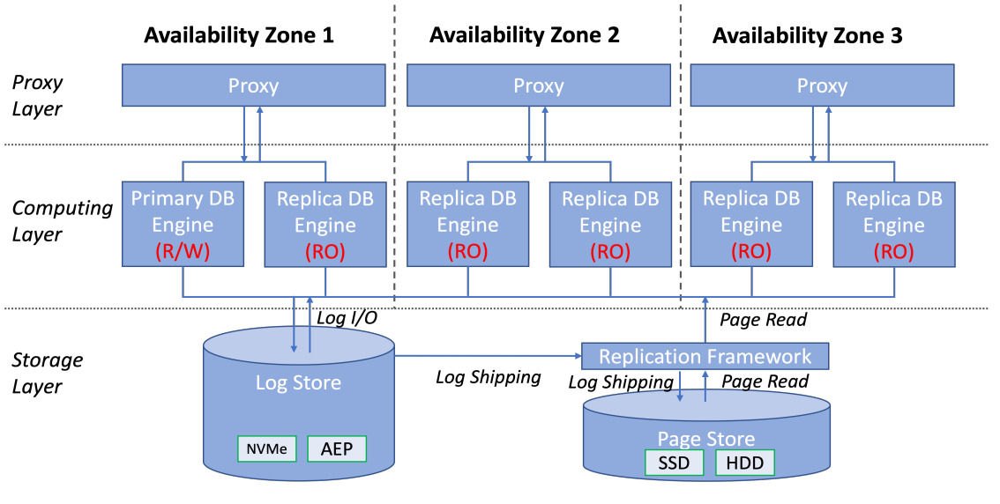
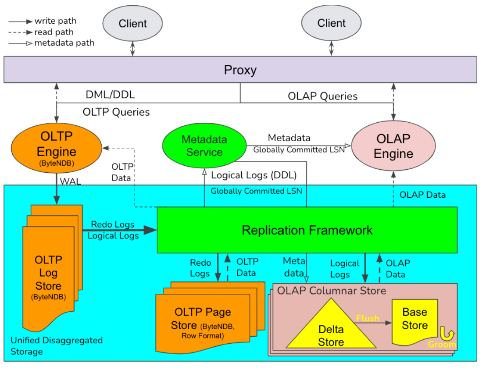
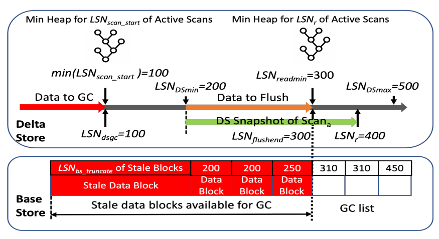

# 1. Introduction

More and more business scenarios require performing complex analysis over freshly imported data, together with transaction support and strong data consistency.

设计目标如下
- Large scale
- Real time
- Highly fresh data changes
- Strong data consistency

最近的一个survey姜HTAP分厂以下连个类别
- Single engine: 使用unified HTAP engine，又可以进而氛围single data format和mixed data format
- Separate engine: 使用不同的engine来处理OLTP和OLAP workload，也可以进一步分成separate storage或者shared storage

这里byteHTAP采用separate engine和shared storage，原因如下
- Separate engine: 设计能够将OLAP和OLTP合在一起的engine比较复杂，分开的话可以尽量利用已有的ByteNDB和open-source项目比如Apache Flink
- Shared storage: 扩展ByteNDB已有的replication framework来将data changes propagate in storage layer. Columnar storage包含in-memory Delta Store和Base Store

# 2. Related Work

相关内容比较多，这里简述几个

TiDB asynchronously replicates logs from TiKV to TiFlash, transforms row-format data into column format, and provides data consistency among logs

Google F1 Lightning包含3部分: an OLTP database, the Lightning component, and a federated query engine. Lightning component采用CDC来改善OLAP的data freshness

# 3. System Architecture and Important Components

## 3.1. ByteNDB Overview

ByteNDB的系统如下

它supports the "log is database" principle as Amazon Aurora does, and can have multiple read replicas besides a read/write master instance. Computing layer的主要部分是proxy和SQL engine，proxy了解系统配置以及怎样将不同的SQL query route到master或者read-only replica去

而且可以看到，ByteNDB的replicated storage layer包含Log Store(存储redo logs)和Page Store(包含data page的不同version并且不断地apply redo logs)

Replication Framework负责the replication and distribution of the redo logs, 每个redo log都会被分配一个LSN(log sequence number)，并且同一个transaction内的redo logs会被atomically replicate within a batch

每一个log会被发送到Page Store的3个不同的storage server去，Replication Framework同样会记录每个replica的LSN，这样可以方便地将query route到符合条件的replica

## 3.2. System Overview

ByteHTAP utilizes ByteNDB as the OLTP engine and Flink as the OLAP engine, ByteHTAP使用proxy layer来动态决定应该将query交给OLTP还是OLAP engine执行. 通常来说, DMLs, DDLs, simple queries and queries suitable for OLTP(with predicates over indexes on OLTP tables) are sent to the OLTP engine, while complex queries(with join/aggregate/sort) are sent to OLAP engine

每个ByteHTAP table都需要有一个primary key，column store会根据它来将数据排序，另外用户也可以指定column store的partition key

ByteHTAP扩展了ByteNDB的Replication Framework, 进而provide a reliable log distribution to multiple storage nodes for each partition to build a columnar data store, which may reside on different storage nodes from its corresponding row store.

## 3.3. Metadata Service

Metadata Service(MDS)主要包含3方面的metadata
- Catalog information
- Partition information for OLTP/OLAP engines
- Statistic information for OLTP/OLAP data

ByteHTAP的OLTP系统会在自己的data store里相关的metadata，MDS则处理与OLAP storage相关的metadata

MDS使用Zookeeper实现高可用

## 3.4. OLAP Engine

ByteHTAP采用Flink作为OLAP compute engine，团队实现了custom connector that supports reading from the Columnar Store in parallel

# 4. Shared Storage with High Data Freshness

ByteHTAP的columnar store包括Delta Store和Base Store. Delta Store is an in-memory and row-format store, Base Store is a distributed and persistent columnar store

## 4.1. Delta Store

OLAP table会被partition并且每个partition都有3个replica，因此每个partition replica都有对应的Delta Store. Delta Store包含两个list: insertion list & deletion list，它们分别负责按照LSN的顺序记录insert和delete操作. 另外会针对delete操作维护一个delete hash map用于快速查看某个row是否被delete

Delta Store包含4中操作
- LogApply: 将log加入到insertion list/deletion list/delete hash map中
- Flush: Background task，首先计算LSN的flush range，接着将insersion list中的row按照primary key排序，最后转化成column format并写入Base Store(以data block的形式). Deletion list通过更新Base Store中data block的delete bitmap完成fllush
- Garbage Collection(GC): 如果flushed的data已经没有active scan则GC
- SCAN: OLAP query会scan Delta Store和Base Store最终将结果合并

## 4.2. Base Store

Base Store data is stored in a Partitioned Attributes Across(PAX)-like format in the local file system of a storage node. Each Base Store contains many data blocks(32MB default), data within each block is ordered by primary key

每个data block都包括metadata和encoded data，这些block-level metadata包括the number of rows, key range, bloom filter for primary keys, and per-column statistics like min/max, and they will be used during a read operation to trim the data in advance

每个data block的delete bitmap并不在data block中，而是在RocksDB里

由于delete只是更新delete bitmap，所以data会无限增长, Base Store implements a groom mechanism for Compaction and Garbage Collection(GC)
- Compaction: 后台线程周期性地检查data block里delete rows和overlap pertentage，这两项比较高的data block会被优先compaction. Compaction的末尾old data blocks会被放进GC list
- Garbage collection: 后台线程，周期性地检查GC list，如果这些data block上没有active query就reclaim storage space

## 4.3. High Data Freshness

Data freshness is defined as how long the recently changed data from OLTP system can be visible to an OLAP query. Achieve high data freshness的手段如下
- Efficient Log Replication
- Fast LogApply with Efficient Delete Handling: 之前介绍过的soft delete
- Efficient Memory Management Using a Vector of Arenas: 自己实现内存分配器，记录每个arena里的max LSN. During the Delta Store GC, arenas whose LSN is smaller than the GC LSN

# 5. LSN-Based Strong Data Consistency

## 5.1. Important LSNs in ByteHTAP

- LSN_DSmin: The lowest LSN for the active data entries in a Delta Store that have not been fushed to the Base Store
- LSN_DSmax:  The lowest LSN for the active data entries in a Delta Store that have not been fushed to the Base Store
- LSN_r: The read LSN of a scan
- LSN_readmin: The read LSN_r of a scan
- LSN_scan_start: The lower bound of a scan’s snapshot, which is the LSN_DSmin when a scan arrives at the Delta Store
- LSN_flushed: The largest LSN of a Delta Store’s data entries in the next Flush
- LSN_dsgc: Delta Store’s data entries with LSNs less than this LSN will be truncated by the next Delta Store GC
- LSN_bs_truncate: 在data block的最大query LSN

## 5.2. Query and DML Handling

- Scan
    - LSN_r > LSN_DSmax: Replication Framework will put this scan on hold until the dat ais available
    - LSN_r < LSN_DSmin: 返回error，会从MDS获取新的LSN_r
    - LSN_Dmin <= LSN_r <= LSN_DSmax: 扫描对应的Delta Store并将结果与Base Store合并
- LogApply: Increase LSN_DSmax
- Flush: 将处于[LSN_DSmin, LSN_flushed]之间的data flush，一开始的时候会将LSN_readmin作为LSN_flushed，最后会更新LSN_DSmin

## 5.3. DDL Handling

When a DDL statement arrives in ByteHTAP, it will first be processed by the OLTP engine. Next the Replication Framework is responsible to send the DDL logical log generated for the DDL operation to MDS and the AP storage servers

# 6. OLAP Query Performance Optimization

## 6.1. Delete Optimization for Scans

During a Base Store scan operation, the scanner frstly takes a snapshot of the block ids to be scanned, then fetches the bitmap based on each block id, and fnally, scans the base column data and applies the deletes. 在这一过程中，通常我们有两种方法来handle Delta Store中的delete
- Lazy approach: 首先scan Base Store，之后对于每个row进行hash lookup
- Eager approach: 将Delta Store中的delete map直接拿过来，然后进行Base Store scan

为了尽可能产出optimal execution plan，ByteHTAP内置一个cost model来决定lazy/eager approach

## 6.2. Computation Pushdown to Storage Engine

- Predicate Pushdown: Query planner decides if a predicate of a scan operator can be pushed down to the storage engine by checking whether the predicate can be evaluated by the storage engine
- Aggregate Pushdown: In each partition, storage engine will aggregate the scanned data after applying fltering predicates (if exist) and returns the partially aggregated results to the compute engine

## 6.3. OLAP Query Engine Optimization

- Statistics Collection
- Asynchronous Read: 在Flink connector中使用两个线程，一个拿数据另一个负责后续处理, they communicate through an adjustable buffer
- Parallelism Optimization: Adjust source scan parallelism based on the data statistics and the number of partitions

# 8. Lessons Learned from Production

- Allow ByteNDB customers to painlessly upgrade to ByteHTAP: 与之前读到的论文相似，易用性很重要
- Cross OLTP database query ability: 数据可能存在多个OLTP db里，要支持这种情况
- Efficient data import: Easier onboarding
- Flink enhancements: Flink query engine逐渐成为bottleneck，将Flink的plan generation变成多线程，重新设计Flink的core scheduler

# 9. Concllusions

ByteHTAP is a large-scale real-time analytics system supporting both fresh data changes and strong data consistency, and is designed to meet ByteDance’s growing business demands. The modular system design fully utilizes an existing ByteDance’s OLTP system and an open source OLAP system