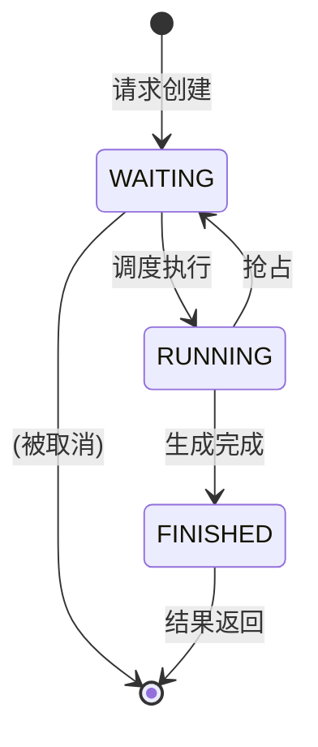

最近在学习 AI Infra 相关的知识并根据一些教程阅读nano-vllm的源代码，这里记录一下相关内容，我们从`Sequence`开始，因为在源码中它的dependency比较少，而且代表了用户的每一个请求

## 1. Sequence的生命周期

在系统中，每一个请求（比如一个 prompt）都会被封装成一个 Sequence 对象，它会经历几种不同的状态。SequenceStatus 这个枚举类就定义了这些状态：
- `WAITING`: 等待处理。当一个请求刚被创建，或者因资源不足（如 KV 缓存满了）被抢占时，它会处于这个状态。
- `RUNNING`: 正在运行。当调度器（Scheduler）决定处理这个请求，并为其分配了计算资源时，它就进入了运行状态
- `FINISHED`: 已完成。当生成过程结束（比如生成到了 eos token 或者达到了最大长度），请求就完成了。

如图所示


## 2. 代码解析

### 2.1. 初始化(__init__)
```python
class Sequence:
    block_size = 256
    counter = count()

    def __init__(self, token_ids: list[int], sampling_params = SamplingParams()):
        self.seq_id = next(Sequence.counter)
        self.status = SequenceStatus.WAITING
        self.token_ids = copy(token_ids)
        self.last_token = token_ids[-1]
        self.num_tokens = len(self.token_ids)
        self.num_prompt_tokens = len(token_ids)
        self.num_cached_tokens = 0
        self.block_table = []
        self.temperature = sampling_params.temperature
        self.max_tokens = sampling_params.max_tokens
        self.ignore_eos = sampling_params.ignore_eos
```
- 唯一标识 (seq_id)：通过 itertools.count() 实现的自增计数器，为每个请求分配一个独一无二的 ID
- 状态 (status)：初始状态总是 WAITING
- Token 信息：
    - token_ids: 存储着从 prompt 到当前所有已生成 token 的完整列表
    - last_token: 最后一个 token，在解码（decode）阶段非常有用
    - num_tokens: 当前总 token 数。
- num_prompt_tokens: 输入 prompt 的 token 数，这个值是固定的
- KV 缓存相关：
    - num_cached_tokens: 已被缓存的 token 数量，用于前缀缓存（Prefix Caching）优化。
    - block_table: 这是核心中的核心。它是一个列表，存储着分配给这个序列的 KV 缓存块（Block）的 ID
- 采样参数 (sampling_params)：存储了如 temperature、max_tokens 等采样所需的参数

### 2.2. 与 KV 缓存块的交互
```python
@property
def num_blocks(self):
    return (self.num_tokens + self.block_size - 1) // self.block_size

@property
def last_block_num_tokens(self):
    return self.num_tokens - (self.num_blocks - 1) * self.block_size

def block(self, i):
    assert 0 <= i < self.num_blocks
    return self.token_ids[i*self.block_size: (i+1)*self.block_size]
```
- num_blocks: 计算当前序列需要多少个物理块来存储 KV 缓存
- last_block_num_tokens: 计算最后一个块中存储了多少个 token 的 KV 缓存
- block(i): 获取第 i 个逻辑块对应的 token_ids，这在计算块的哈希值以实现前缀复用时非常有用

这些接口将 Sequence 的逻辑长度与物理存储（block_table）解耦，BlockManager 可以根据这些信息来执行高效的内存分配和回收

### 2.3. 状态更新
当模型每生成一个新 token，就需要更新 Sequence 的状态。append_token 方法就负责这个任务
```python
def append_token(self, token_id: int):
    self.token_ids.append(token_id)
    self.last_token = token_id
    self.num_tokens += 1
```
将新生成的 token_id 添加到列表中，并更新 last_token 和 num_tokens。调度器的 postprocess 方法会在每次模型 step 后调用它

## 3. Sequence与其他部分的结合
1. 用户请求被 LLMEngine 封装成 Sequence 对象，并交给 Scheduler
2. Scheduler 检查 Sequence 的状态 (seq.status) 和所需资源 (seq.num_blocks)，然后向 BlockManager 申请 KV 缓存
3. BlockManager 为 Sequence 分配物理块，并将块 ID 填入 seq.block_table
4. Scheduler 将准备好的 Sequence 批次发送给 ModelRunner
5. ModelRunner 根据 Sequence 批次中的 token_ids, block_table 等信息，执行一次前向传播，生成新的 token
6. Scheduler 调用 seq.append_token() 更新序列，并检查 seq.is_finished。如果完成，就让 BlockManager 释放其占用的 block_table