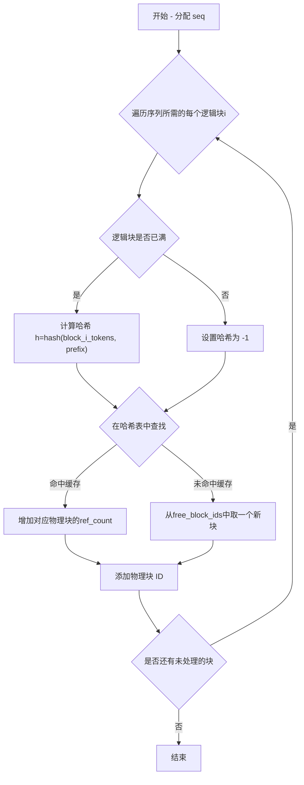

在上一篇文章中，我们介绍了代表用户请求的Sequence类，它通过block_table来追踪存储其KV cache的物理内存块，这篇文章将介绍负责管理这些内存块的BlockManager类

## 1. 为什么需要BlockManager

在处理大语言模型推理时，每个请求都需要一个动态增长的 KV 缓存。如果为每个请求都分配连续的大块内存，会导致严重的内存碎片问题，并且无法在不同请求间共享相同的 prompt 部分（例如，系统指令或多轮对话历史）

BlockManager 通过将显存预先划分为固定大小的、非连续的块（Blocks）来解决这个问题，实现了
- 消除内存碎片: 所有块大小相同，可以实现高效的分配和释放
- 实现内存共享: 不同的 Sequence 对象如果包含了相同的 prompt 部分，它们可以共享存储这些 prompt KV 缓存的物理块，从而节省了显存和计算

## 2. Block: 基本的内存单元
在 BlockManager 的世界里，一切都围绕 Block 类展开。它代表了 KV 缓存的一个物理块
```python
class Block:
    def __init__(self, block_id):
        self.block_id = block_id

        # 引用计数
        self.ref_count = 0

        # 用于识别块内容是否相同
        self.hash = -1
        self.token_ids = []
```
- block_id: 每个块的唯一标识符
- ref_count: 引用计数。每个块可以背多个Sequence同时引用，只有当ref_count为0的时候，这个块才能被安全地释放
- hash和token_ids: 用于前缀缓存。通过计算一个块中token_ids的hash值，可以快速判断两个块是否包含相同的内容

## 3. BlockManager: 内存的分配与调度
BlockManager负责对所有Block进行统一管理。在进行初始化时，会创建一整个物理块池，并维护关键的数据结构
```python
class BlockManager:
    def __init__(self, num_blocks: int, block_size: int):
        self.block_size = block_size
        self.blocks: list[Block] = [Block(i) for i in range(num_blocks)]
        self.hash_to_block_id: dict[int, int] = dict()
        self.free_block_ids: deque[int] = deque(range(num_blocks))
        self.used_block_ids: set[int] = set()
```
- blocks: 所有存储Block的列表
- hash_to_block_id: 用于存储hash -> block_id的映射，用于快速查找具有特定内容的块
- free_block_ids和used_block_ids: 分别用于追踪哪些块是空闲的，哪些块正在被使用，从而进行高效的分配与回收

### 3.1. allocate: 基于hash实现前缀缓存
allocate是BlockManager的核心方法，它负责根据token_ids的hash值来分配一个合适的Block，从而实现前缀缓存
```python
def allocate(self, seq: Sequence):
    """
    Allocate blocks for a sequence.
    """
    # Make sure the it's the first time to allocate blocks
    assert not seq.block_table
    h = -1
    cache_miss = False

    # seq.num_blocks is the number of blocks needed to store the sequence,
    # this can be calcualted statically
    for i in range(seq.num_blocks):
        token_ids = seq.block(i)
        # Only compute the hash if the block is full
        h = self.compute_hash(token_ids, h) if len(token_ids) == self.block_size else -1

        block_id = self.hash_to_block_id.get(h, -1)
        if block_id == -1 or self.blocks[block_id].token_ids != token_ids:
            # Cache miss, or the block is not the same as existing one
            cache_miss = True

        if cache_miss:
            # Allocate new block if cache miss
            block_id = self.free_block_ids[0]
            block = self._allocate_block(block_id)
        else:
            seq.num_cached_tokens += self.block_size
            if block_id in self.used_block_ids:
                block = self.blocks[block_id]
                block.ref_count += 1
            else:
                # Maybe hash table has the block_id but used_block_ids is cleared
                block = self._allocate_block(block_id)

        if h != -1:
            # Update the hash value of block
            block.update(h, token_ids)
            self.hash_to_block_id[h] = block_id
        seq.block_table.append(block_id)
```

整体流程图如下



这个流程的关键在于compute_hash
```python
@classmethod
def compute_hash(cls, token_ids: list[int], prefix: int = -1):
    h = xxhash.xxh64()
    if prefix != -1:
        # 链式哈希：将前一个块的哈希作为当前块哈希计算的一部分
        h.update(prefix.to_bytes(8, "little"))
    h.update(np.array(token_ids).tobytes())
    return h.intdigest()
```

它采用了一种链式哈希的策略。计算当前块的哈希时，会把前一个块的哈希值 (prefix) 也包含进去。这确保了只有整个 prompt 前缀完全相同的序列，才能命中并共享缓存。比如对于下面两个序列
- Seq A: `[1, 2, 3, 4, 5, 6]`
- Seq B: `[1, 2, 3, 4, 7, 8]`

在block_size=4的情况下，两个Sequence第一个块的hash是相同的，Seq B可以直接复用为Seq A分配的物理块，但第二个块则需分配新的物理块

### 3.2. may_append: 添加新生成的token

与一次行为整个prompt分配所有块的allocate不同，may_append的工作是增量式的，它在每生成一个新的token后被调用，在现有的块不够用的时候，及时追加新的物理块，同时它也会在一个块被填满的时候计算这个块的哈希值，并更新hash_to_block_id

may_append会在Schduler类的schedule方法中被调用，大致的流程如下
1. Scheduler从正在运行的队列(self.running)中取出Sequence
2. 通过self.block_manager.can_append(seq)判断是否有足够的空闲块可供分配
3. 如果可以，Scheduler会调用self.block_manager.may_append(seq)
4. 上面的操作完成后，这个Sequence才会被送往模型下一步的计算批次中

所以，may_append是在预测下一个token之前，为当前序列预先准备好可能需要的内存块

下面我们看一下它的实现:
```python
def may_append(self, seq: Sequence):
    block_table = seq.block_table
    last_block = self.blocks[block_table[-1]]
```
may_append 的逻辑是基于序列当前长度 len(seq) 和 block_size 的关系来划分的。假设 block_size = 256

```python
if len(seq) % self.block_size == 1:
    # 最后一个块中只有一个 token
    assert last_block.hash != -1
    block_id = self.free_block_ids[0]
    self._allocate_block(block_id)
    block_table.append(block_id)
```
- 触发条件: 当序列的长度是 257, 513 等（即 N * block_size + 1）时触发。这表示刚刚生成的那个 token 是一个新的，未满块中的第一个 token
- 执行操作:
    1. 从空闲块队列 free_block_ids 的头部取出一个新的 block_id
    2. 调用 _allocate_block 将其标记为已使用，并重置其状态（ref_count 设为 1)
    3. 将这个新的 block_id 追加到序列的 block_table 末尾

```python
elif len(seq) % self.block_size == 0:
    # 最后一个块已满，需要更新其哈希和 token_ids
    assert last_block.hash == -1
    token_ids = seq.block(seq.num_blocks-1)

    # 计算最后一个块的哈希 (基于前一个块的哈希)
    prefix = self.blocks[block_table[-2]].hash if len(block_table) > 1 else -1
    h = self.compute_hash(token_ids, prefix)
    last_block.update(h, token_ids)
    
    self.hash_to_block_id[h] = last_block.block_id
```
- 触发条件: 当序列长度是 256, 512 等（即 N * block_size）时触发。这表示刚刚生成的那个 token 正好填满了当前的最后一个块
- 执行操作:
    1. 此时不分配新块。主要任务是为这个刚刚填满的块计算并登记哈希
    2. 获取这个块的 token_ids
    3. 计算它的链式哈希值 h（包含了前一个块的哈希 prefix）
    4. 调用 last_block.update() 将计算出的 h 和 token_ids 存入块对象
    5. 更新全局的 hash_to_block_id 查找表，这样这个块将来就可以被复用了

```python
else:
    assert last_block.hash == -1
```
- 触发条件: 所有其他情况。例如，序列长度从 258 增长到 511 的任何一步
- 执行操作:
    - 什么都不做，因为新的token只是被添加到一个已存在但还没有满的块中
    - 不需要分配新块
    - 因为块未满，所以不计算哈希

### 3.3. deallocate: 释放物理块
当一个序列完成时，管理器会调用此方法
```python
def deallocate(self, seq: Sequence):
    # Deallocate from end to start
    for block_id in reversed(seq.block_table):
        block = self.blocks[block_id]
        block.ref_count -= 1
        if block.ref_count == 0:
            # Only release the block if ref count is 0
            self._deallocate_block(block_id)
    seq.num_cached_tokens = 0
    seq.block_table.clear()
```
它会遍历序列的 block_table，将每个物理块的 ref_count 减一。只有当 ref_count 归零时，该块才会被真正地加入 free_block_ids 列表，等待下一次分配