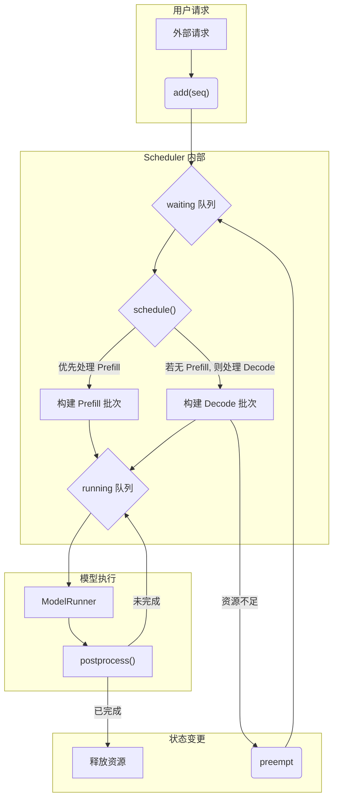

在前面文章中我们介绍了代表用户请求的Sequence类，以及负责管理block的BlockManager类。这篇文章将介绍负责调度Scheduler

## 1. 调度器的核心职责

调度器的主要任务是在系统约束(如最大批处理大小，GPU显存限制)和性能目标(高吞吐量，低延迟)之间做出最优抉择，它通过维护两个核心队列来管理请求的生命周期
- `waiting: deque[Sequence]`: 一个等待队列，存放所有新提交的，或者因为资源不足被强占的请求
- `running: deque[Sequence]`: 一个运行队列，存放所有当前正在被处理(已分配KV cache)的请求

调度器的工作可以分为两个主要阶段: Prefill和Decode



## 2. 调度器实现

### 2.1. `schedule()`方法

`schedule()`方法在每个推理步骤被调用，决定下一步要执行哪些序列

#### 阶段一: Prefill - 除此计算

Prefill指的是对一个新请求的prompt进行的第一次，也是计算量最大的一次前向传播，调度器回优先处理waiting队列，因为它倾向于尽快开始新任务
```python
# PREFILL
# 当等待队列不为空，且当前批次未满时
while self.waiting and num_seqs < self.max_num_seqs:
    seq = self.waiting[0] # 从等待队列头部取出一个序列

    # 检查资源：当前批次的 token 数加上新序列的长度是否超限？
    # BlockManager 是否有足够空间为其分配 KV 缓存？
    if num_batched_tokens + len(seq) > self.max_num_batched_tokens or not self.block_manager.can_allocate(seq):
        break # 资源不足，停止组建 prefill 批次
    
    # 分配资源
    self.block_manager.allocate(seq)
    
    # 更新状态，将序列从 waiting 移动到 running
    seq.status = SequenceStatus.RUNNING
    self.waiting.popleft()
    self.running.append(seq)
    scheduled_seqs.append(seq)

if scheduled_seqs:
    return scheduled_seqs, True # 返回 prefill 批次
```
这个阶段的逻辑为尽可能多地从`waiting`队列中打包序列，直到大道系统处理能力的上限

#### 阶段二: Decode - 逐个生成每个token

如果在`waiting`队列中没有可以处理的请求(比如因为资源不足)，调度器会转向处理`running`队列中的序列，即执行Decode操作
```python
# DECODE
while self.running and num_seqs < self.max_num_seqs:
    seq = self.running.popleft()
    
    # 检查是否可以为这个序列追加下一个 token 的 KV 缓存
    while not self.block_manager.can_append(seq):
        # 资源不足，必须抢占一个序列来腾出空间
        if self.running:
            self.preempt(self.running.pop()) # 抢占 running 队列尾部的序列
        else:
            self.preempt(seq) # 如果 running 队列只剩自己，就抢占自己
            break
    else:
        # 资源充足，为序列准备好下一个 token 的内存
        self.block_manager.may_append(seq)
        scheduled_seqs.append(seq)
        
assert scheduled_seqs # 解码阶段必须至少有一个序列在运行
self.running.extendleft(reversed(scheduled_seqs)) # 将处理完的序列放回 running 队列头部
return scheduled_seqs, False # 返回 decode 批次
```
Decode阶段比较复杂，因为它引入了抢占(Preemption)机制。如果系统没有足够的空闲块来为Sequence生成下一个token，调度器就必须做出选择: 从`running`队列尾部(通常是最近被处理过的序列，优先级比较低)移除一个序列，释放它占用的所有资源，并将其放回`waiting`队列的头部，等待下一次机会

这种方式保证了正在运行的，生成了较多token的序列能够优先完成，避免了因系统的资源不足而卡死

### 2.2. `preempt()`方法

```python
def preempt(self, seq: Sequence):
    seq.status = SequenceStatus.WAITING
    self.block_manager.deallocate(seq)
    self.waiting.appendleft(seq)
```

这个方法负责执行抢占操作，它将一个序列的状态改回`WAITING`，调用`block_manager.deallocate(seq)`释放其所有的KV cache blocks，然后把它放回`waiting`队列的头部，保证它能被优先再次调度

### 2.3. `postprocess()`方法

```python
def postprocess(self, seqs: list[Sequence], token_ids: list[int]) -> list[bool]:
    for seq, token_id in zip(seqs, token_ids):
        seq.append_token(token_id)

        # Check if the sequence is finished by EOS or max tokens
        if (not seq.ignore_eos and token_id == self.eos) or seq.num_completion_tokens == seq.max_tokens:
            seq.status = SequenceStatus.FINISHED
            self.block_manager.deallocate(seq)
            self.running.remove(seq)
```

在模型完成一次前向传播后，`LLMEngine`会调用这个方法。它负责
1. 将新生成的`token_id`追加到对应的`Sequence`对象中
2. 检查序列是否已达到完成条件（生成了`eos token`或达到了`max_tokens`）
3. 如果序列已完成，就将其状态设为`FINISHED`，释放其资源，并从`running`队列中彻底移除

## 3. 总结

`Scheduler`是实现高性能推理的核心引擎。它通过双阶段调度(Prefill & Decode)和抢占机制，在最大化GPU利用率(通过批处理)和保证服务质量(让长序列尽快完成)之间取得了平衡